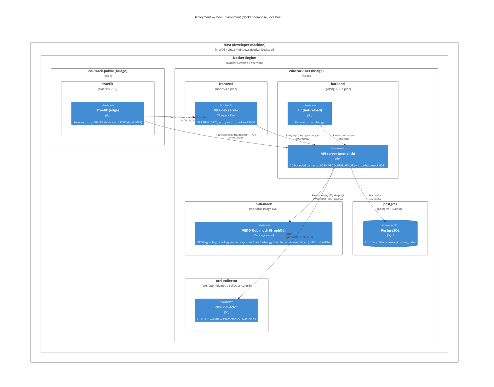
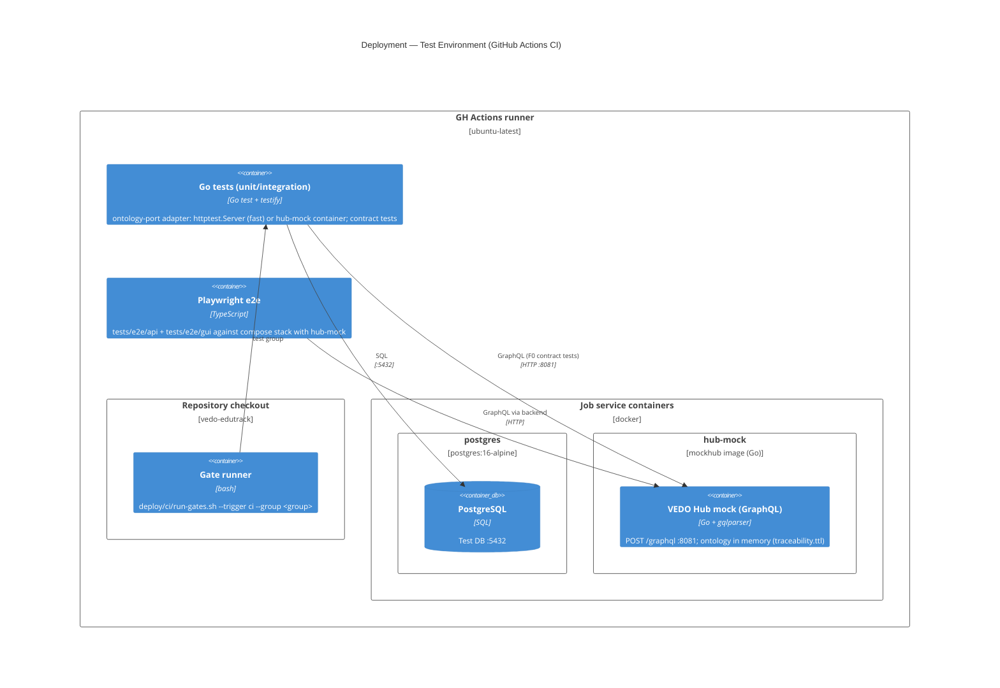

# Research

Updated: 2026-08-03 03:45
Status: active

## Active Summary (input for /aif-plan)
<!-- aif:active-summary:start -->
Topic: Accurate Pixso → React code generation (landing page) — beyond design_to_code

Goal: Replace the unreliable `design_to_code` pipeline (Path 1) with a more accurate approach for converting the Pixso landing page design into production React+Tailwind code. The design is the «Дай пять» landing (VEDO EduTrack brand, frame 3:1309, 1920×10602, 12 sections).

Constraints:
- ui_language = ru, artifact_language = en, technical_terms = keep
- Colors MUST use `var(--*)` CSS custom properties from frontend/src/styles/pixso-variables.css (ADR-IMPL.UI.pixso-variables-approach.md, Approach 1)
- Theme switching via `data-collection-3-4-mode="light|dark"` on <html>
- Inter font; lucide-react for icons; Tailwind CSS v4; responsive (desktop → 768px → 480px)
- Max content width 1760px, px-20 padding, section vertical gap 72px

Decisions:
1. `design_to_code` output is unreliable: Pixso-* classes, slot_4_258 props, separate 182KB pixso-landing.css, invented filler content. Replaced by DSL+SVG-guided manual/targeted generation.
2. `get_node_dsl({ guid, simplify:true })` → compact structured tree: exact text, sizes, layout, autoLayout, fills, component refs. Best source for text & structure (~40KB per section).
3. `get_export_image({ guid, imageType:3 })` → SVG with pixel-exact coordinates (radius, positions, colors). Best for VERIFICATION of positioning/geometry, but text is glyph-paths (not readable) and files are huge (200-300KB per card).
4. Best workflow: export SVG for a section → verify geometry (radii, gaps, absolute positions) → write code from DSL text/structure. Section-by-section, not whole page at once.
5. Cleaned up: deleted the unused 182KB frontend/src/styles/pixso-landing.css (design_to_code artifact).

Open questions:
- Whether to re-verify each remaining section (Hero, Testimonials, Philosophy, FAQ, Final CTA, Footer) against SVG geometry like Pricing
- Icons: lucide-react views vs exact Pixso SVG paths (minor visual differences acceptable?)
- Fonts: Inter via Google Fonts vs local files

Success signals:
- Pricing section rewritten to match design exactly: correct icons (Map/Compass/Navigation), 7 exact features per plan, annual pricing rows with savings badges, badge inside title row, radius 24px, all-white cards, correct section header + B2B link ✅
- Testimonials fixed: correct names (Елена/Андрей/Ольга), quotes, results, metrics (1000+/500+/200+), section header text ✅
- Philosophy fixed: correct 4 principles with exact descriptions, compass icon for СВОБОДА, VEDO Hub link, correct metaphor text ✅
- FAQ fixed: all 7 correct questions/answers from design, correct section subtitle ✅
- Final CTA fixed: correct subtitle text, UTP line "Не проходите курс — достигайте цель" ✅
- Footer fixed: 4 nav columns with correct links ✅
- pnpm typecheck + pnpm build pass (Landing 58.20kB / 13.87kB gzip) ✅
- Cleanup of pixso-landing.css (182KB) ✅

Next step: commit the corrected Landing.tsx; verify remaining sections (Hero, Solution, Benefits, Problem) against Design if needed
<!-- aif:active-summary:end -->

## Sessions
<!-- aif:sessions:start -->
### 2026-08-05 — Pixso export accuracy: DSL+SVG over design_to_code

What changed:
- Diagnosed that `design_to_code` (Path 1) produces incorrect output: Pixso-* classes, slot_4_258 props, separate 182KB pixso-landing.css, invented filler content (e.g. Pricing features made up, wrong icons, missing annual pricing).
- Established alternative pipeline: `get_node_dsl` (structure+text) + `get_export_image` SVG (geometry) → section-by-section exact code generation.
- Rewrote the Pricing section to match the design exactly (see Active Summary).
- Rewrote Testimonials, Philosophy, FAQ sections with correct content from DSL.
- Fixed Final CTA subtitle, UTP line, and Footer nav links.
- Deleted the unused 182KB frontend/src/styles/pixso-landing.css.
- Cleaned imports: removed Star, MessageCircle, ExternalLink; added Info, Navigation.

Key notes:
- SVG export (imageType:3) gives pixel-exact radii/positions/colors but text renders as glyph paths (not readable); files large (200-300KB/card). DSL (simplify:true) is compact (~40KB/section) and has exact text + structure. Use SVG to verify geometry, DSL to write content.
- Section-by-section beats whole-page generation (agent context limits).

Links (paths):
- vedo-edutrack/frontend/src/pages/Landing.tsx (Pricing section rewritten; imports: +Info, +Navigation, -Star, -ExternalLink)
- vedo-edutrack/frontend/src/styles/pixso-variables.css (kept, Approach 1)
- vedo-edutrack/specs/adr/ADR-IMPL.UI.pixso-variables-approach.md (Approach 1 source of truth)
- design source frame: 3:1309 «Дай пять / Desktop / Light»; pricing cards 7:23/7:66/7:114

### 2026-08-02 17:00 — Initial exploration: 21-step algorithm vs current ROADMAP

What changed:
Mapped the user's 21-step DDD-to-`make up` algorithm against the existing 10-milestone product roadmap to identify gaps.

Key findings:
1. **The current ROADMAP has no engineering foundation phase.** It assumes architecture, stack, repo structure, containers, CI/CD, Keycloak, and test framework already exist by M1. They don't.

2. **The algorithm covers 5 phases of engineering work:**
   - Phase 0: DDD modeling (steps 1-2)
   - Phase 1: Architecture basis — ADR, C4, RBAC, traceability (steps 3-6)
   - Phase 2: Engineering foundation — repo, Docker, Makefile, test scaffold (steps 7-10)
   - Phase 3: Implementation — scaffold, Keycloak, landing page (steps 11-16)
   - Phase 4: Quality — TDD, CI gates, observability, README, first launch (steps 17-21)

3. **Only phases 3-4 roughly correspond to roadmap M1-M4.** Phases 0-2 have no roadmap representation.

4. **A requirements elaboration phase is missing from the algorithm itself.** The algorithm jumps to DDD without formalizing US, UC, FR, NFR artifacts. These MUST be produced before DDD begins.

5. **Semantic naming conventions exist** for US (`US-<domain>.<subdomain>.<action>`), UC (`UC-<L1>.<L2>.<L3>`), and ADR (`ADR-<LEVEL>.<AREA>.<semantic-tag>`). FR and NFR conventions do NOT exist — `specs/requirements/` is empty.

6. **Proposed Phase 0 structure** (to insert before the existing Phase 1):
   - M0.0: Requirements elaboration (US, UC, FR, NFR with semantic IDs)
   - M0.1: Domain model & architecture basis (DDD, C4, ADR, RBAC, traceability)
   - M0.2: Engineering platform (repo structure, Docker, Makefile, CI gates)
   - M0.3: App scaffold (healthcheck, Keycloak, stubs, landing page)

Links (paths):
- `vedo-edutrack/specs/user-stories/README.md` — US naming convention
- `vedo-edutrack/specs/use-cases/README.md` — UC naming convention (VEDO Core; EduTrack needs its own L1 domains)
- `vedo-edutrack/specs/adr/README.md` — ADR naming convention
- `vedo-edutrack/.ai-factory/ROADMAP.md` — current roadmap (M1–M10, 4 product phases)
- `vedo-edutrack/specs/vision.md` — business requirements (authoritative)
- `vedo-edutrack/specs/glossary.md` — domain terminology
- `vedo-edutrack/specs/requirements/` — empty; needs README for FR and NFR conventions
### 2026-08-02 18:30 — Quality-matrix final audit + recommendatory NFR triage

What changed:
Final quality-matrix audit (2026-08-02) confirmed 20/20 green cells: 107 requirements (60 FR + 47 NFR), 0 lacunas, 0 hierarchy violations, all metrologically valid. Three recommendatory open questions from audit Step 7 were triaged with the user.

Key notes:
- A/B testing framework: deferred — no MVP product hypotheses; overlaps with canary-kill-switch
- Vertical certification (ISO 27001/PCI DSS): deferred — no regulated vertical selected; PCI scope likely with acquirer
- Localization: approved — i18n-readiness NFR (P2, cell 2.2): RU+EN, easy language addition (translations + config only, ≤ 1 day, 0 code changes), RTL explicitly out of scope
- Requirement corpus grew from 79 (66 FR + 13 NFR) to 107 (60 FR + 47 NFR) across 8 loop iterations (commits 0fe934d..2975ae3)

Links (paths):
- specs/requirements/ (60 FR + 47 NFR)
- traceability.ttl (107 requirement instances, 0 orphans)
- specs/vision.md (authoritative)

### 2026-08-03 — CLI interface decision: single binary with cobra subcommands

What changed:
Explored embedding a CLI into the backend executable. Decided: single binary `vedo-edutrack` with cobra subcommands (server / mcp / migrate / seed / ontology sync / route compute / plan get / gap diagnose / report). CLI is an input adapter over the Application layer (same pattern as MCP server). Created ADR-DES.API.cli-interface (ПРИНЯТО) and updated structure + documentation.

Key notes:
- MCP stdio requirement (REQ-FR-api.mcp.server) forces a spawnable binary mode — CLI embedding is required, not optional
- cmd/server renamed to cmd/vedo-edutrack; CLI tree in internal/cli (not cmd/ — minimal entry point; not platform/ — platform must not import modules)
- Per-command lazy wire: migrate = config + Postgres only; server = full graph
- CLI = trusted operator tooling (bypasses JWT by design); audit logging via zap; scriptable (no prompts); --output json|table|csv; queries + targeted commands (no event cascades)
- CLI also for testing: route compute --stub enables route-engine TDD without Postgres/Hub
- Makefile becomes thin wrapper: make migrate → vedo-edutrack migrate up
- Alternatives rejected: two binaries (cmd/server+cmd/cli), thin REST CLI client (kubectl pattern), Makefile-only, CLI in main.go, CLI in platform/

Links (paths):
- specs/adr/ADR-DES.API.cli-interface.md (new ADR)
- specs/adr/ADR-IMPL.PROCESS.repository-structure.md (tree §4, principle 4, alternatives, consequences)
- specs/adr/ADR-IMPL.PROCESS.development-tooling.md (§4 cobra, §11 Makefile wrappers)
- specs/c4/component-api-server.md (Composition Root references)
- AGENTS.md (structure + entry points + docs)
- .ai-factory/DESCRIPTION.md (stack: CLI line)
- .ai-factory/plans/m0-2-engineering-platform.md (T1, T5, T9, T10, T12)
- traceability.ttl (tr:adr-des-api-cli-interface)
- backend/cmd/vedo-edutrack/main.go, backend/internal/cli/cli.go

### 2026-08-03 02:43 — Gate automation: unified manifest + two-tier fast/delivery model

What changed:
Designed how to unify delivery gates into automation: a single gate manifest + runner consumed by the dev loop, delivery handoff, CI, and agent skills. Mapped the user's gate list (build, lint/format, docker, unit, integration+e2e for current and all previous phases) to M0.2 T12 and closed the gaps: typecheck, generated-code consistency (oapi-codegen/sqlc), test quality (TQS/RCS), security (gosec/gitleaks/syft/pnpm audit), DB migrations (atlas), traceability, artifact consistency (docs/env/drift).

Key notes:
- Two tiers: fast (dev feedback loop: compile/types/lint/format/touched-unit/gen-consistency/mermaid/secrets, ≤ 2–3 min, no external services) and delivery (full set, phase <= current for regression; mandatory before declaring a task ready)
- Single source of truth: deploy/ci/gates.yaml; runner deploy/ci/run-gates.sh --tier fast|delivery [--phase] [--out-format table|json|github]; aggregated aif-gate-result JSON; exit 1 on blocking fail
- Decision rule: ready for delivery ⇔ delivery tier zero blocking fails → /aif-verify (semantic gates) → /aif-review → /aif-security-checklist → /aif-commit
- Wiring: aif-implement Step 3.4 → fast tier per task; Final Step → delivery tier before /aif-verify; CI T12 jobs call the runner with --group (no command duplication); Makefile gains make dev-check / make check
- NFR grounding: REQ-NFR-process.dev.engineering-gates (P0: lint 0 errors, format 0 diff, review ≥ 1 approve, runbooks, make up ≤ 30 min), REQ-NFR-process.dev.test-coverage (P1: unit ≥ 90% core / ≥ 80% rest, integration ≥ 70% API contracts, e2e 100% MVP Must, mutation ≤ 15%, regression = 0)
- Honest boundaries: code review, mutation testing, runbook coverage, onboarding — declared in the manifest (runner: agent / phase m1) but not executed as shell commands

Links (paths):
- specs/requirements/REQ-NFR-process.dev.engineering-gates.md
- specs/requirements/REQ-NFR-process.dev.test-coverage.md
- .ai-factory/plans/m0-2-engineering-platform.md (T12 CI pipeline, T9 Makefile)
- .agents/skills/aif-implement/SKILL.md (Step 3.4, Final Step — Verify or Commit)
- .agents/skills/aif-verify/SKILL.md (Step 2/3, aif-gate-result contract)
- .agents/skills/aif-test-quality/SKILL.md (TQS/RCS/B1–B7)
- .agents/skills/aif-security-checklist/SKILL.md

### 2026-08-03 03:45 — VEDO Hub mock server: GraphQL-only container for dev/test/CI

What changed:
Crystallized the design of a minimal VEDO Hub mock. Decision: a separate Docker container serving ONLY the Hub's GraphQL interface (ontology-service schema.graphql from the vedo-hub contracts), ontology loaded in memory from an arbitrary .ttl file (first seed: traceability.ttl). Used in the dev stack, Go integration/contract tests, e2e, and CI. Explore-mode constraint: ADR and C4 files are materialized by /aif-plan; drafts below are persisted here.

Key notes:

### Scope
- GraphQL interface only; REST / SPARQL / MCP channels are deferred until the adapter needs them.
- Runs as a separate container (dev + CI) for plausibility: the backend talks to it over the network exactly like to the real Hub.
- Ontology in memory at startup; restart to reload. First seed traceability.ttl (TBox: ~22 classes, ~20 object/datatype properties, subClassOf hierarchy, no individuals); arbitrary .ttl must be loadable.

### Design

```
traceability.ttl (TBox)
   │ mini-Turtle parser (prefixes + Class/ObjectProperty/DatatypeProperty
   │ + label/comment/subClassOf/domain/range), 0 deps
   ▼
Ontology (Go, in-memory: classes, properties, parents/children)
   │ gqlparser/v2: parse queries + resolvers for QueryRoot fields
   ▼
POST /graphql (http.Handler)
   ├── httptest.Server  → Go adapter/contract tests (in-process, fast)
   └── hub-mock image   → compose service :8081 (dev) / GH Actions service (CI)
```

GraphQL surface (vedo-hub ontology-service): classes, class, classTree, classAncestors, classDescendants, properties, property, individuals, individual, graphNeighborhood, autocompleteClasses, _service{sdl}. Pagination {items,total,page,perPage} (default 20). Any Bearer accepted; missing token → error; GraphQL errors array.

TBox mapping: tr:X a owl:Class → Class{id,label,comment,parents(from subClassOf),children,isAbstract:false,isDeprecated:false}; owl:ObjectProperty/DatatypeProperty → Property{propertyType OBJECT|DATATYPE, domains, ranges, xsdType, characteristics(functional from owl:FunctionalProperty)}; no individuals → empty connections; graphNeighborhood returns the node without edges until ABox appears (mock is data-driven).

### ADR draft (proposed ADR-DES.INFRA.mock-hub-strategy; final file in Russian)

**Статус:** ПРЕДЛОЖЕНО (draft) · **Дата:** 2026-08-03
**Контекст:** EduTrack — сервис-слой над VEDO Hub (ontology-port ACL, F0); в dev-стеке Hub отсутствует (VEDO_HUB_API_URL=http://localhost:8081 указывает в никуда; из контейнера localhost — сам backend); контрактные тесты границы Hub (ROADMAP M1, REQ-NFR-api.availability.hub-dependency-sla) требуют управляемого стенда, CI — без живого Hub. GraphQL-интерфейс ontology-service (query-only) заточен под графовую навигацию (graphNeighborhood, classDescendants); REST-контракт не имеет эндпоинтов обхода графа.
**Требование-источник:** REQ-FR-api.hub.read-ontology (F0.1), REQ-FR-api.hub.copy-subgraph (F0.2), REQ-NFR-api.availability.hub-dependency-sla, REQ-NFR-process.dev.test-coverage, ADR-DES.API.communication-patterns §6, ADR-DES.INFRA.docker-images-environments.
**Решение:** мок VEDO Hub как отдельный Docker-контейнер (hub-mock) в том же Go-модуле: cmd/mockhub + backend/internal/testing/mockhub; только GraphQL (POST /graphql); онтология в памяти из произвольного .ttl (ONTOLOGY_FILE; первый сид traceability.ttl, read-only volume); исполнение gqlparser/v2 с резолверами QueryRoot; тот же хендлер — как httptest.Server для in-process тестов; образ backend/Dockerfile.mockhub (multi-stage, distroless/alpine); compose-сервис :8081 в edutrack-net + healthcheck /healthz; дефолт VEDO_HUB_API_URL → http://hub-mock:8081; в CI — service-контейнер рядом с postgres. Документированное исключение из single-binary (ADR-DES.API.cli-interface): тестовый инструмент, не поставляется, не в SBOM.
**Рассмотренные альтернативы:** REST-only мок (отклонён — адаптер ходит в GraphQL, у REST нет обхода графа); WireMock/Prism/MockServer (тяжёлый рантайм JVM/Node, реальные данные из .ttl не отдать без своего кода); реальный triplestore Fuseki/GraphDB (отложен — Java, формат REST всё равно оборачивать; вернуться при сложных SPARQL в M1); gqlgen (кодоген для 11 резолверов избыточен); ручной GraphQL-исполнитель (introspection/фрагменты/переменные хрупки); только in-process fake (остаётся быстрым путём для application-тестов, но не закрывает адаптер/контракт/e2e/CI).
**Последствия:** + детерминированный управляемый Hub для dev/test/CI, закрыта дыра :8081, один хендлер для in-process и контейнера, 0 влияния на прод; − новая зависимость gqlparser/v2 (пиннинг, SBOM dev-образов), правки контракта FR/ADR/traceability (канал GraphQL), второй cmd/ (документированное исключение).

### Stack ADR clarification (ADR-DES.STACK.framework-vs-vs)
- Мок использует тот же Go-стек; единственная новая зависимость — gqlparser/v2 (test-only).
- По README rule 6 изменение принятого ADR — через статус/новый ADR; substantive-решение (стек мока) живёт в новом ADR (mock-hub-strategy), в framework-vs-vs достаточно cross-reference в «Связанные артефакты» (документационная правка).

### C4 deployment-dev.md — update (add hub-mock)

(Финал — в конвенции C4 репозитория, русские подписи, легенда, контекст, связи с артефактами.)

### C4 deployment-test.md — new (CI)


### Traceability follow-ups
- New ADR instance (tr:adr-des-infra-mock-hub-strategy), C4 deployment-test COMP, TEST instances (contract tests for the Hub boundary).
- REQ-FR-api.hub.read-ontology + ADR-DES.API.communication-patterns §6: add GraphQL to the F0 channel wording; re-sync traceability.ttl (0 orphans rule).

Links (paths):
- vedo-hub contracts (workspace shared items): apps/services/api-gateway/docs/openapi.json (REST — not mocked initially), apps/services/ontology-service/schema.graphql (GraphQL — mocked)
- vedo-edutrack/specs/requirements/REQ-FR-api.hub.read-ontology.md (F0.1 — channel wording to update)
- vedo-edutrack/specs/requirements/REQ-FR-api.hub.copy-subgraph.md (F0.2 — graphNeighborhood/classDescendants fit)
- vedo-edutrack/specs/requirements/REQ-NFR-api.availability.hub-dependency-sla.md (timeouts ≤3s, offline cache — mock used for contract/degradation tests)
- vedo-edutrack/specs/adr/ADR-DES.API.communication-patterns.md (§6 boundary REST+MCP+SPARQL — to update)
- vedo-edutrack/specs/adr/ADR-DES.STACK.framework-vs-vs.md (stack ADR — cross-reference for mock stack)
- vedo-edutrack/specs/c4/deployment-dev.md (update: hub-mock node) + new deployment-test.md
- vedo-edutrack/backend/internal/platform/config/config.go (VEDO_HUB_API_URL — compose default fix)
- vedo-edutrack/deploy/docker-compose.yml (no hub service today; default http://localhost:8081 dead in-container)
- vedo-edutrack/.github/workflows/ci.yml (test job uses services.postgres — hub-mock becomes a sibling service container)
- vedo-edutrack/traceability.ttl (TBox seed; needs new ADR/C4/TEST instances)

<!-- aif:sessions:end -->
