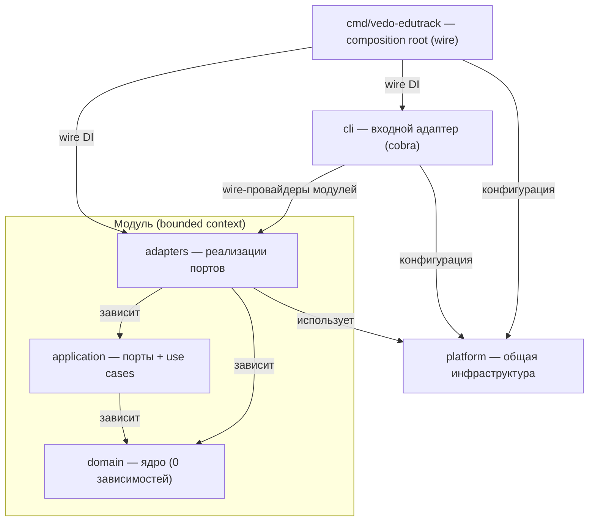

# ADR-IMPL.PROCESS.repository-structure

**Статус:** ПРИНЯТО
**Дата:** 2026-08-02
**Контекст:** Структура монорепозитория VEDO EduTrack (M0.1, T5)

Стек зафиксирован (T3, `ADR-DES.STACK.*` + `ADR-IMPL.PROCESS.development-tooling`): **Go + chi + oapi-codegen** (бэкенд), **React + TypeScript + Vite + Tailwind** (фронтенд), **sqlc + Atlas** (доступ к данным/миграции, §3 development-tooling), **wire** (DI), **pnpm** (пакетный менеджер, монорепо-воркспейс). Архитектура: **модульный монолит** (`ADR-DES.INFRA.modular-monolith-approach`) — 10 bounded contexts в одном процессе, каждый — модуль Clean Architecture (`ADR-DES.INFRA.clean-architecture-adoption`). БД — PostgreSQL, единственный datastore MVP (`ADR-DES.DATA.storage-strategy`).

Продукт ведётся в режиме **вайбкодинга через AI Factory** (`ADR-IMPL.PROCESS.development-tooling` §12): спеки/ADR/требования — входные данные для AI-генерации. Поэтому структура обязана быть **детерминированной до файла**: предсказуемые пути → стабильная генерация, типизированные границы → генератор не может нарушить Dependency Rule неявно, тесты рядом с кодом → всегда понятно, куда их писать. Единообразие критично для bus-factor ≥ 2.

**Требование-источник:**
- `REQ-NFR-process.dev.test-coverage` (покрытие ядра ≥ 90% — структура изолирует ядро и даёт явные пути тестам)
- `REQ-NFR-process.dev.engineering-gates` (архитектурные тесты, линтеры в CI — структура даёт проверяемые границы)
- `REQ-NFR-process.dev.code-complexity` (CC ≤ 10)
- `REQ-NFR-process.dev.developer-documentation` (bus-factor ≥ 2 — понятная навигация)
- `REQ-NFR-ops.compliance.user-documentation` (OpenAPI ≥ 90% эндпоинтов — спека в репозитории)
- `REQ-NFR-infra.compliance.cicd-supply-chain-security` (SBOM, pinning — единый lockfile)
- `REQ-NFR-ops.release.deployment-verification` (drift = 0 — Atlas-миграции в структуре)

**Решение:**

Принять **монорепозиторий** (Go-модуль + pnpm-воркспейс) с **жёстким соблюдением Dependency Rule** Clean Architecture: зависимости направлены **внутрь** — `adapters → application → domain`; никто не зависит от `adapters` как внешнего слоя, только от `domain` и портов `application`.

---

## 1. Dependency Rule (инвариант)

**Матрица импортов (бэкенд, Go):**

| Слой | Импортирует | Запрещено импортировать |
|------|-------------|-------------------------|
| `domain/` | только stdlib | `application`, `adapters`, `platform`, другие модули |
| `application/` | только `domain/`, stdlib | `adapters`, `platform`, другие модули |
| `adapters/` | `domain/`, `application/ports`, `platform` | другие модули |
| `platform/` | stdlib, внешние библиотеки | `modules/*` (никакой бизнес-логики) |
| `cli/` (входной адаптер CLI) | `modules/*` (wire-провайдеры), `platform` | другая логика, кроме вызова use cases через wire |
| `cmd/vedo-edutrack` (composition root) | всё (wire DI) | — |

**Запрещено (проверяется `archguard` в `make lint`):**
- `domain` → `application` / `adapters` / `platform`
- `application` → `adapters` (только через порты из `application/ports/`)
- `adapters` → `platform` напрямую — подключение через wire/DI (composition root), не прямой импорт
- `moduleA` → `moduleB` (межмодульные импорты запрещены; связь — только события/порты)

**Матрица импортов (фронтенд, TypeScript):**

| Слой | Импортирует | Запрещено импортировать |
|------|-------------|-------------------------|
| `domain/` | ничего | `application`, `adapters` |
| `application/` | только `domain/` | `adapters` |
| `adapters/` | `domain/`, `application/ports` | другие модули |
| `routes/`, `components/` | `adapters/ui`, viewmodels | `stores` напрямую (через viewmodels), `domain`-зависимости |

**Запрещено (фронтенд):**
- `components/pages` → `stores` напрямую — только через viewmodels
- `domain` → `application`
- `application` → `adapters`

**Визуализация границ:**



---

## 2. Структура модуля (бэкенд, жёсткая)

```
backend/internal/modules/<context>/
├── domain/                           # СЛОЙ 1: ЯДРО (НЕТ ЗАВИСИМОСТЕЙ)
│   ├── entities.go                   # Сущности
│   ├── value_objects.go              # Value Objects
│   ├── aggregates.go                 # Агрегаты (транзакционные границы)
│   ├── events.go                     # Доменные события
│   ├── errors.go                     # Доменные ошибки (ErrInvalidRoute, …)
│   └── domain_test.go                # Unit-тесты ядра (100% покрытие)
│
├── application/                      # СЛОЙ 2: ПОРТЫ + USE CASES
│   ├── ports/                        # ПОРТЫ (интерфейсы, реализуемые адаптерами)
│   │   ├── repositories.go           # Репозитории (Load, Save)
│   │   ├── eventbus.go               # Шина событий
│   │   └── transaction.go            # Транзакции (Unit of Work)
│   ├── commands/                     # CQRS: мутации
│   │   ├── plan_route.go             # Use Case: PlanRoute
│   │   ├── plan_route_test.go        # Unit-тесты с моками портов
│   │   ├── update_route.go
│   │   └── cancel_route.go
│   ├── queries/                      # CQRS: read-модели
│   │   ├── get_route_by_id.go
│   │   ├── list_routes.go
│   │   └── get_route_progress.go
│   ├── dtos/                         # Входные/выходные DTO (для адаптеров)
│   │   ├── plan_route_request.go
│   │   └── route_response.go
│   └── application_test.go           # Интеграционные тесты use cases
│
├── adapters/                         # СЛОЙ 3: АДАПТЕРЫ (реализации портов)
│   ├── handler/                      # Входной адаптер: HTTP (REST)
│   │   ├── http_handlers.go          # Реализация oapi-codegen интерфейса
│   │   ├── http_handlers_test.go     # Интеграционные (testcontainers)
│   │   ├── mapper.go                 # DTO ↔ Command/Query
│   │   └── errors.go                 # domain errors → HTTP status codes
│   ├── repository/                   # Выходной адаптер: БД (PostgreSQL)
│   │   ├── sqlc/                     # sqlc: source of truth запросов
│   │   │   ├── queries.sql           # SQL-запросы
│   │   │   ├── models.go             # sqlc-генерируемые модели
│   │   │   └── db.go                 # sqlc-генерируемый интерфейс
│   │   ├── route_repository.go       # Реализация application.ports.Repositories
│   │   ├── route_repository_test.go  # Интеграционные (testcontainers)
│   │   ├── mapper.go                 # sqlc.Model → domain.Entity
│   │   └── errors.go                 # SQL-ошибки → domain errors
│   ├── eventbus/                     # Выходной адаптер: шина событий
│   │   ├── eventbus.go               # Реализация application.ports.EventBus
│   │   └── handlers.go               # Подписки на доменные события
│   └── transaction/                  # Выходной адаптер: транзакции
│       └── transaction.go            # Реализация application.ports.Transaction
│
├── wire.go                           # DI-провайдеры модуля
└── module.go                         # Интерфейс модуля (регистрация в сервере)
```

---

## 3. Структура фронтенда (зеркальная)

```
frontend/src/
├── domain/                           # СЛОЙ 1: ЯДРО (НЕТ ЗАВИСИМОСТЕЙ)
│   ├── entities/                     # Доменные модели (TS-классы)
│   │   ├── Route.ts
│   │   ├── Trip.ts
│   │   └── Progress.ts
│   ├── value_objects/                # Value Objects
│   │   ├── Coordinates.ts
│   │   └── Distance.ts
│   ├── events/                       # Доменные события (для стора)
│   │   └── RouteEvents.ts
│   └── errors/                       # Доменные ошибки
│       └── DomainErrors.ts
│
├── application/                      # СЛОЙ 2: ПОРТЫ + USE CASES
│   ├── ports/                        # ПОРТЫ (интерфейсы)
│   │   ├── repositories.ts           # Интерфейс API-клиента
│   │   └── stores.ts                 # Интерфейсы стора
│   ├── stores/                       # Zustand-сторы (state management)
│   │   ├── routeStore.ts
│   │   ├── uiStore.ts
│   │   └── authStore.ts
│   ├── usecases/                     # Use Cases (бизнес-логика UI)
│   │   ├── planRoute.ts              # Вызов API + трансформация
│   │   ├── updateRoute.ts
│   │   └── getRouteProgress.ts
│   ├── dtos/                         # DTO для API-адаптера
│   │   ├── route.request.ts
│   │   └── route.response.ts
│   └── viewmodels/                   # View Models (презентационная логика)
│       ├── RouteListViewModel.ts
│       └── RouteDetailsViewModel.ts
│
├── adapters/                         # СЛОЙ 3: АДАПТЕРЫ
│   ├── api/                          # Выходной адаптер: API-клиент
│   │   ├── client.ts                 # openapi-typescript-клиент
│   │   ├── types.ts                  # Сгенерированные типы (из v1.yaml)
│   │   ├── mappers.ts                # API DTO → domain.Entity
│   │   └── errors.ts                 # API-ошибки → domain errors
│   ├── persistence/                  # Выходной адаптер: LocalStorage (при необходимости)
│   │   └── localCache.ts
│   └── ui/                           # Входной адаптер: UI-компоненты
│       ├── pages/                    # Страницы (React Router)
│       │   ├── RouteListPage.tsx
│       │   ├── RouteDetailsPage.tsx
│       │   └── RoutePlanningPage.tsx
│       ├── features/                 # Фичи (сложные компоненты, по модулям)
│       │   ├── RouteCard/
│       │   │   ├── RouteCard.tsx
│       │   │   └── RouteCard.test.tsx
│       │   └── RouteMap/
│       │       └── RouteMap.tsx
│       ├── shared/                   # Переиспользуемые UI-примитивы
│       │   ├── Button/
│       │   ├── Input/
│       │   └── Spinner/
│       └── hooks/                    # React-хуки (UI-логика)
│           ├── useRouteData.ts
│           └── useRouteForm.ts
│
├── routes/                           # Маршрутизация (композиция)
│   ├── AppRouter.tsx
│   ├── PrivateRoute.tsx
│   └── routes.ts                     # Конфигурация маршрутов
├── styles/                           # Стилизация
│   ├── tokens/                       # Дизайн-токены (из .pen → CSS-переменные)
│   │   ├── colors.ts
│   │   └── typography.ts
│   └── tailwind.config.ts
└── main.tsx                          # Точка входа (DI + ReactDOM)
```

---

## 4. Полная структура репозитория

```
vedo-edutrack/
├── backend/                          # Go-модуль (бэкенд, modular monolith)
│   ├── Dockerfile                    # Образ бэкенда (стратегия A/B — принцип 13)
│   ├── cmd/
│   │   └── vedo-edutrack/            # Единственный бинарник (cobra-дерево, ADR-DES.API.cli-interface)
│   │       └── main.go               # Тонкий entry: cli.Execute() (composition root, wire)
│   ├── internal/
│   │   ├── cli/                      # CLI-команды (cobra, входной адаптер): server, mcp, migrate,
│   │   │                             #   seed, ontology sync, route compute, plan get, gap diagnose, report
│   │   │   ├── root.go               # Корень: version, completion, --config/--output
│   │   │   ├── server.go             # Подкоманда server (HTTP + MCP-SSE + SPARQL + webhooks)
│   │   │   ├── mcp.go                # Подкоманда mcp (stdio, F6.6)
│   │   │   ├── migrate.go            # migrate up/down/validate (Atlas)
│   │   │   ├── seed.go               # RBAC-каталог + демо-данные
│   │   │   ├── ontology.go           # ontology sync (F0.2)
│   │   │   ├── route.go              # route compute (--stub | из БД)
│   │   │   ├── plan.go               # plan get
│   │   │   ├── gap.go                # gap diagnose
│   │   │   ├── report.go             # report attestation/coverage
│   │   │   └── wire.go               # Per-command wire-функции (lazy)
│   │   ├── modules/                  # 10 bounded contexts (структура — раздел 2)
│   │   │   ├── routeplanning/        # core
│   │   │   ├── executionprogress/    # core
│   │   │   ├── gapcoverage/          # core
│   │   │   ├── planmanagement/       # supporting
│   │   │   ├── ontologyport/         # supporting (ACL к VEDO Hub)
│   │   │   ├── resources/            # supporting
│   │   │   ├── practicelife/         # supporting
│   │   │   ├── visualization/        # supporting (read-модели)
│   │   │   ├── identityaccess/       # generic (auth, RBAC)
│   │   │   └── integrations/         # generic (REST/SPARQL/webhooks/MCP/LMS/SSO)
│   │   ├── pkg/                      # Общие утилиты (инфраструктурно-нейтральные)
│   │   └── platform/                 # Общие адаптеры (без бизнес-логики)
│   │       ├── postgres/             # connection.go, migration.go (Atlas)
│   │       ├── telemetry/            # tracer.go (OTel), metrics.go (Prometheus)
│   │       ├── config/               # Загрузка конфигурации (env)
│   │       ├── logger/               # zap + otelzapbridge
│   │       └── wire.go               # Общие DI-провайдеры
│   ├── migrations/                   # Atlas: <timestamp>_<schema>_<desc>.sql
│   ├── api/
│   │   └── openapi/
│   │       └── v1.yaml               # OpenAPI-спека (источник истины)
│   ├── tests/                        # Интеграционные (Go, testcontainers, кросс-модульные)
│   └── go.mod
├── tools/
│   └── archguard/                    # go vet-анализатор границ (Dependency Rule)
├── frontend/                         # React SPA (pnpm-воркспейс apps/web)
│   ├── Dockerfile                    # Vite → статика (nginx) — вариант B
│   ├── src/                          # Структура — раздел 3
├── design/                       # Pixso-файлы (дизайн-процесс)
│   ├── package.json
│   └── vite.config.ts
├── tests/                            # Системные тесты (pnpm-воркспейс, TS/Playwright)
│   ├── e2e/
│   │   ├── gui/                      # Браузерные E2E (Playwright, M1–M10 Must-сценарии)
│   │   └── api/                      # API-флоу (Playwright request fixture, REST/OpenAPI)
│   └── integration/                  # Кросс-слойные интеграционные (compose-стек)
├── specs/                            # Формализованные артефакты (источник истины домена)
│   ├── vision.md, glossary.md, ddd/, c4/, adr/, requirements/, user-stories/, use-cases/
│   ├── requirements/REQ-NFR-security.compliance.*.md   # RBAC (role-catalog, permission-matrix, ops-admin-separation)
│   ├── requirements/REQ-NFR-api.compliance.*.md        # граница Hub (ownership-boundary, ontology-read-only)
├── docs/                             # Пользовательская/разработческая документация
├── scripts/                          # Вспомогательные скрипты (validate-mermaid.mjs и др.)
├── deploy/                           # Инфраструктура, конфигурация и CI/CD (единая точка)
│   ├── ci/                           # CI/CD-логика: скрипты, шаги, конфиги пайплайна
│   ├── keycloak/                     # Keycloak: realm, клиенты, маппинг ролей IdP
│   ├── observability/                # OTel Collector, Prometheus, Loki, Tempo, Grafana
│   ├── postgres/                     # PostgreSQL: init-скрипты, расширения, параметры
│   ├── seeds/                        # Сид-данные: каталог ролей RBAC, демо-данные
│   ├── docker-compose.yml            # Dev/SaaS: backend + frontend + PostgreSQL + OTel
│   └── README.md                     # Документация по развёртыванию и CI/CD
├── .github/
│   └── workflows/                    # Тонкие entry-точки GitHub Actions (вызов Makefile)
│       ├── ci.yml                    # lint → test → coverage → security → build
│       └── release.yml               # deploy (SSH + compose) → smoke
├── .ai-factory/                      # AI Factory-контекст (обновляется вместе с кодом)
│   ├── DESCRIPTION.md, RULES.md, ROADMAP.md, RESEARCH.md, config.yaml
│   ├── plans/                        # m0-0-*.md, m0-1-*.md
│   ├── rules/                        # base.md + area-правила
│   ├── references/                   # Референсы (biome-precommit.md, clean-architecture.md)
│   └── evolution/                    # Эволюция правил (патчи, skill-context)
├── Makefile                          # Единая точка входа (принцип 15)
├── package.json, pnpm-workspace.yaml, pnpm-lock.yaml
├── lefthook.yml                      # Git-хуки (biome + gofmt + golangci-lint)
├── .nvmrc                            # Node-версия (24)
└── traceability.ttl                  # Трассируемость Vision → UC → FR → ADR → COMP → TEST
```

---

## 5. Тестовая структура (по слоям)

**Правило: `*_test.go` рядом с тестируемым кодом; слой определяет тип теста.**

| Слой | Тип теста | Требование |
|------|-----------|------------|
| `domain/` | Unit (0 внешних зависимостей) | **100%** покрытие |
| `application/` (`commands/`, `queries/`) | Unit с моками портов (testify/mock) | **≥ 90%** покрытие |
| `adapters/handler/` | Интеграционные (HTTP через testcontainers) | API-контракты |
| `adapters/repository/` | Интеграционные (реальный PostgreSQL, testcontainers) | SQL/маппинг |
| `adapters/eventbus/`, `transaction/` | Интеграционные | события/транзакции |
| `frontend` domain/application | Vitest + RTL (без браузера) | ≥ 90% ядра фронта |
| `frontend` adapters/ui | Компонентные (RTL) | — |
| `tests/e2e/gui/` | E2E GUI: Playwright, браузерные сценарии (M1–M10 Must) | 100% Must-критериев MVP |
| `tests/e2e/api/` | E2E API: Playwright `request` fixture (REST/OpenAPI, webhooks, SPARQL) | API-контракты (дрейф = ошибка) |
| `tests/integration/` | Интеграционные (TS, compose-стек): кросс-слойные флоу frontend ↔ backend ↔ Hub | кросс-слоёные |
| `backend/tests/` | Интеграционные (Go, testcontainers): кросс-модульные | события/транзакции/БД |

```
tests/
├── e2e/
│   ├── gui/
│   │   └── m1-route-compute.spec.ts       # M1–M10 Must-сценарии (Playwright, браузер)
│   └── api/
│       └── rest-contracts.spec.ts         # REST/OpenAPI, webhooks, SPARQL (request fixture)
└── integration/
    └── cross-layer-flows.spec.ts          # compose-стек: frontend ↔ backend ↔ Hub
```

```
backend/internal/modules/routeplanning/
├── domain/domain_test.go              # 100% (без внешних зависимостей)
├── application/commands/plan_route_test.go   # моки портов
├── application/queries/get_route_test.go     # моки портов
└── adapters/
    ├── handler/http_handlers_test.go         # testcontainers (PostgreSQL)
    └── repository/route_repository_test.go   # testcontainers (PostgreSQL)
```

---

## 6. Принципы структуры

1. **Монорепозиторий — один репозиторий на продукт**: бэкенд (Go), фронтенд (React), спеки, инфраструктура (compose, CI) и AI-контекст живут вместе. Причины: единый CI-конвейер с кросс-контрактными тестами (OpenAPI → Go/TS), одна ветка/релиз-цикл, общий Makefile, вайбкодинг-контекст рядом с кодом. Инструменты (lint, CI) — через pnpm и Makefile, не ad-hoc npm.

2. **Бэкенд — модули = bounded contexts**: `backend/internal/modules/<context>/` — каждый контекст из T1 (10 модулей). Модули **не импортируют друг друга** (арх-тесты + depguard + archguard в CI — `REQ-NFR-process.dev.engineering-gates`); связь — только события (in-process шина) и порты.

3. **Жёсткая структура модуля** (раздел 2): `domain/` (ядро, 0 зависимостей) → `application/` (`ports/` + `commands/` + `queries/` + `dtos/`) → `adapters/` (`handler/`, `repository/sqlc/`, `eventbus/`, `transaction/`) + `wire.go` + `module.go`. **Dependency Rule проверяется автоматически** (раздел 1).

4. **Точка входа минимальна**: `cmd/vedo-edutrack/main.go` — тонкий entry (composition root, wire), вызывает `cli.Execute()`. Вся бизнес-логика — в модулях; дерево CLI-команд — `internal/cli/` (входной адаптер, `ADR-DES.API.cli-interface`), команды зовут use cases модулей через wire-провайдеры (per-command lazy wire).

5. **`platform/` vs `modules/<m>/adapters/`** (границы инкапсуляции):
   - `internal/platform/` — **общие инфраструктурные адаптеры без бизнес-логики**: `postgres/` (пул, Atlas-драйвер), `telemetry/`, `config/`, `logger/`, `wire.go`. Никаких доменных репозиториев.
   - **Реализации репозиториев каждого модуля — внутри модуля** (`adapters/repository/`), используя `platform/postgres.Connection` — схема БД модуля (schema-per-module) инкапсулирована.
   - `platform` импортируется из `adapters/` и `cmd/` (DI), не из `domain/`/`application/`.

6. **sqlc — стабильный путь**: запросы и генерация — `adapters/repository/sqlc/` (`queries.sql` → `models.go` + `db.go`; реализация порта — `route_repository.go` в родительском каталоге). Генерация — `make generate`; сгенерированный код в репо, гейт актуальности в CI.

7. **OpenAPI-спека — в `backend/api/openapi/v1.yaml`** (источник истины): генерирует стабы сервера (oapi-codegen), клиент фронта (openapi-typescript → `frontend/src/adapters/api/`), документацию (swagger-ui), контрактные тесты. Версионирование — URL-path (`/api/v1/...`, `ADR-DES.API.communication-patterns`). **Контракт в CI**: `make openapi-validate` (spectral / `oapi-codegen -validate`) — дрейф = ошибка сборки.

8. **Миграции — `backend/migrations/` (Atlas)**: именование **`<timestamp>_<schema>_<description>.sql`** (пример: `20260802120000_routeplanning_create_plan_tables.sql`); обратимость — `-- atlas:up` / `-- atlas:down`-директивы (или парные файлы); checksum `atlas.sum`; drift-детекция в CI (`REQ-NFR-data.availability.migration-rollback`).

9. **Фронтенд — зеркальная Clean Architecture** (раздел 3): `domain/` → `application/` (`ports/`, `stores/`, `usecases/`, `dtos/`, `viewmodels/`) → `adapters/` (`api/`, `persistence/`, `ui/`) → `routes/` + `styles/`. **UI не обращается к сторам напрямую** — только через viewmodels. Дизайн-токены — `styles/tokens/` (из .pen).

10. **Спеки — рядом с кодом**: `specs/` — формализованный вход для AI и ревью; **`traceability.ttl` в корне** (OWL Turtle, Vision → UC → FR → ADR → COMP → TEST) — машиночитаемый источник трассируемости, обязателен по `RULES.md`; спеки/ADR — текст/mermaid, не бинарники.

11. **Контуры Community/Enterprise — конфигурация, не структура**: один код, различие — env/config (тиры, изоляция схем/tenant), из `ADR-DES.INFRA.modular-monolith-approach` и `REQ-NFR-infra.compliance.community-enterprise-isolation`.

12. **Архитектурные границы — `tools/archguard`**: кастомный `go vet`-анализатор (`golang.org/x/tools/go/analysis`, unitchecker) проверяет: (а) `domain/` не импортирует `application`/`adapters`/`platform`; (б) `application/` не импортирует `adapters`; (в) `adapters` не импортирует `platform` напрямую (только DI); (г) межмодульные импорты (`modules/*` → `modules/*`) запрещены. Запуск в `make lint`:
    ```
    lint:
        go vet -vettool=$(which archguard) ./...
        golangci-lint run
    ```
    Дополнительно — `depguard` для `platform`-пакетов и фронтенд-аналог (import boundary-правило Biome/ESLint для TS).

13. **Docker-стратегия — два режима** (из `ADR-IMPL.PROCESS.development-tooling` §8):
    - **Вариант A (Enterprise on-prem)**: единый артефакт — `backend/Dockerfile` собирает SPA в Go embed, отдаёт через chi-роутер; `frontend/Dockerfile` не используется.
    - **Вариант B (Community SaaS)**: раздельные образы — `backend/Dockerfile` (API) + `frontend/Dockerfile` (Vite → nginx/статика) для независимого масштабирования.
    - `deploy/docker-compose.yml` выбирает стратегию через **профили** (`--profile onprem` / `--profile saas`).

14. **Инфраструктура и CI/CD — в `deploy/`**: пайплайны, Keycloak (`deploy/keycloak/`), observability as-code (`deploy/observability/`), PostgreSQL (`deploy/postgres/`), сид-данные (`deploy/seeds/`), docker-compose (`deploy/docker-compose.yml`), README (`deploy/README.md`). **CI-логика — в `deploy/ci/`** (скрипты, шаги, конфиги); GitHub Actions требует entry-файлы в `.github/workflows/`, поэтому там остаются **тонкие точки входа** (`ci.yml`, `release.yml` — 5–10 строк: вызов Makefile-целей). CI локально = `make ci`, без дублирования логики.

15. **Makefile — обязательные цели** (единая точка входа, зеркало CI):
    ```
    help            # Список команд
    up / down       # docker-compose up -d / down (профиль)
    dev             # compose + hot-reload (air / Vite dev)
    build           # backend (distroless) + frontend (Vite)
    test            # unit + integration (testcontainers) + vitest + e2e (playwright)
    test:e2e        # E2E: playwright test (tests/e2e/gui + tests/e2e/api)
    test-coverage   # Покрытие ядра ≥ 90% (coverage.html)
    lint            # golangci-lint + biome ci + depguard + archguard
    ci              # Полный CI-пайплайн локально
    migrate-up / migrate-down  # Atlas
    generate        # sqlc + oapi-codegen + openapi-typescript + wire
    openapi-validate  # Валидация спеки (spectral / oapi-codegen -validate)
    ```

16. **AI Factory-артефакты — часть репозитория**: `.ai-factory/` (DESCRIPTION, RULES, ROADMAP, RESEARCH, config, plans/, rules/, references/, evolution/) обновляется вместе с кодом (§12 development-tooling).

---

## Рассмотренные альтернативы

| Альтернатива | Оценка | Причина отклонения |
|--------------|--------|--------------------|
| **Полирепо (backend/, frontend/, specs/ отдельно)** | ❌ | Разрыв контрактов (OpenAPI-изменение требует кросс-репо PR), двойной CI, сложнее координация релизов; вайбкодинг-контекст не может целостно видеть продукт; монорепо — де-факто стандарт для модульного монолита |
| **Монорепо без разделения backend/frontend (все в src/)** | ⚠️ | Смешение Go и TS ломает инструменты (go vet ./..., biome), размывает границы; разделение по технологии + воркспейс pnpm — чище |
| **Всё в cmd/ (по одному binary на модуль)** | ❌ | Противоречит модульному монолиту (один процесс, один артефакт); `cmd/vedo-edutrack` — единственная точка входа (cobra-дерево, `ADR-DES.API.cli-interface`) |
| **Отдельный бинарник CLI (cmd/server + cmd/cli)** | ⚠️ | Чистое разделение ролей, но MCP stdio и без того требует spawnable-режим; два артефакта усложняют поставку (distroless, SBOM, on-prem единый артефакт). Отклонено в `ADR-DES.API.cli-interface` — один бинарник с подкомандами |
| **Плоская структура (controllers/, services/, models/)** | ❌ | Нарушает границы bounded contexts и Clean Architecture; инварианты («маршрут — функция») размываются; невозможны арх-тесты границ |
| **Структура по слоям внутри modules/ (общие domain/, application/ папки)** | ❌ | Делит контексты по слоям — межмодульные зависимости просачиваются через общие слои; модуль = контекст (инкапсуляция!) |
| **Структура по типу (interface/, service/) внутри модуля** | ⚠️ | Устаревший Go-паттерн; приоритет — слои Clean Architecture; интерфейсы-порты — в `application/ports/` |
| **Все репозитории в общем `platform/`** | ❌ | Размывает границы: нарушает инкапсуляцию схем модулей (schema-per-module), порты становятся «невидимыми», кросс-модульные SQL просачиваются; репозитории в модуле сохраняют границы |
| **Без CQRS-разделения (все use cases в одном `application/usecases.go`)** | ⚠️ | Меньше файлов, но при росте модуля (10+ use cases) — монолитный файл; `commands/` + `queries/` дают предсказуемые пути и разделение read/write-моделей (CQRS-light из ADR монолита) |
| **traceability в Markdown/JSON вместо TTL** | ⚠️ | Markdown удобнее для чтения, но теряет машинную валидацию (OWL-ограничения); существующая TTL-модель наполнена (100+ экземпляров) и обязательна по `RULES.md`; TTL — источник истины, Markdown — генерация при необходимости |

---

## Последствия

*Положительные:*
- **Границы проверяемы автоматически**: `tools/archguard` + depguard + Biome boundary-правила — Dependency Rule нарушить нельзя (CI-гейт, `REQ-NFR-process.dev.engineering-gates`).
- **Ядро изолировано и тестируемо**: `domain/` — 100%, `application/` — ≥ 90% (моки портов), адаптеры — интеграционные (testcontainers) — прямое выполнение `REQ-NFR-process.dev.test-coverage`.
- **Детерминированные пути → стабильный вайбкодинг**: генератор знает, что use case — в `application/commands/`, порт — в `application/ports/`, SQL — в `adapters/repository/sqlc/`; типизированные границы не дают сгенерировать нарушение.
- **Один контракт**: OpenAPI-спека генерирует код обоих концов; `make openapi-validate` в CI — дрейф = ошибка.
- **Инкапсуляция схем**: репозитории модулей в модулях, `platform/` — только общая инфраструктура; schema-per-module не протекает.
- **CQRS-light**: `commands/` (мутации) и `queries/` (read-модели) разделены — визуализация (F4) читает read-модели, не транзакционное ядро.
- **CLI — третий входной адаптер**: `internal/cli/` вызывает те же use cases через wire (как HTTP и MCP) — поддержка/тесты без HTTP, без второго пути к данным (`ADR-DES.API.cli-interface`).
- **Два режима поставки**: on-prem единый артефакт (Go embed) / SaaS раздельные образы — профили docker-compose.
- **CI локально = CI в GitHub**: `make ci` зеркалирует пайплайн, `.github/workflows/` — тонкие entry-точки.
- **Bus-factor ≥ 2**: структура детерминирована до файла, документируется в README/AGENTS.md и проверяется арх-тестами.

*Отрицательные и смягчение:*
- **Монорепо растёт** → смягчение: строгие границы (modules/, specs/) + линтеры; бинарные артефакты не хранятся в репо.
- **Go + pnpm в одном репо — два инструментария** → смягчение: единый Makefile и pre-commit-хуки; pnpm — только фронт и инструменты.
- **Дублирование структуры по 10 модулям** → смягчение: конвенция фиксирована, генерация модуля по шаблону, арх-тесты проверяют единообразие.
- **CQRS-разделение добавляет файлы** → смягчение: `commands/`+`queries/` — 2 каталога с понятными именами; тонкие use cases без церемоний для простых запросов.
- **`tools/archguard` — самописный анализатор** → смягчение: узкий скоуп (4 проверки), unit-тесты на сам анализатор; fallback — depguard-правила per-module.
- **sqlc-генерация на 10 модулей** → смягчение: `make generate`, сгенерированный код в репо, гейт актуальности в CI.
- **Спеки в одном репо с кодом увеличивают размер** → смягчение: спеки — текст/mermaid, не бинарники; это фича (единый источник для AI).

---

## Связанные артефакты

- [ADR-DES.INFRA.modular-monolith-approach](ADR-DES.INFRA.modular-monolith-approach.md) — 10 модулей = 10 контекстов, in-process шина, CQRS-light
- [ADR-DES.INFRA.clean-architecture-adoption](ADR-DES.INFRA.clean-architecture-adoption.md) — слои внутри модулей, зеркальный фронтенд
- [ADR-DES.DATA.storage-strategy](ADR-DES.DATA.storage-strategy.md) — schema-per-module, миграции Atlas
- [ADR-DES.API.communication-patterns](ADR-DES.API.communication-patterns.md) — OpenAPI-first, URL-версионирование
- [ADR-DES.API.cli-interface](ADR-DES.API.cli-interface.md) — единый бинарник с cobra-подкомандами, `internal/cli/` как входной адаптер
- [ADR-IMPL.PROCESS.development-tooling](ADR-IMPL.PROCESS.development-tooling.md) — Makefile, pnpm, pre-commit, CI/CD, sqlc/Atlas (§3), Docker (§8), wire (§4)
- [Карта контекстов](../ddd/context-map.md) — T1: 10 bounded contexts
- AGENTS.md — структурная карта репозитория для AI-агентов (обновляется при изменении структуры)
