# C4 Level 3: Component Diagram — API-сервер (бэкенд)

> Уровень 3 модели C4: компоненты внутри контейнера «API-сервер (модульный монолит)». Первичные источники: `specs/adr/ADR-DES.INFRA.modular-monolith-approach.md` (архитектурный стиль), `specs/adr/ADR-DES.INFRA.clean-architecture-adoption.md` (круги Clean Architecture), `specs/adr/ADR-DES.STACK.language-vs-vs.md` и `ADR-DES.STACK.framework-vs-vs.md` (стек: Go, chi, oapi-codegen, sqlc, wire), `specs/adr/ADR-IMPL.PROCESS.development-tooling.md` (инструменты), `specs/ddd/context-map.md` (10 bounded contexts), `specs/ddd/aggregates.md` (агрегаты и сервисы), `specs/ddd/domain-events.md` (события и каскады).

## Диаграмма

```mermaid
C4Component
    title Component Diagram — API-сервер (модульный монолит, Go)

    %% Семантика стрелок: рёбра «модуль → адаптер» (db, bus, outbox, hubClient) — поток управления;
    %% исходная зависимость инвертирована (DIP): порт объявлен модулем, адаптер реализует порт.

    Container_Boundary(api, "API-сервер (Go / chi, модульный монолит)") {
        %% ===== Общая инфраструктура — круг Frameworks & Drivers =====
        Component(http, "HTTP API-слой", "Infra · chi + oapi-codegen + middleware", "Вход REST: маршрутизация, валидация, JWT RS256/JWKS, rate limiting (token bucket), CORS, CSP")
        Component(auth, "AuthN / AuthZ", "Infra · jwx (JWT RS256)", "Проверка токенов, refresh-ротация, роли, границы видимости (родитель → дети, HR → департамент)")
        Component(bus, "In-process шина событий", "Infra · async bus", "Каскады RouteRecalculated / ModuleMastered / PlanDeviationDetected — in-process, без сети, гарантия порядка на агрегат")
        Component(outbox, "Outbox-релей", "Infra · PostgreSQL outbox-таблица", "Идемпотентная доставка внешних webhook / LMS / MCP (idempotencyKey + секрет подписи)")
        Component(db, "Доступ к данным", "Infra · sqlc + pgx", "Типизированные SQL-запросы, транзакции, репозитории за портами модулей, проекции read-моделей")
        Component(hubClient, "Клиент VEDO Hub", "Infra · REST / MCP / SPARQL адаптеры", "ACL-чтение онтологии, копирование подграфа (F0.2), подписка на уведомления (F0.3), circuit breaker")
        Component(otel, "Наблюдаемость", "Infra · OTel Go SDK + zap", "Метрики (Prometheus), трейсы (OTLP), JSON-логи с trace_id / span_id / request_id")
        Component(conf, "Конфигурация и feature-флаги", "Infra · env + config", "Контуры Community/Enterprise, тиры, LLM-флаги — без пересборки")
        Component(wire, "Composition Root (DI)", "Infra · wire (compile-time)", "Сборка графа зависимостей на входе приложения: реализации адаптеров встраиваются в порты модулей (best practice Clean Architecture)")

        %% ===== Core-контексты (ядро: конкурентное преимущество) =====
        Component(rp, "Route Planning", "Core · Go модуль (Clean Architecture)", "Route = f(position, goal, pedagogyConcept, ontologyVersion): двухэтапное вычисление на подграфе, веса strict/soft/enrich, essential-ядро, три горизонта, каскад пересчёта (F1.1–F1.7, F1.12)")
        Component(ex, "Execution & Progress", "Core · Go модуль (Clean Architecture)", "Траектория (факт), план-факт, прогноз к контрольной точке, отклонения и уведомления (F2.4–F2.6)")
        Component(gc, "Gap & Coverage", "Core · Go модуль (Clean Architecture)", "Корневые лакуны (подъём по strict-связям), покрытие ФГОС / профстандарта, дефициты, аттестационная готовность (F2.1–F2.3, F2.7–F2.8)")

        %% ===== Supporting-контексты =====
        Component(op, "Ontology Port (ACL)", "Supporting · Go модуль (Clean Architecture)", "Антикоррупционный слой: read-only чтение Hub, снэпшот подграфа (in-memory, иммутабелен по ontologyVersion) (F0)")
        Component(pm, "Plan Management", "Supporting · Go модуль (Clean Architecture)", "LearningPlan (агрегат: снэпшот маршрута + плановые даты), расписание, контрольные точки, пересмотр по дельте >15% (F1.8–F1.11)")
        Component(rs, "Resources", "Supporting · Go модуль (Clean Architecture)", "Каталог ресурсов, подбор под ученика, доступность и альтернативы, бюджет маршрута (F3)")
        Component(pl, "Practice & Life", "Supporting · Go модуль (Clean Architecture)", "Истории и контекст «зачем», проектные идеи на стыке модулей, карта качеств (F5)")
        Component(vz, "Visualization", "Supporting · Go модуль (Clean Architecture, read-only)", "Материализованные read-модели (CQRS-light): карта знаний, карта лакун, дашборды, конструктор (F4)")

        %% ===== Generic-контексты =====
        Component(ia, "Identity & Access", "Generic · Go модуль (Clean Architecture)", "Account, Learner (агрегаты), позиция ученика — источник истины для расчётов, SSO/SAML (F6.5)")
        Component(ig, "Integrations", "Generic · Go модуль (Clean Architecture)", "Интеграционный фасад: REST API, read-only SPARQL, LMS-коннекторы, webhook-диспетчер, MCP-сервер (F6)")

        %% ===== Входы: HTTP-слой → модули =====
        Rel(http, ia, "REST: auth, аккаунты, ученики")
        Rel(http, rp, "REST: маршрут (F1)")
        Rel(http, ex, "REST: прогресс, план-факт (F2.4–F2.6)")
        Rel(http, gc, "REST: лакуны, покрытие (F2.1–F2.3)")
        Rel(http, vz, "REST: карта, дашборды, конструктор (F4)")
        Rel(http, pm, "REST: планы (F1.8–F1.11)")
        Rel(http, rs, "REST: ресурсы (F3)")
        Rel(http, pl, "REST: практика и жизнь (F5)")
        Rel(http, ig, "REST: внешние вызовы (F6)")

        %% ===== ACL: порт онтологии → потребители =====
        Rel(op, rp, "онтология: модули, связи, рамки")
        Rel(op, rs, "ресурсы модулей")
        Rel(op, pl, "истории, проектные идеи, качества")

        %% ===== Identity → ядро =====
        Rel(ia, rp, "позиция ученика")
        Rel(ia, ex, "ученик, позиция")

        %% ===== Доменная цепочка =====
        Rel(rp, pm, "снэпшот маршрута")
        Rel(pm, ex, "план с плановыми датами")
        BiRel(rs, rp, "партнёрство: подбор ресурсов ↔ доступность")

        %% ===== Каскады через in-process шину =====
        Rel(ex, bus, "публикует: ModuleMastered, PlanDeviationDetected")
        Rel(gc, bus, "публикует: StandardDeficitDetected, AttestationReadinessReportGenerated")
        Rel(rp, bus, "публикует: RouteRecalculated")
        Rel(pm, bus, "публикует: PlanFixed")
        Rel(ia, bus, "публикует: GoalChanged")
        Rel(bus, rp, "ModuleMastered, GoalChanged, OntologyUpdated → каскад")
        Rel(bus, pm, "RouteRecalculated → проверка дельты >15%")
        Rel(bus, rs, "RouteRecalculated → переподбор ресурсов")
        Rel(bus, pl, "RouteRecalculated, ModuleMastered → истории/проекты")
        Rel(bus, gc, "ModuleMastered → покрытие, лакуны")
        Rel(bus, vz, "обновление read-проекций")

        %% ===== Фасад Integrations → ядро (через порты, DIP) =====
        Rel(ig, rp, "вызов ядра через порт: compute-route (F6.1)")
        Rel(ig, ex, "вызов ядра через порт: query-progress (F6.1)")
        Rel(ig, gc, "вызов ядра через порт: query-coverage (F6.1)")
        Rel(ig, ia, "SSO/SAML, API-ключи (F6.5)")

        %% ===== Outbox для внешних интеграций =====
        Rel(bus, outbox, "внешние события → outbox-таблица")
        Rel(outbox, ig, "идемпотентная доставка: webhook / LMS / MCP")

        %% ===== Данные =====
        Rel(ia, db, "CRUD: Account, Learner")
        Rel(pm, db, "LearningPlan, Schedule")
        Rel(ex, db, "MasteryRecord")
        Rel(gc, db, "покрытие, банк заданий")
        Rel(vz, db, "read-модели (SELECT)")
        Rel(ig, db, "outbox, webhook-подписки")
    }

    Container_Ext(webApp, "Веб-приложение", "React SPA (браузер)", "Пользовательский интерфейс: карта знаний, дашборды, конструктор маршрутов")
    ContainerDb(postgres, "PostgreSQL", "БД", "Данные EduTrack: ученики, планы, прогресс, покрытие, read-модели, outbox. Изоляция контуров схемами/tenant")
    System_Ext(hub, "VEDO Hub", "Платформа онтологий: REST API, MCP, SPARQL, уведомления об обновлениях (внешняя)")
    System_Ext(lms, "LMS (WebTutor / iSpring / SAP)", "Корпоративные системы обучения")
    System_Ext(idp, "IdP (Keycloak)", "SSO/SAML для Enterprise-контура")
    System_Ext(edtech, "EdTech-платформа (клиент)", "Платформа-интегратор, подключающая API маршрутов")
    System_Ext(aiAgents, "AI-агенты", "Внешние AI-сервисы, работающие через MCP-сервер")

    Rel(webApp, http, "REST / WebSocket / SSE", "JSON/HTTPS")
    Rel(edtech, ig, "REST API / SPARQL (read-only)", "HTTPS")
    Rel(aiAgents, ig, "MCP", "JSON-RPC")
    Rel(ig, lms, "LMS-коннекторы", "REST")
    Rel(ig, idp, "SSO/SAML", "SAML/OIDC")
    Rel(op, hubClient, "порт OntologyReader (ACL)")
    Rel(hubClient, hub, "REST / MCP / SPARQL (read-only)", "F0.1–F0.2")
    Rel(hub, hubClient, "уведомления об обновлениях", "F0.3")
    Rel(hubClient, op, "уведомления → обновление снэпшота (F0.3)")
    Rel(db, postgres, "SQL (pgx / sqlc)", "PostgreSQL")
```

## Компоненты (легенда)

### Общая инфраструктура — круг Frameworks & Drivers

| Компонент | Ответственность | Технология |
|-----------|-----------------|------------|
| **HTTP API-слой** | Единый вход REST: маршрутизация по модулям, валидация (oapi-codegen-стабы из OpenAPI), middleware (auth, rate limiting, CORS, CSP, request_id) | `chi`, `oapi-codegen` |
| **AuthN / AuthZ** | JWT RS256 + JWKS (`/.well-known/jwks.json`), короткий TTL + refresh-ротация, ступенчатая ротация ключей; роли и границы видимости | `lestrrat-go/jwx` |
| **In-process шина событий** | Каскады между модулями без сети; гарантия порядка на агрегат; фундамент p95 ≤ 200 мс | Go async bus |
| **Outbox-релей** | Идемпотентная доставка внешних webhook/LMS/MCP; outbox-таблица в PostgreSQL (единственный компонент хранения в MVP) | PostgreSQL-таблица |
| **Доступ к данным** | Типизированный SQL за портами репозиториев модулей; проекции read-моделей; миграции Atlas (drift = 0) | `sqlc`, `pgx`, Atlas |
| **Клиент VEDO Hub** | Адаптеры REST / MCP / SPARQL для ACL-чтения онтологии; circuit breaker по `REQ-NFR-api.availability.hub-dependency-sla` | HTTP/MCP/SPARQL-клиенты |
| **Наблюдаемость** | Метрики, трейсы (OTLP), JSON-логи; sampling 100% ошибок + 10% успеха; PII-redaction (152-ФЗ) | `otel`, `zap` |
| **Конфигурация и feature-флаги** | Разделение контуров Community/Enterprise конфигурацией; LLM-фичи выключаются без пересборки | env/config |
| **Composition Root (DI)** | Сборка графа зависимостей на входе приложения (`cmd/vedo-edutrack`): реализации адаптеров (sqlc-репозитории, шина, hub-клиент, auth) встраиваются в порты модулей; ручной DI скомпилирован в `wire_gen.go`; CLI-команды (`internal/cli`) — входной адаптер на тех же use cases (`ADR-DES.API.cli-interface`) | `wire` (compile-time), `cobra` |

### Модули — bounded contexts (модули Clean Architecture)

| Модуль | Класс (DDD) | Агрегаты / вычисления | Ключевые доменные сервисы |
|--------|-------------|-----------------------|---------------------------|
| **Identity & Access** | Generic | `Account`, `Learner` (агрегаты); `Position`, `Goal` | SSO-адаптер, управление ролями/границами видимости |
| **Ontology Port (ACL)** | Supporting | `OntologySnapshot` (кэш-проекция подграфа) | Клиент подграфа, подписка F0.3 |
| **Route Planning** | **Core** | `Route` (проекция, не агрегат), `RouteStep`, `Horizons` | `RouteComputationService`, `HorizonService`, `GapToGoalAnalysisService`, `PedagogyConceptService`, `CascadeRecomputeService` |
| **Plan Management** | Supporting | `LearningPlan` (агрегат), `Schedule`, `Checkpoint` | `PlanService`, `ScheduleService` |
| **Execution & Progress** | **Core** | `Trajectory` (проекция), `MasteryRecord`, `Deviation` | `TrajectoryService`, `PlanVsActualService`, `ForecastService`, `DeviationAlertService` |
| **Gap & Coverage** | **Core** | `GapDiagnosis` (вычисление), `CoverageReport`, `AssessmentItem` | `GapDiagnosisService`, `CoverageService`, `DeficitService`, `AttestationReadinessService`, `AssessmentService` |
| **Resources** | Supporting | `ResourceCatalog` (агрегат), `RouteBudget` | `ResourceMatchingService`, `AvailabilityService`, `BudgetService` |
| **Practice & Life** | Supporting | `StoryCatalog`, `ProjectIdeaCatalog` (кэш-проекции) | `StoryRecommendationService`, `ProjectIdeaService`, `QualityService` |
| **Visualization** | Supporting (read-only) | View-модели (read-модели в PostgreSQL) | `KnowledgeMapProjectionService`, `DashboardProjectionService`, `RouteBuilderService` |
| **Integrations** | Generic | `WebhookSubscription`, API-контракты | `RestApiService`, `SparqlGateway`, `LmsConnectorService`, `WebhookDispatcherService`, `McpServerService`, `SsoService` |

> **LLM-адаптер** — пост-MVP: генерация с валидацией (generate-and-validate) изолирована за портом контекста `integrations`, не загрязняет детерминированное ядро (ADR-DES.STACK.language-vs-vs, компромиссы).

## Интерфейсы компонентов

### HTTP API-слой (REST, контракт — OpenAPI-спека)

- **Протокол**: REST / JSON (HTTPS); OpenAPI-спека — единственный источник истины (`oapi-codegen` → стабы, контрактные тесты в CI).
- **Операции** (группы эндпоинтов, генерируются из спеки):
  - `POST /v1/routes/compute` — вычисление маршрута (F1)
  - `GET /v1/learners/{id}/progress`, `POST /v1/learners/{id}/mastery` — исполнение (F2.4–F2.6)
  - `GET /v1/learners/{id}/gaps`, `GET /v1/learners/{id}/coverage` — лакуны/покрытие (F2.1–F2.3, F2.7–F2.8)
  - `GET /v1/visualization/*` — карта, дашборды, конструктор (F4)
  - `GET/POST /v1/plans`, `GET /v1/resources`, `GET /v1/stories` — планы/ресурсы/практика (F1.8–F1.11, F3, F5)
  - `POST /v1/auth/login`, `POST /v1/auth/refresh` — аутентификация (F6.5)
  - `POST /v1/webhooks/subscriptions` — подписки webhook (F6.4)
- **Cross-cutting**: JWT RS256 (JWKS), rate limiting (token bucket на ноду), request_id, OTel-middleware.

### In-process шина событий (async, каскады)

| Событие | Producer → Consumer | Эскиз payload |
|---------|---------------------|---------------|
| `RouteRecalculated` | `route-planning` → plan-management, resources, practice-life, visualization, integrations | `{ routeId, learnerId, goalId, ontologyVersion, steps, horizons, computedAt }` |
| `GoalChanged` | `identity-access` → route-planning, plan-management | `{ learnerId, previousGoalId, newGoalId, changedBy, changedAt }` |
| `PlanFixed` | `plan-management` → execution-progress, visualization, integrations | `{ planId, learnerId, routeSnapshotId, schedule, checkpoints, ontologyVersion, fixedAt }` |
| `ModuleMastered` | `execution-progress` → route-planning, gap-coverage, practice-life, visualization, integrations | `{ learnerId, moduleRef, masteryLevel, source, masteredAt }` |
| `PlanDeviationDetected` | `execution-progress` → gap-coverage, visualization, integrations | `{ learnerId, planId, stepRef, deviationDays, reason, threshold, detectedAt }` |
| `StandardDeficitDetected` | `gap-coverage` → visualization, integrations, plan-management | `{ learnerId, standardRef, checkpointId, deficits, coverage, forecast, detectedAt }` |
| `AttestationReadinessReportGenerated` | `gap-coverage` → visualization, integrations | `{ learnerId, checkpointId, coverageByDomain, deficits, criticalPath, forecast, generatedAt }` |
| `CrossDisciplinaryDiscoveryOffered` | `route-planning` / `practice-life` → visualization | `{ learnerId, masteredModuleRef, discovery, offeredAt }` |

Каскад по ADR модульного монолита: `ModuleMastered → RouteRecalculated → (Resources / Practice & Life / Plan Management дельта) → PlanFixed` — in-process, без сетевых вызовов.

### Outbox-релей (внешние события)

- **Протокол**: PostgreSQL outbox-таблица → диспетчер → внешние webhook (`route.recalculated`, `module.mastered`, `plan.deviated`, `standard.risk_detected`), LMS, MCP.
- **Гарантии**: идемпотентность (`idempotencyKey` + секрет подписи), доставка по крайней мере один раз, дубли не ломают состояние (`REQ-FR-api.webhooks.idempotency`).

### Порт онтологии (ACL)

- **Протокол**: REST / MCP / SPARQL (read-only) к VEDO Hub; уведомления об обновлениях (F0.3).
- **Операции**: чтение модулей/связей/рамок/концепций/ресурсов/историй; копирование релевантного подграфа (F0.2) в `OntologySnapshot` (in-memory, иммутабелен по `ontologyVersion`).
- **Гарантии**: contract tests на порту, circuit breaker (смена контракта Hub не ломает ядро).

### Integrations (фасад для внешних систем)

- **Протоколы**: REST API (F6.1), read-only SPARQL (F6.2), LMS-коннекторы (F6.3), идемпотентные webhooks (F6.4), MCP-сервер (F6.6), SSO/SAML через Keycloak (F6.5).
- **Один API-контракт** для обоих контуров (`REQ-NFR-infra.compliance.community-enterprise-isolation`).

### Порты модулей (принадлежат Application-кругу, DIP)

> По Clean Architecture порты объявляются внутренним кругом (Application), реализации — адаптерами на периферии; исходная зависимость всегда направлена от адаптера к порту (референс: «Crossing Boundaries», «Ports & Adapters»). В таблице — входные/выходные порты каждого модуля и их адаптеры-реализации.

| Модуль | Входные порты (владеет модуль) | Выходные порты (владеет модуль) | Адаптеры-реализации (периферия) |
|--------|--------------------------------|----------------------------------|----------------------------------|
| Identity & Access | `AuthControllerPort`, `LearnerCommandPort` | `AccountRepositoryPort`, `LearnerRepositoryPort`, `EventPublisherPort` | SQL (sqlc), шина, auth-JWT, Keycloak (пост-MVP) |
| Ontology Port (ACL) | — (сам порт для ядра) | `OntologyReaderPort` (чтение подграфа), `OntologyUpdatedSubscriberPort` | Клиент VEDO Hub (REST/MCP/SPARQL), шина |
| Route Planning | `RouteComputationPort` (REST), `EventSubscriberPort` (ModuleMastered, GoalChanged, OntologyUpdated) | `EventPublisherPort` (RouteRecalculated); репозиторий не нужен — маршрут проекция | Шина, HTTP-контроллер |
| Plan Management | `PlanCommandPort` (REST), `EventSubscriberPort` (RouteRecalculated) | `LearningPlanRepositoryPort`, `ScheduleRepositoryPort`, `EventPublisherPort` (PlanFixed) | SQL (sqlc), шина |
| Execution & Progress | `TrajectoryCommandPort` (REST), `EventSubscriberPort` (PlanFixed) | `TrajectoryRepositoryPort`, `EventPublisherPort` (ModuleMastered, PlanDeviationDetected) | SQL (sqlc), шина |
| Gap & Coverage | `GapQueryPort`, `AssessmentCommandPort` (REST), `EventSubscriberPort` (ModuleMastered) | `CoverageRepositoryPort`, `EventPublisherPort` (StandardDeficitDetected, AttestationReadinessReportGenerated) | SQL (sqlc), шина |
| Resources | `ResourceQueryPort` (REST), `EventSubscriberPort` (RouteRecalculated) | `ResourceCatalogRepositoryPort` | SQL (sqlc), шина |
| Practice & Life | `StoryQueryPort` (REST), `EventSubscriberPort` (RouteRecalculated, ModuleMastered) | `StoryCatalogRepositoryPort` (кэш-проекции) | SQL (sqlc), шина |
| Visualization | `ProjectionQueryPort` (REST) | `ReadModelRepositoryPort` (SELECT read-моделей) | SQL (sqlc) |
| Integrations | `ExternalApiPort` (REST/SPARQL/MCP/webhook), `WebhookSubscriptionPort` | вызовы портов ядра (rp/ex/gc/ia) через `CoreFacadePort`; `WebhookDispatcherPort` | outbox-релей, LMS-коннекторы, MCP-сервер |

**DIP-правило для чтения диаграммы:** стрелка «модуль → адаптер» (например, `Plan Management → Доступ к данным`) означает **поток управления** (модуль инициирует вызов), а не исходную зависимость: в коде модуль ссылается только на свой порт `LearningPlanRepositoryPort`, реализацию (sqlc-репозиторий) внедряет Composition Root.

## Контекст

Диаграмма построена для сценария «инженерный baseline (M0.1)» по итогам принятых ADR (T3, T4): модульный монолит + Clean Architecture. Каждый bounded context — модуль Clean Architecture с кругами Domain → Application → Adapters внутри; прямые импорты между модулями запрещены (архитектурные тесты в CI). Компоненты отражают решение ADR-DES.INFRA.clean-architecture-adoption: HTTP-слой, auth, БД, клиент Hub — адаптеры на периферии; детерминированное ядро (маршруты, лакуны, покрытие) — чистые функции, зависящие только от портов.

**Ключевые решения, отражённые в диаграмме:**

- **Каскады — in-process**: все события ядра доставляются через in-process шину без сети (p95 ≤ 200 мс); внешние события — только через outbox.
- **Read-модели**: `visualization` не запрашивает ядро напрямую — читает материализованные проекции в PostgreSQL (CQRS-light).
- **Маршрут — функция, не документ**: у `route-planning` нет хранилища; кэшируется только in-memory подграф (иммутабелен по `ontologyVersion`), поэтому Redis не нужен на MVP.
- **Контуры Community/Enterprise**: различаются конфигурацией и изоляцией схем/tenant, не структурой компонентов.
- **Composition Root на входе**: `wire` собирает граф — реализации адаптеров внедряются в порты модулей в одной точке (`cmd/vedo-edutrack`); вне composition root модули не ссылаются на конкретные адаптеры (референс: best practice #8). CLI (`internal/cli`) и MCP — отдельные входные адаптеры на тот же Application-слой (`ADR-DES.API.cli-interface`).
- **Все стрелки «модуль → адаптер» — поток управления с DIP**: исходная зависимость направлена от адаптера к порту модуля; нарушение Dependency Rule ловится архитектурными тестами в CI (`REQ-NFR-process.dev.engineering-gates`).

## Связи с функциями (vision.md)

| Связь | Функции |
|-------|---------|
| HTTP-слой → Identity & Access | F6.5 (auth, роли) |
| HTTP-слой → Route Planning | F1.1–F1.7, F1.12 (вычисление, горизонты, каскад) |
| HTTP-слой → Plan Management | F1.8–F1.11 (фиксация, расписание, контрольные точки) |
| HTTP-слой → Execution & Progress | F2.4–F2.6 (план-факт, прогноз, отклонения) |
| HTTP-слой → Gap & Coverage | F2.1–F2.3, F2.7–F2.8 (лакуны, покрытие, аттестация) |
| HTTP-слой → Resources | F3 (подбор, доступность, бюджет) |
| HTTP-слой → Practice & Life | F5 (истории, проектные идеи, качества) |
| HTTP-слой → Visualization | F4 (карта, дашборды, конструктор) |
| Ontology Port → VEDO Hub | F0.1, F0.2, F0.3 (ACL, подграф, уведомления) |
| Integrations → LMS / IdP / EdTech / AI-агенты | F6.1–F6.6 (REST, SPARQL, LMS, webhooks, MCP, SSO) |
| Outbox → Integrations | F6.4 (идемпотентные webhooks) |
| In-process шина → каскады | F1.6 (ModuleMastered → RouteRecalculated → Resources/Stories → Plan) |

## Связанные артефакты

- [Веб-приложение (компоненты)](component-web-app.md) — фронтенд, зеркальные круги Clean Architecture
- [Контейнеры](container-overview.md) — уровень 2 (контейнер «API-сервер»)
- [System Context](context-system.md) — уровень 1
- [ADR модульного монолита](../adr/ADR-DES.INFRA.modular-monolith-approach.md)
- [ADR Clean Architecture](../adr/ADR-DES.INFRA.clean-architecture-adoption.md)
- [ADR стек: Go + chi + oapi-codegen](../adr/ADR-DES.STACK.language-vs-vs.md), [ADR стек: фреймворки](../adr/ADR-DES.STACK.framework-vs-vs.md)
- [ADR инструменты разработки](../adr/ADR-IMPL.PROCESS.development-tooling.md)
- [Карта контекстов](../ddd/context-map.md), [Агрегаты](../ddd/aggregates.md), [Доменные события](../ddd/domain-events.md)
