# C4 Level 3: Component Diagram — Веб-приложение (фронтенд)

> Уровень 3 модели C4: компоненты внутри контейнера «Веб-приложение (React SPA)». Первичные источники: `specs/adr/ADR-DES.INFRA.clean-architecture-adoption.md` (зеркальные круги Clean Architecture на фронтенде), `specs/adr/ADR-DES.STACK.framework-vs-vs.md` (React, React Flow, Cytoscape.js, openapi-typescript, react-i18next), `specs/adr/ADR-IMPL.PROCESS.development-tooling.md` (Vite, pnpm, Zustand, Tailwind v4, Pencil-дизайн), `REQ-NFR-ui.compliance.wcag-level` (WCAG 2.1 AA), `REQ-NFR-ops.compliance.i18n-readiness` (RU+EN, ICU).

## Диаграмма

```mermaid
C4Component
    title Component Diagram — Веб-приложение (React SPA)

    %% Семантика стрелок: рёбра «стор → API-клиент» — поток управления через порт (DIP):
    %% стор объявляет порт в Application-круге, API-клиент (адаптер) реализует порт.

    Container_Boundary(web, "Веб-приложение (React + TypeScript SPA, Vite)") {
        %% ===== Domain (ядро) =====
        Component(domainModels, "Доменные модели", "Domain · TS-типы + чистые функции", "Модели предметной области, инварианты и допущения, общие с бэкендом: статусы маршрута/плана, порог дельты ±15%, типы событий. Тестируется без UI")

        %% ===== Application (use cases + состояние) =====
        Component(storeRoute, "Store «Маршрут»", "Application · Zustand", "Загрузка/пересчёт маршрута, три горизонта, критический путь, оценка времени (F1)")
        Component(storeExecution, "Store «Исполнение»", "Application · Zustand", "План-факт, отклонения, прогноз, отметка освоения модуля (F2.4–F2.6)")
        Component(storeGap, "Store «Лакуны / покрытие»", "Application · Zustand", "Карта лакун, покрытие ФГОС, аттестационная готовность (F2.1–F2.3, F2.7–F2.8)")
        Component(storeViz, "Store «Визуализация»", "Application · Zustand", "Проекции карты знаний, дашборды ученика/родителя/HR/методиста, панель группы (F4)")
        Component(storeAuth, "Store «Авторизация»", "Application · Zustand", "Вход, токены/refresh, роли, границы видимости (F6.5)")

        %% ===== Interface Adapters =====
        Component(apiClient, "API-клиент", "Adapters · openapi-typescript (из OpenAPI-спеки)", "Типизированные REST-вызовы; WebSocket/SSE-подписка на события route.recalculated, module.mastered, plan.deviated")
        Component(mappers, "DTO-мапперы", "Adapters · TS-адаптеры", "REST DTO ↔ внутренние модели: сырые payload'ы не проникают в ядро")
        Component(viewModels, "View-модели", "Adapters · TS-типы", "Проекции состояния для UI: форматирование, i18n-готовность, сортировки, агрегаты дашбордов")

        %% ===== Frameworks & Drivers (внешний круг) =====
        Component(ui, "UI-компоненты", "Framework · React + Tailwind v4 (дизайн-система из Pencil .pen)", "Экраны: карта знаний, дашборды, конструктор маршрутов, панель группы. WCAG 2.1 AA, axe-core = 0 critical")
        Component(graph, "Граф-движки", "Framework · Cytoscape.js + React Flow + Web Workers", "Карта знаний/лакун (canvas >500 нод, layout в Worker), node-редактор конструктора")
        Component(router, "Роутер", "Framework · react-router", "Навигация между экранами SPA")
        Component(i18n, "i18n", "Framework · react-i18next (ICU)", "Строки RU/EN, добавление языка без кода (NFR)")
        Component(a11y, "A11y-мост", "Framework · axe-core", "Аудит доступности: WCAG 2.1 AA, 0 critical (dev + CI)")
    }

    Container_Ext(api, "API-сервер (модульный монолит)", "Go / chi", "REST / WebSocket / SSE, JWT RS256")

    Person(user, "Пользователь", "Родитель / Ученик / Методист / Директор / HR / Сотрудник")

    Rel(user, ui, "Использует", "HTTPS (браузер)")
    Rel(ui, router, "URL-навигация")
    Rel(ui, graph, "Рендерит карту знаний, конструктор (canvas/editor)")
    Rel(ui, i18n, "Строки и форматирование (RU/EN, ICU)")
    Rel(ui, viewModels, "Читает view-модели")
    Rel(viewModels, storeViz, "Селекторы / деривация")
    Rel(viewModels, storeGap, "Селекторы / деривация")
    Rel(ui, storeAuth, "Действия: вход / выход")
    Rel(ui, storeRoute, "Действия: вычислить маршрут")
    Rel(ui, storeExecution, "Действия: отметить освоение")
    Rel(ui, storeGap, "Действия: запросить лакуны / покрытие")
    Rel(storeRoute, domainModels, "Чистые функции, инварианты")
    Rel(storeExecution, domainModels, "Чистые функции, инварианты")
    Rel(storeGap, domainModels, "Чистые функции, инварианты")
    Rel(storeRoute, apiClient, "REST: маршрут (F1)")
    Rel(storeExecution, apiClient, "REST: прогресс (F2.4–F2.6)")
    Rel(storeGap, apiClient, "REST: лакуны / покрытие (F2.1–F2.3)")
    Rel(storeViz, apiClient, "REST: проекции (F4)")
    Rel(storeAuth, apiClient, "REST: auth (F6.5)")
    Rel(apiClient, mappers, "REST DTO → внутренние модели")
    Rel(apiClient, api, "REST / WebSocket / SSE", "JSON/HTTPS")
    Rel(api, apiClient, "События: route.recalculated, module.mastered, plan.deviated", "SSE/WebSocket")
```

## Компоненты (легенда)

### Domain (ядро)

| Компонент | Ответственность | Ключевое правило |
|-----------|-----------------|------------------|
| **Доменные модели** | Модели предметной области, типы, чистые функции: статусы маршрута/плана, допущения (дельты, пороги), типы событий — общие с бэкендом | Бизнес-правила **не живут в компонентах** (ADR-DES.INFRA.clean-architecture-adoption, правило 5); тестируются без UI |

### Application (use cases + состояние)

| Компонент | Ответственность | Использует порт |
|-----------|-----------------|-----------------|
| **Store «Маршрут»** | Вычисление/пересчёт маршрута, три горизонта, критический путь, оценка времени конструктора (F1) | API-клиент (маршрут) |
| **Store «Исполнение»** | План-факт, отклонения, прогноз, отметка освоения (F2.4–F2.6) | API-клиент (прогресс) |
| **Store «Лакуны / покрытие»** | Карта лакун, покрытие ФГОС, аттестация (F2.1–F2.3, F2.7–F2.8) | API-клиент (лакуны) |
| **Store «Визуализация»** | Проекции карты знаний и дашбордов, панель группы (F4) | API-клиент (проекции) |
| **Store «Авторизация»** | Вход, токены/refresh, роли, границы видимости (F6.5) | API-клиент (auth) |

> **Состояние = слой use cases**: стор (Zustand) — это и состояние, и действия (use cases); компоненты только вызывают действия и читают селекторы.

### Interface Adapters

| Компонент | Ответственность | Технология |
|-----------|-----------------|------------|
| **API-клиент** | Типизированные REST-вызовы; WebSocket/SSE-подписка на события обновлений | `openapi-typescript` — генерируется из той же OpenAPI-спеки, что и серверные стабы Go (`oapi-codegen`) |
| **DTO-мапперы** | Преобразование REST DTO ↔ внутренние модели; изоляция формата API от ядра | TS-адаптеры |
| **View-модели** | Проекции состояния для UI: форматирование, локализация, агрегаты дашбордов | TS-типы |

### Frameworks & Drivers (внешний круг)

| Компонент | Ответственность | Технология |
|-----------|-----------------|------------|
| **UI-компоненты** | Экраны и переиспользуемые компоненты из дизайн-системы; семантические Tailwind-классы | React, Tailwind v4, Lucide; дизайн из Pencil (`.pen` → код) |
| **Граф-движки** | Карта знаний/лакун (canvas >500 нод, layout в Web Workers) и node-редактор конструктора | Cytoscape.js, React Flow |
| **Роутер** | Навигация между экранами SPA | react-router |
| **i18n** | Строки RU/EN, ICU; добавление языка без кода | react-i18next |
| **A11y-мост** | Аудит доступности, WCAG 2.1 AA | axe-core (dev + CI, 0 critical) |

## Интерфейсы компонентов

### Use cases (прикладной слой → порт API-клиента)

| Use case | Операция (REST) | Стор |
|----------|-----------------|------|
| Вычислить маршрут | `POST /v1/routes/compute` | Store «Маршрут» |
| Три горизонта / критический путь | `GET /v1/routes/{id}/horizons` | Store «Маршрут» |
| Отметить освоение модуля | `POST /v1/learners/{id}/mastery` | Store «Исполнение» |
| План-факт / прогноз | `GET /v1/learners/{id}/progress` | Store «Исполнение» |
| Карта лакун / покрытие ФГОС | `GET /v1/learners/{id}/gaps`, `GET /v1/learners/{id}/coverage` | Store «Лакуны / покрытие» |
| Проекции карты и дашбордов | `GET /v1/visualization/*` | Store «Визуализация» |
| Вход / refresh | `POST /v1/auth/login`, `POST /v1/auth/refresh` | Store «Авторизация» |

### События с сервера (SSE / WebSocket)

| Событие | Действие фронтенда |
|---------|--------------------|
| `route.recalculated` | Перерисовать карту маршрута и горизонты (Store «Маршрут» + граф-движки) |
| `module.mastered` | Обновить прогресс и карту лакун (Store «Исполнение», Store «Лакуны / покрытие») |
| `plan.deviated` | Показать уведомление об отклонении, обновить план-факт (Store «Исполнение») |
| `standard.risk_detected` | Обновить дашборд покрытия, показать риск (Store «Лакуны / покрытие») |

### Границы кругов (Dependency Rule)

- **Зависимости направлены внутрь**: UI (Frameworks) → View-модели/мапперы (Adapters) → Сторы (Application) → Доменные модели (Domain).
- **Порты принадлежат прикладному слою**: стор объявляет порт, API-клиент (адаптер) реализует. Явные порты: `RouteApiPort`, `ProgressApiPort`, `GapApiPort`, `VizApiPort`, `AuthApiPort` (события SSE/WS — через `EventStreamPort`). Смена контракта API не затрагивает ядро: меняется только адаптер `apiClient`.
- **Доменный код не живёт в компонентах**: статусы, допущения, вычисления (например, расчёт статуса «под риском») — чистые функции в Domain, а не в JSX.
- **Composition Root — точка входа приложения** (`main.tsx`): здесь подключаются провайдеры (react-i18next, react-router, Zustand-сторы) и выполняется DI-связывание `apiClient` → порты сторов; вне этой точки UI не ссылается на конкретные адаптеры.
- **Стрелки «стор → API-клиент» на диаграмме — поток управления, не исходная зависимость**: в коде стор ссылается на интерфейс порта, реализация внедряется в composition root (референс: «Crossing Boundaries», DIP).

## Контекст

Диаграмма построена для сценария «инженерный baseline (M0.1)» по итогам ADR-DES.INFRA.clean-architecture-adoption (зеркальные круги на фронтенде) и ADR-DES.STACK.framework-vs-vs (React + React Flow + Cytoscape.js + openapi-typescript + react-i18next).

**Ключевые решения, отражённые в диаграмме:**

- **Тонкий SPA-клиент**: фронтенд не содержит алгоритмов ядра (маршрут, лакуны) — только отображение, ввод и UI-логика (`REQ-NFR-infra.compliance.client-server-web-app`); расчёты — на бэкенде, фронт их визуализирует.
- **Визуализация — ядро UX (F4)**: Cytoscape.js (canvas-граф >500 нод, layout в Web Workers) для карты знаний/лакун и React Flow (node-редактор) для конструктора — рендеринг больших графов вынесен из React-дерева.
- **Общий контракт OpenAPI**: `openapi-typescript`-клиент генерируется из той же спеки, что и `oapi-codegen`-стабы Go — дрейф типов между фронтом и бэком = CI-ошибка.
- **Состояние = слой use cases**: Zustand-сторы реализуют прикладной слой; бизнес-правила — чистые функции в Domain.
- **i18n и WCAG без правок ядра**: строки/форматирование — на периферии (react-i18next, view-модели); замена UI-слоя не затрагивает Domain/Application.

## Связи с функциями (vision.md)

| Компонент | Функции |
|-----------|---------|
| Store «Маршрут» | F1 (вычисление, горизонты, конструктор-оценка времени) |
| Store «Исполнение» | F2.4–F2.6 (план-факт, прогноз, отклонения) |
| Store «Лакуны / покрытие» | F2.1–F2.3, F2.7–F2.8 (карта лакун, покрытие, аттестация) |
| Store «Визуализация» + Граф-движки | F4.1–F4.7 (карта знаний, карта лакун, дашборды, конструктор, панель группы) |
| Store «Авторизация» | F6.5 (вход, роли, границы видимости) |
| API-клиент ↔ API-сервер | F1–F6 (весь пользовательский функционал через REST + события SSE/WS) |

## Связанные артефакты

- [API-сервер (компоненты)](component-api-server.md) — бэкенд, модульный монолит
- [Контейнеры](container-overview.md) — уровень 2 (контейнер «Веб-приложение»)
- [System Context](context-system.md) — уровень 1
- [ADR Clean Architecture](../adr/ADR-DES.INFRA.clean-architecture-adoption.md) — круги на фронтенде
- [ADR стек: фреймворки](../adr/ADR-DES.STACK.framework-vs-vs.md) — React, React Flow, Cytoscape.js, openapi-typescript
- [ADR инструменты разработки](../adr/ADR-IMPL.PROCESS.development-tooling.md) — Vite, pnpm, Zustand, Tailwind v4, Pencil
- [Карта контекстов](../ddd/context-map.md) — bounded contexts (визуализация как read-only проекции)
