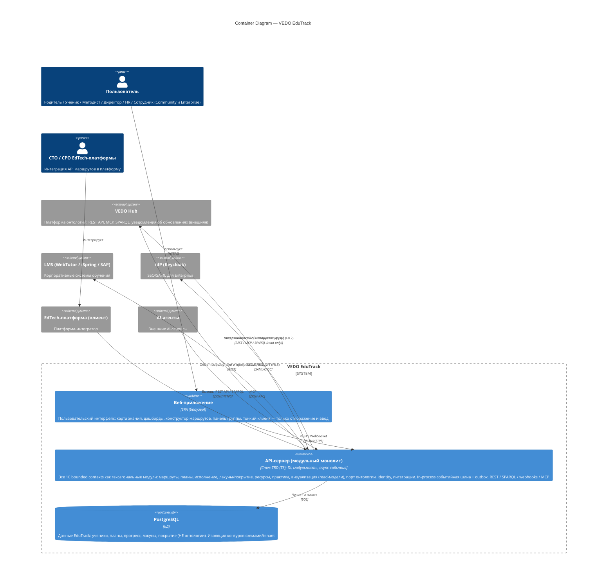

# C4 Level 2: Container Diagram — VEDO EduTrack

> Уровень 2 модели C4: крупные строительные блоки (контейнеры) системы и их взаимодействие. Первичные источники: `specs/vision.md` §2.2 (функции F0–F6), `specs/glossary.md` §4 (архитектура), `specs/adr/ADR-DES.INFRA.modular-monolith-approach.md` (архитектурный стиль), `specs/ddd/context-map.md` (ограниченные контексты), `REQ-NFR-infra.compliance.client-server-web-app` (форма поставки).

## Диаграмма

## Легенда

| Контейнер | Тип | Описание |
|-----------|-----|----------|
| **Веб-приложение** | SPA (браузер) | Тонкий клиент: рендерит карту знаний (F4), дашборды, конструктор маршрутов, панель группы. Не содержит алгоритмов ядра — только отображение и ввод (согласуется с `REQ-NFR-infra.compliance.client-server-web-app`). |
| **API-сервер (модульный монолит)** | Приложение | Ядро системы по ADR модульного монолита: 10 ограниченных контекстов как гексагональные модули внутри одного процесса. In-process событийная шина для каскадов (`ModuleMastered → RouteRecalculated → …`), outbox для внешних webhook. Детерминированное ядро (F1/F2) — чистые функции. Стек — TBD (T3), но стиль требует DI, модульность, async-события. |
| **PostgreSQL** | База данных | Хранит **только данные EduTrack** (ученики, планы, прогресс, покрытие) — не онтологии (они в VEDO Hub). Изоляция контуров Community/Enterprise — схемами/tenant. Единственный компонент хранения в MVP: кэш read-моделей (проекционные таблицы), кэш подграфа (in-memory), outbox-таблица и rate limiting закрываются PostgreSQL + in-memory кэш Go-процесса. |

### Модули внутри API-сервера (bounded contexts, не отдельные контейнеры)

| Модуль | Контекст | Отвечает за |
|--------|----------|-------------|
| Route Planning | `route-planning` (core) | Вычисление маршрута, горизонты, каскад (F1) |
| Plan Management | `plan-management` | План-снэпшот, расписание, контрольные точки (F1.8–F1.11) |
| Execution & Progress | `execution-progress` (core) | Траектория, план-факт, прогноз, отклонения (F2.4–F2.6) |
| Gap & Coverage | `gap-coverage` (core) | Лакуны, покрытие ФГОС, дефициты, аттестация (F2.1–F2.3, F2.7–F2.8) |
| Resources | `resources` | Каталог, подбор, доступность, бюджет (F3) |
| Practice & Life | `practice-life` | Истории, проектные идеи, качества (F5) |
| Visualization (read-модели) | `visualization` | Read-only проекции карты/дашбордов (F4) |
| Ontology Port (ACL) | `ontology-port` | Read-only чтение VEDO Hub, копирование подграфа (F0) |
| Identity & Access | `identity-access` | Аккаунты, роли, SSO (F6.5) |
| Integrations | `integrations` | REST API, SPARQL, webhooks, MCP, LMS (F6) |

## Контекст

Диаграмма построена для сценария «инженерный baseline (M0.1)» — фиксирует контейнеры до выбора стека (T3) и инженерной платформы (M0.2). Отражает ADR модульного монолита: движки маршрутов/исполнения/ресурсов — **модули одного контейнера**, а не отдельные сервисы; **хранилище маршрутов отсутствует** (маршрут вычисляется на лету и кэшируется in-memory — подграф онтологии иммутабелен по `ontologyVersion`, поэтому распределённый кэш не нужен).

> **Redis — пост-MVP**: не входит в MVP-контейнеры (один компонент хранения — PostgreSQL). Добавляется по триггеру (кросс-нодовый WebSocket/SSE fan-out, распределённый rate limiting при 10× нагрузке, тяжёлый outbox-трафик) как адаптер за портами кэша/очереди — без изменения ядра.

## Контуры развёртывания

Оба контура (Community SaaS / Enterprise on-prem) используют **одинаковый набор контейнеров** — отличаются конфигурацией и изоляцией:

| Контур | Размещение | Изоляция данных | Отличия |
|--------|-----------|-----------------|---------|
| **Community** | Публичное облако (SaaS) | Tenant-схемы в том же PostgreSQL | Без IdP (пароль/соцсети), тиры Community/Pro |
| **Enterprise** | on-premise / private cloud | Выделенный инстанс PostgreSQL | SSO/SAML через Keycloak, 152-ФЗ, изоляция полная |

## Связи с функциями (vision.md)

| Связь | Функции |
|-------|---------|
| Веб-приложение ↔ API-сервер | F1–F6 (весь пользовательский функционал через API) |
| API-сервер → VEDO Hub (read-only) | F0.1, F0.2, F0.3 |
| API-сервер → PostgreSQL | F2 (прогресс, планы, покрытие), F4 (read-модели), F6.4 (outbox) |
| API-сервер → LMS | F6.3 |
| API-сервер → IdP | F6.5 |
| EdTech-платформа → API-сервер | F6.1, F6.2 |
| AI-агенты → API-сервер | F6.6 |

## Связанные артефакты

- [System Context](context-system.md) — уровень 1
- [Компоненты](../c4/README.md) — уровень 3 (T7: route-engine, execution, ontology-port)
- [Карта контекстов](../ddd/context-map.md) — bounded contexts ↔ модули
- [ADR модульного монолита](../adr/ADR-DES.INFRA.modular-monolith-approach.md)
- [Граница ответственности](../boundary.md) — EduTrack vs VEDO Hub (T10)
