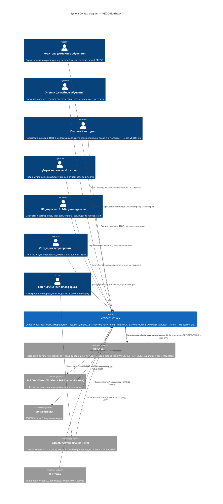

# C4 Level 1: System Context — VEDO EduTrack

> Уровень 1 модели C4: система и её внешние акторы и системы. Первичные источники: `specs/vision.md` §3.1 (профили заинтересованных лиц), §1.5 (приложения сервиса), §2.2 (функции F0–F6), `specs/glossary.md` §4 (архитектура), `specs/adr/ADR-DES.INFRA.modular-monolith-approach.md` (архитектурный стиль).

## Диаграмма

## Легенда

| Элемент | Тип | Описание |
|---------|-----|----------|
| **VEDO EduTrack** | Система (System) | Сервис образовательных маршрутов. Вычисляет маршруты на лету (функция, не документ) — хранилище маршрутов отсутствует. Разворачивается в двух контурах: Community (SaaS) и Enterprise (on-premise / private cloud). |
| **VEDO Hub** | Внешняя система | Платформа онтологий. **Всегда внешняя** — EduTrack читает онтологию через REST API / MCP / SPARQL и никогда не редактирует её. Владеет онтологиями, версионированием, форками, социальным хабом. |
| **Родитель / Ученик / Методист / Директор школы** | Человек (Community) | Акторы Community-контура (приложения «Дай пять», «Свой Вектор»). |
| **HR / Сотрудник** | Человек (Enterprise) | Акторы Enterprise-контура (приложение «Вектор Компетенций»). |
| **CTO/CPO EdTech-платформы** | Человек (программный пользователь) | Интегратор, подключающий API маршрутов в свою платформу (F6.1). |
| **EdTech-платформа (клиент)** | Внешняя система | Платформа-интегратор, через неё тысячи конечных пользователей получают маршруты (B2B-сценарий). |
| **LMS** | Внешняя система | WebTutor / iSpring / SAP SuccessFactors — корпоративные системы обучения (F6.3). |
| **IdP (Keycloak)** | Внешняя система | Identity Provider для SSO/SAML Enterprise (F6.5). |
| **AI-агенты** | Внешняя система | Внешние AI-сервисы через MCP-сервер (F6.6). |

## Контекст

Диаграмма построена для сценария «инженерный baseline (M0.1)»: фиксирует границу системы, её акторов и внешние зависимости до выбора стека. Отражает решение `ADR-DES.INFRA.modular-monolith-approach` (стиль) и `REQ-NFR-infra.compliance.client-server-web-app` (форма поставки: веб-приложение, клиент-сервер).

## Контуры развёртывания

| Контур | Экземпляр | Акторы | Размещение |
|--------|-----------|--------|------------|
| **Community** | Отдельный экземпляр EduTrack | Родитель, Ученик, Методист, Директор школы, CTO/CPO EdTech-платформы | SaaS (публичное облако) |
| **Enterprise** | Отдельный экземпляр EduTrack | HR/L&D, Сотрудник | on-premise / private cloud (152-ФЗ), SSO через Keycloak |

Оба контура — **разные экземпляры одной системы** с разными акторами, разделяющие один API-контракт (согласуется с `REQ-NFR-infra.compliance.community-enterprise-isolation`).

## Связи с функциями (vision.md)

| Связь | Функции |
|-------|---------|
| EduTrack ↔ VEDO Hub (read-only, уведомления) | F0.1, F0.2, F0.3 |
| Родитель / Ученик ↔ EduTrack | F1 (маршруты), F2 (исполнение), F4 (визуализация), F5 (практика) |
| Методист / Директор ↔ EduTrack | F2.7 (покрытие), F4.5 (дашборд методиста) |
| HR / Сотрудник ↔ EduTrack | F1 (онбординг), F2 (прогресс, аттестация) |
| EdTech-платформа ↔ EduTrack | F6.1 (REST API), F6.2 (SPARQL) |
| EduTrack ↔ LMS | F6.3 (коннекторы) |
| EduTrack ↔ IdP | F6.5 (SSO/SAML) |
| AI-агенты ↔ EduTrack | F6.6 (MCP-сервер) |

## Связанные артефакты

- [Контейнеры](container-overview.md) — уровень 2 (создаётся в T6)
- [Компоненты](../c4/README.md) — уровень 3 (T7)
- [Карта контекстов](../ddd/context-map.md) — ограниченные контексты
- [Граница ответственности](../boundary.md) — EduTrack vs VEDO Hub (T10)
- [Видение продукта](../vision.md) — §2.2, §3.1
- [Глоссарий](../glossary.md) — §4
