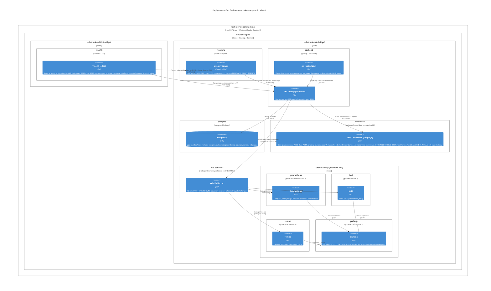

# C4 Level 4: Deployment Diagram — Dev Environment (local)

> Уровень 4 модели C4: физическое развёртывание. Сценарий — **локальная разработка** (`docker compose -f deploy/docker-compose.yml up -d --wait`, `make dev`). Первичный источник: `deploy/docker-compose.yml` (T6), `deploy/README.md` §Dev Environment (T8), ADR-IMPL.PROCESS.development-tooling §8.

## Диаграмма

## Легенда

| Узел | Технология | Роль |
|------|-----------|------|
| **traefik** | traefik:v3.1.2 | Edge (опционально в dev): TLS, маршруты api/spa, rate limit, security headers, circuit breaker; дашборд на host :8082 |
| **frontend / Vite** | node:24-alpine | SPA dev-сервер с HMR; `pnpm dev --host`; прокси `/api` → backend |
| **backend / air** | golang:1.26-alpine | Модульный монолит; air пересобирает при изменении `.go` (`backend/.air.toml`) |
| **postgres** | postgres:16-alpine | Единственное хранилище MVP; volume `postgres_data`, init-скрипт `deploy/postgres/init.sql` |
| **hub-mock** | Go (сборка из `backend/cmd/mockhub`) | Стенд VEDO Hub: GraphQL read-only, онтология из `.ttl` (`traceability.ttl` → `/data/ontology.ttl`); `VEDO_HUB_API_URL=http://hub-mock:8081` |
| **otel-collector** | otel/opentelemetry-collector-contrib | Приём OTLP, redaction PII (152-ФЗ), экспорт в 3 бэкенда |
| **prometheus / loki / tempo / grafana** | — | Observability-стек provisioned as-code (`deploy/observability/`) |

**Особенности dev-контура:** браузер ходит напрямую на Vite (`localhost:5173`) и API через его прокси — Traefik не является обязательной точкой входа в dev; конфигурация `deploy/traefik/` актуальна для SaaS/staging. Сеть `edutrack-public` содержит только Traefik.

## Контекст

Диаграмма отражает инженерную платформу M0.2 (T6): один набор сервисов поднимается одной командой (`make up` / `docker compose up -d --wait`). Внутренняя сеть `edutrack-net` — служебная, `edutrack-public` — Traefik-вход. Тома: `postgres_data`, `grafana_data`, `loki_data`, `tempo_data`, `frontend_node_modules` (контейнерный node_modules). Переменные — из `deploy/.env` с дефолтами в compose.

## Связи с артефактами

| Артефакт | Роль |
|----------|------|
| `deploy/docker-compose.yml` | Определяет весь dev-стек (T6) |
| `deploy/observability/` | Конфиги collector/prometheus/loki/tempo/grafana (T3) |
| `deploy/traefik/` | Edge-конфиг для SaaS (T7) |
| `deploy/postgres/init.sql` | Расширения и схема при первом старте (T3) |
| `backend/Dockerfile` | Production-образ (в dev не используется — hot-reload) |
| [Container diagram](container-overview.md) | Логические контейнеры этого развёртывания |

## Связанные артефакты

- [Container overview](container-overview.md) — логический уровень 2
- [Контуры развёртывания](../adr/../deploy/README.md) — Community vs Enterprise (M0.2, T8)
- [ADR-IMPL.PROCESS.development-tooling](../adr/ADR-IMPL.PROCESS.development-tooling.md) §8 — dev-env
- [REQ-NFR-infra.compliance.environment-isolation](../requirements/REQ-NFR-infra.compliance.environment-isolation.md) — сети compose
