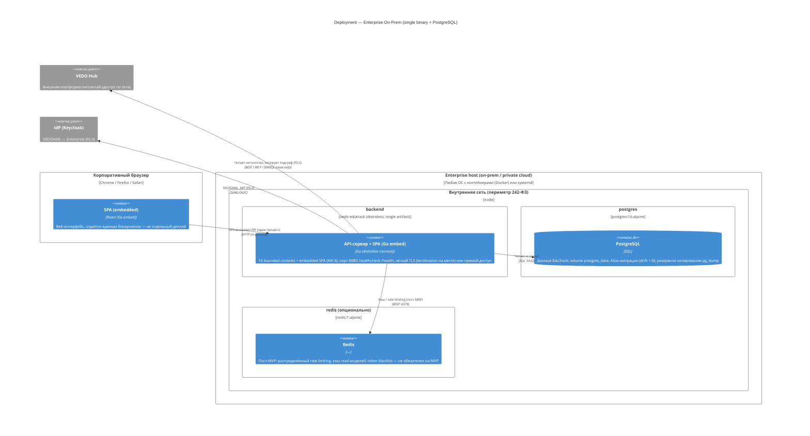

# C4 Level 4: Deployment Diagram — Enterprise On-Prem

> Уровень 4 модели C4: физическое развёртывание. Сценарий — **Enterprise on-prem / private cloud**: минимальный контур (единый бинарник с embedded SPA + PostgreSQL), соответствует 242-ФЗ (данные в периметре). Первичный источник: `deploy/README.md` §Enterprise On-Prem (T8), `backend/Dockerfile` (T4–T5), ADR-DES.INFRA.modular-monolith-approach §7–8.

## Диаграмма

## Легенда

| Узел | Технология | Роль |
|------|-----------|------|
| **backend** | vedo-edutrack (distroless) | **Единственный артефакт**: SPA встроена в бинарник через Go embed (M0.3) — на one-artifact деплой без orchestration |
| **postgres** | postgres:16-alpine | Единственное обязательное хранилище; `pg_dump` перед миграциями; откат ≤ 15 мин |
| **redis** | redis:7-alpine | Опционально (пост-MVP): rate limiting при 2+ репликах, кэш read-моделей, token blacklist |
| **Traefik / OTel / Grafana** | — | **Не входят** в минимальный контур: телеметрия в периметре (242-ФЗ), TLS — на месте |

**Отличия от SaaS:** нет Traefik-эджа (или опциональный), нет nginx-контейнера (SPA embedded), observability-стек — по требованию Enterprise, без внешней телеметрии. Данные и логи остаются в периметре (242-ФЗ).

## Контекст

Контур Enterprise выводится из container strategy (`deploy/README.md`, T8): «single Go binary (embedded SPA) + PostgreSQL only; Redis optional; no orchestration required on MVP; K8s/Helm post-MVP». Соответствует `REQ-NFR-ops.compliance.support-sla` (один артефакт упрощает поддержку) и `REQ-NFR-infra.compliance.community-enterprise-isolation`. Требования SSO/SAML — через Keycloak (пост-MVP адаптер, F6.5), телеметрия — в периметре.

## Связи с артефактами

| Артефакт | Роль |
|----------|------|
| `backend/Dockerfile` | Distroless-образ с embedded SPA (T4–T5) |
| `deploy/postgres/init.sql` | Расширения и схема (T3) |
| [Container diagram](container-overview.md) | Логические контейнеры |

## Связанные артефакты

- [Deployment: Dev](deployment-dev.md) — локальный контур
- [Deployment: SaaS](deployment-saas.md) — Community-контур
- [Container overview](container-overview.md) — уровень 2
- [Container strategy](../../deploy/README.md) — Enterprise-контур (M0.2, T8)
- [ADR-DES.INFRA.modular-monolith-approach](../adr/ADR-DES.INFRA.modular-monolith-approach.md) §7–8 — Go embed
- [REQ-NFR-ops.compliance.support-sla](../requirements/REQ-NFR-ops.compliance.support-sla.md)
