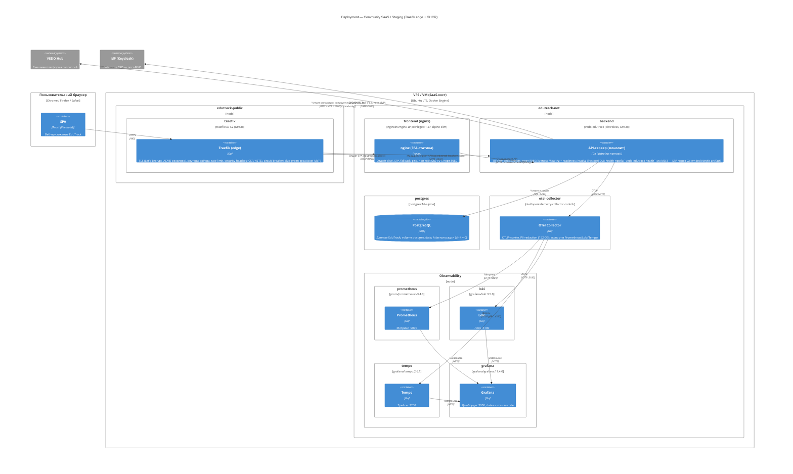

# C4 Level 4: Deployment Diagram — Community SaaS / Staging

> Уровень 4 модели C4: физическое развёртывание. Сценарий — **SaaS (Community) / staging**: Traefik-эдж + compose-стек, образы из GHCR. Первичный источник: `deploy/README.md` §SaaS Deployment (T8), `deploy/traefik/` (T7), `deploy/docker-compose.yml` (T6), `.github/workflows/ci.yml` (T12).

## Диаграмма

## Легенда

| Узел | Технология | Роль |
|------|-----------|------|
| **traefik** | traefik:v3.1.2 | Единственная точка входа: TLS (Let's Encrypt staging→prod), роутинг SPA/API, rate limiting, CSP/HSTS, circuit breaker; blue-green weighted (post-MVP) |
| **frontend (nginx)** | nginxinc/nginx-unprivileged:1.27-alpine-slim | SPA-статика, non-root UID 101, SPA-fallback, 404 для отсутствующих файлов; вариант B (SaaS/CDN) |
| **backend** | vedo-edutrack (distroless) | Модульный монолит ~1.4 МБ, nonroot, healthcheck; M0.3 — embedded SPA (single artifact) |
| **postgres** | postgres:16-alpine | Единственное хранилище; Atlas-миграции, drift = 0 |
| **Observability** | OTel → Prom/Loki/Tempo + Grafana | Golden-signals, provisioning as-code, PII-redaction |

**GHCR-поставка:** образы собираются в CI (T12) и пушатся на `main` с тегами `:latest` и `:sha-<commit>` (`deploy/ci/push-images.sh`). Размер distroless-образа контролируется гейтом `docker-build` (≤ 20 МБ).

## Контекст

Диаграмма соответствует SaaS-контуру Community из `deploy/README.md` (T8): Traefik-эдж + полный OTel-стек + nginx-вариант SPA. Blue-green деплой — пост-MVP через weighted-сервисы Traefik (canary + kill switch ≤ 5 мин, `REQ-NFR-ops.release.canary-kill-switch`). В отличие от dev — нет air/Vite; образы из реестра. Enterprise-контур — отдельная диаграмма (`deployment-enterprise.md`).

## Связи с артефактами

| Артефакт | Роль |
|----------|------|
| `deploy/traefik/traefik.yml` | Static: entrypoints, ACME-резолвер, docker/file-провайдеры (T7) |
| `deploy/traefik/dynamic.yml` | Routers api/spa, middlewares, weighted blue-green (T7) |
| `backend/Dockerfile` | Distroless-образ бэкенда (T4) |
| `frontend/Dockerfile` | nginx-вариант SPA (T5) |
| `.github/workflows/ci.yml` + `deploy/ci/` | Сборка и публикация образов (T12, T16) |
| [Container diagram](container-overview.md) | Логические контейнеры |

## Связанные артефакты

- [Deployment: Dev](deployment-dev.md) — локальный контур
- [Deployment: Enterprise](deployment-enterprise.md) — on-prem минимальный
- [Container overview](container-overview.md) — уровень 2
- [Container strategy](../../deploy/README.md) — SaaS-контур (M0.2, T8)
- [ADR-IMPL.PROCESS.development-tooling](../adr/ADR-IMPL.PROCESS.development-tooling.md) §7–8
- [REQ-NFR-ops.release.canary-kill-switch](../requirements/REQ-NFR-ops.release.canary-kill-switch.md)
