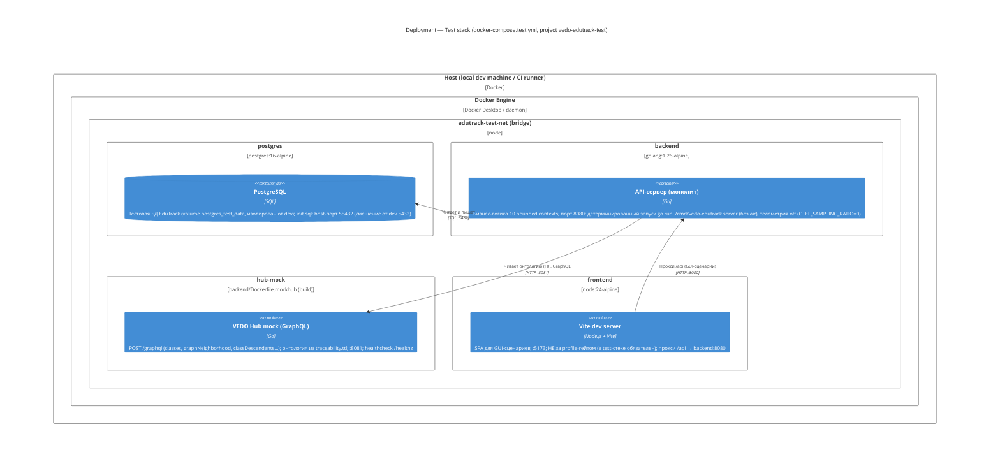

# C4 Level 4: Deployment Diagram — Test Environment (E2E / integration)

> Уровень 4 модели C4: физическое развёртывание. Сценарий — **E2E-тесты и интеграционные прогоны** (локально и в GitHub Actions через `deploy/ci/e2e-run.sh`). Первичный источник: `deploy/docker-compose.test.yml` (ADR-IMPL.INFRA.dev-test-compose-separation), `deploy/ci/gates.yaml` (T16), `.github/workflows/ci.yml` (T12), ADR-DES.INFRA.mock-hub-strategy (T20).

## Диаграмма

## Контекст

Test-стек (compose-проект **`vedo-edutrack-test`**) — минимальный набор для E2E и интеграционных прогонов: только то, что нужно тестам. **Исключены** намеренно: observability (otel-collector, prometheus, loki, tempo, grafana) и traefik — они не участвуют в тестах и удлиняют цикл. Тома изолированы (`postgres_test_data`) — `make test-down --volumes` не может затронуть dev-данные. Postgres на host-порту `55432` — dev (5432) и test стеки могут работать параллельно.

Жизненный цикл управляется `deploy/ci/e2e-run.sh <gui|api>`: probe (api: `:8080/healthz`, gui: `:5173`) → `make test-up` → Playwright → `make test-down` (trap на падение). E2E-гейты `e2e-gui` / `e2e-api` (`deploy/ci/gates.yaml`) вызывают этот скрипт; в CI те же гейты гоняет джоба `test` (`.github/workflows/ci.yml`).

## Связи с артефактами

| Артефакт | Роль |
|----------|------|
| `deploy/docker-compose.test.yml` | Определяет test-стек (4 сервиса) |
| `deploy/ci/e2e-run.sh` | Автоматический lifecycle стека (up → test → down) |
| `deploy/ci/gates.yaml` | Гейты `e2e-gui` / `e2e-api` |
| `backend/Dockerfile.mockhub` | Образ стенда (T24) |
| `backend/internal/testing/mockhub` | Тот же хендлер как `httptest.Server` (T22) |
| `traceability.ttl` | Первый сид онтологии стенда |
| [ADR-IMPL.INFRA.dev-test-compose-separation](../adr/ADR-IMPL.INFRA.dev-test-compose-separation.md) | Решение о разделении dev/test стеков |
| [ADR-DES.INFRA.mock-hub-strategy](../adr/ADR-DES.INFRA.mock-hub-strategy.md) | Дизайн стенда (T20) |
