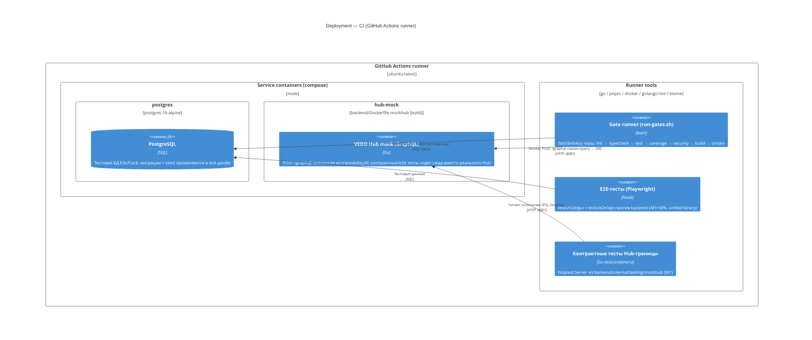

# C4 Level 4: Deployment Diagram — CI Test Environment (GitHub Actions)

> Уровень 4 модели C4: физическое развёртывание. Сценарий — **непрерывная интеграция** (GitHub Actions, `deploy/ci/run-gates.sh --tier delivery`). Первичный источник: `.github/workflows/ci.yml` (T12), `deploy/ci/gates.yaml` (T16), ADR-DES.INFRA.mock-hub-strategy (T20).

## Диаграмма

## Контекст

CI собирает unified backend-образ (API + embedded SPA, `backend/Dockerfile`) и образ `hub-mock` (`backend/Dockerfile.mockhub`), затем прогоняет гейты delivery-тира. Контрактные тесты границы Hub (M1) и e2e-сценарии ходят на `hub-mock` вместо реального VEDO Hub — контролируемый стенд закрывает зависимость `REQ-NFR-api.availability.hub-dependency-sla` в CI.

## Связи с артефактами

| Артефакт | Роль |
|----------|------|
| `.github/workflows/ci.yml` | CI-пайплайн: build обоих образов + smoke (T12, T25) |
| `deploy/ci/gates.yaml` | Манифест гейтов (T16) |
| `backend/Dockerfile.mockhub` | Образ стенда (T24) |
| `backend/internal/testing/mockhub` | Тот же хендлер как `httptest.Server` (T22) |
| `traceability.ttl` | Первый сид онтологии стенда |
| [ADR-DES.INFRA.mock-hub-strategy](../adr/ADR-DES.INFRA.mock-hub-strategy.md) | Дизайн стенда (T20) |
