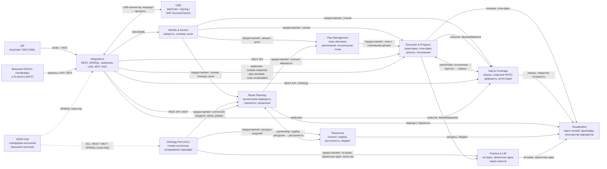

# Карта контекстов (Context Map) — VEDO EduTrack

> Документ идентифицирует ограниченные контексты (bounded contexts) предметной области VEDO EduTrack и связи между ними. Первичные источники: `specs/vision.md` §2.2 (декомпозиция функций F0–F6), `specs/glossary.md` §4 (архитектура сервиса), 42 UC из `specs/use-cases/`.

## Контекст построения

Карта контекстов построена для сценария «инженерный baseline до выбора стека»: фиксирует границы предметной области и их отношения до принятия стековых решений (ADR `DES.STACK.*`, M0.1 T3). Все инварианты из `specs/glossary.md` и `specs/vision.md` соблюдаются: маршрут — функция, а не документ; VEDO Hub — внешняя система; два контура (Community / Enterprise) разделяют один API-контракт.

---

## Диаграмма карты контекстов

---

## Ограниченные контексты

> **Классификация контекстов** (DDD: core / supporting / generic):
> - **Core** — конкурентное преимущество: уникальные алгоритмические механики ядра (маршруты F1, исполнение и диагностика лакун F2, покрытие ФГОС). Максимальные инвестиции in-house, приоритет качества и тестов (ядро F1/F2 ≥ 90% покрытия, mutation testing).
> - **Supporting** — важная, но не дифференцирующая кастомная логика: строим сами, прагматично, средний уровень инвестиций.
> - **Generic** — товарная инфраструктура: переиспользуем готовые компоненты (Keycloak/SSO, API-шлюз, webhook/MCP-фреймворки, граф-библиотеки визуализации).

| # | Контекст | Класс | ID (slug) | Функции (vision.md) | Ключевые UC | Описание |
|---|----------|--------|-----------|----------------------|-------------|----------|
| 1 | **Identity & Access** | **Generic** | `identity-access` | F6.5 | `UC-api.sso.keycloak-sso-integration` | Учётные записи (Account), ученики (Learner), роли и границы видимости (родитель → дети, директор → школа, HR → департамент), SSO/SAML. Владеет агрегатами `Account` и `Learner` (идентичность + позиция ученика). |
| 2 | **Ontology Port (ACL)** | **Supporting** | `ontology-port` | F0.1, F0.2, F0.3 | `UC-plan.compute.shortest-path-to-goal` (косвенно, через онтологию) | Антикоррупционный слой (ACL) между EduTrack и VEDO Hub: read-only чтение модулей, связей, рамок, концепций, ресурсов, историй через REST/MCP/SPARQL; копирование релевантного подграфа; подписка на обновления (F0.3). Явная граница — см. `specs/requirements/REQ-NFR-api.compliance.ownership-boundary.md` (T10). |
| 3 | **Route Planning** | **Core** | `route-planning` | F1.1–F1.7, F1.12 | `UC-plan.compute.*`, `UC-plan.gap.analyze-gap-to-goal`, `UC-plan.horizon.show-three-horizons` | Вычисление маршрута как функции `Route = f(position, goal, concept, ontologyVersion)`: двухэтапное вычисление на скопированном подграфе, веса связей (strict/soft/enrich), essential-ядро, три горизонта, педагогические концепции, анализ разрыва до цели, каскад пересчёта. Маршрут — проекция, не агрегат. |
| 4 | **Plan Management** | **Supporting** | `plan-management` | F1.8–F1.11 | `UC-plan.fixation.snapshot-plan`, `UC-plan.recalculation.revise-plan-on-delta`, `UC-plan.constraint.apply-checkpoints-and-fgos` | Владеет агрегатом `LearningPlan` (снэпшот маршрута + плановые даты, зафиксированный на контрольной точке) и `Schedule` (расписание). Фиксация плана, пересмотр плана по дельте (>15% модулей или >2 недель), контрольные точки и формальные рамки как входные ограничения, межпредметная синхронизация расписания. |
| 5 | **Execution & Progress** | **Core** | `execution-progress` | F2.4, F2.5, F2.6 | `UC-execute.progress.plan-vs-actual-comparison`, `UC-execute.forecast.binary-readiness-forecast`, `UC-execute.alert.deviation-alert` | Владеет траекторией (факт): план-факт по шагам, отклонения с причинами, прогноз выполнения к контрольной точке (успевает / под риском / не успевает), уведомления об отклонениях. Потребляет позицию ученика и снэпшот плана. |
| 6 | **Gap & Coverage** | **Core** | `gap-coverage` | F2.1–F2.3, F2.7, F2.8 | `UC-execute.gap.diagnose-root-cause`, `UC-execute.coverage.*`, `UC-execute.assessment.assessment-item-generation`, `UC-execute.attestation.attestation-readiness-report` | Диагностика корневых лакун (подъём по strict-связям до первого неосвоенного модуля), проверочные задания и IRT-калибровка, сверка «живого» знания с формальной рамкой, покрытие ФГОС/профстандарта, дефициты с приоритетами, аттестационная готовность. |
| 7 | **Resources** | **Supporting** | `resources` | F3.1–F3.4 | `UC-resource.catalog.filter-by-format`, `UC-resource.match.match-resources-to-learner`, `UC-resource.availability.check-availability-and-alternatives`, `UC-resource.budget.estimate-route-budget` | Контент-ресурсы и ресурсы обеспечения, привязанные к модулям; подбор под ученика (формат, стиль, сложность, длительность, бюджет); доступность и альтернативы; затраты и бюджет маршрута. |
| 8 | **Practice & Life** | **Supporting** | `practice-life` | F5.1–F5.4 | `UC-practice.stories.recommend-stories-at-mastery`, `UC-practice.projects.suggest-cross-subject-projects`, `UC-practice.qualities.development-map` | Истории и контекст «зачем это знать», проектные идеи на стыке модулей, рекомендация историй/проектов в момент освоения, карта качеств и воспитательная маркировка. |
| 9 | **Visualization** | **Supporting** | `visualization` | F4.1–F4.7 | `UC-viz.map.view-knowledge-graph-with-progress`, `UC-viz.map.view-gap-diagnostic-map`, `UC-viz.dashboard.*`, `UC-viz.builder.construct-route-visually`, `UC-viz.panel.group-management-panel`, `UC-a11y.*` | Read-only проекции над другими контекстами: карта знаний с цветовым кодированием прогресса, карта лакун, дашборды ученика/родителя/HR/методиста, конструктор маршрутов, панель группы. Не владеет данными — только читает. |
| 10 | **Integrations** | **Generic** | `integrations` | F6.1–F6.4, F6.6, F6.7 | `UC-api.rest.compute-route`, `UC-api.rest.query-progress`, `UC-api.rest.query-coverage`, `UC-api.sparql.read-only`, `UC-api.webhooks.*` | Интеграционный фасад: REST API маршрутов, read-only SPARQL endpoint, LMS-коннекторы, идемпотентные webhooks, MCP-сервер, контент-агностичность. Единая точка входа для внешних систем; разделяет один API-контракт для двух контуров. |

---

## Отношения между контекстами

| Отношение | Тип | Контекст A | Контекст B | Описание |
|-----------|-----|------------|------------|----------|
| ACL | ACL | VEDO Hub | `ontology-port` | Порт онтологии — антикоррупционный слой: изолирует ядро от изменений Hub (REST/MCP/SPARQL, read-only). |
| Customer-supplier | CS | `identity-access` | `route-planning`, `plan-management`, `execution-progress`, `gap-coverage` | Поставщик: идентичность ученика, аккаунт, роли, позиция. Потребители строят расчёты на позиции. |
| Customer-supplier | CS | `ontology-port` | `route-planning`, `practice-life`, `resources` | Поставщик: онтология (модули, связи, рамки, истории, проектные идеи, ресурсы). |
| Customer-supplier | CS | `route-planning` | `plan-management` | Поставщик: снэпшот маршрута. План фиксирует маршрут на контрольной точке; маршрут продолжает пересчитываться независимо (shared kernel: маршрут-снэпшот). |
| Customer-supplier | CS | `plan-management` | `execution-progress` | Поставщик: план с плановыми датами. Исполнение измеряет план-факт. |
| Partnership | PT | `execution-progress` | `gap-coverage` | Совместная эволюция: отклонения ↔ прогноз ↔ лакуны ↔ покрытие; события `ModuleMastered` и `PlanDeviationDetected` связывают контексты. |
| Partnership | PT | `route-planning` | `resources` | Совместная эволюция: подбор ресурсов влияет на маршрут; доступность ресурсов — ограничение расписания. |
| Customer-supplier | CS | `execution-progress` | `practice-life` | Поставщик: событие `ModuleMastered` — триггер рекомендаций историй и проектных идей. |
| Facade (Read) | CS | `execution-progress`, `gap-coverage`, `route-planning`, `resources`, `practice-life` | `visualization` | Визуализация — read-only проекции; читает маршрут, горизонты, позицию, лакуны, покрытие, ресурсы. |
| Facade (API) | CS | `integrations` | `route-planning`, `execution-progress`, `gap-coverage`, `identity-access` | Интеграционный фасад над ядром: REST/SPARQL/webhooks/MCP/SSO. |

---

## Инварианты, соблюдаемые картой

- **Маршрут — функция, не документ**: `route-planning` не владеет хранилищем маршрутов; маршрут — проекция, пересчитываемая по триггерам. План (снэпшот) живёт в `plan-management`.
- **Траектория всегда видна рядом с маршрутом и планом**: `execution-progress` владеет фактом; `visualization` показывает оба слоя.
- **VEDO Hub — внешняя система**: доступ только через `ontology-port` (ACL) и read-only SPARQL через `integrations`.
- **Essential-ядро нерушимо**: `route-planning` учитывает обязательные модули контекста обучения; порядок и темп вариативны.
- **Диагностика лакун — подъём по strict-связям**: алгоритм закреплён за `gap-coverage`, потребляет позицию из `identity-access`/`execution-progress`.
- **Два контура (Community / Enterprise) — один API-контракт**: `integrations` и `identity-access` учитывают оба контура (разные роли и границы видимости).

---

## Трассируемость

Каждый ограниченный контекст трассируется минимум к одной функции F0–F6 и одному UC (см. таблицу контекстов). Полная цепочка: `Vision → UC → FR → ADR → COMP → TEST` поддерживается в `traceability.ttl` (см. T9).

## Связанные артефакты

- [Видение продукта](../vision.md) — §2.2 (функции), §2.4 (события), §3.1 (акторы)
- [Глоссарий](../glossary.md) — §1 (доменные термины), §4 (архитектура)
- [Прецеденты использования](../use-cases/README.md)
- [Архитектурные решения](../adr/README.md)
- [C4-диаграммы](../c4/README.md)
- [Граница ответственности](../requirements/REQ-NFR-api.compliance.ownership-boundary.md) (T10)
