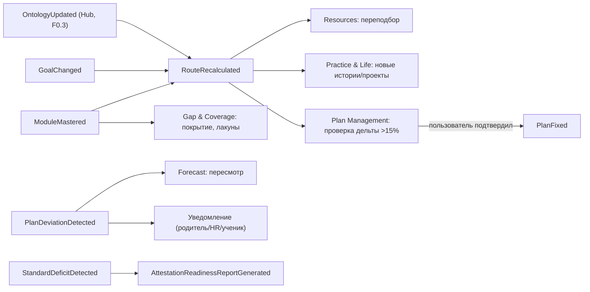

# Каталог доменных событий — VEDO EduTrack

> Каталог событий предметной области: имя, триггер, источник (producer), получатель (consumer), эскиз payload и действие системы. Первичные источники: `specs/vision.md` §2.4 (основные события предметной области), `specs/glossary.md` §5 (событие предметной области, вебхук), `specs/ddd/context-map.md` (контексты-производители и потребители), `specs/ddd/aggregates.md` (агрегаты и проекции).

## Принципы

- **События ядра** публикуются агрегатами/сервисами EduTrack; **внешние события** (VEDO Hub, приложения) помечены отдельно.
- **Каскады пересчёта** явно описаны: `ModuleMastered` → `RouteRecalculated` → переподбор ресурсов + рекомендации историй/проектов.
- **Webhook-форматы** (`route.recalculated`, `module.mastered`, `plan.deviated`, `standard.risk_detected`) — внешнее представление событий ядра через `integrations`, **идемпотентные** (дублирование не ломает состояние).
- Два контура (Community / Enterprise) разделяют один набор событий; различаются каналы доставки и права подписки.

---

## События ядра EduTrack

### 1. `RouteRecalculated`
| Поле | Значение |
|------|----------|
| **Триггер** | Освоение модуля / обновление онтологии / смена цели / периодическая проверка |
| **Источник (producer)** | `route-planning` (RouteComputationService / CascadeRecomputeService) |
| **Получатели (consumers)** | `plan-management` (пересмотр плана по дельте), `resources` (переподбор ресурсов), `practice-life` (новые рекомендации историй/проектов), `visualization` (обновление карты и дашбордов), `integrations` (webhook `route.recalculated`) |
| **Payload (эскиз)** | `{ routeId, learnerId, goalId, ontologyVersion, steps: [RouteStep], horizons: {far, mid, near}, computedAt }` |
| **Действие системы** | Пересчитать маршрут, обновить три горизонта, подобрать ресурсы, рекомендовать истории/проекты |

### 2. `GoalChanged`
| Поле | Значение |
|------|----------|
| **Триггер** | Смена цели учеником, родителем или HR |
| **Источник** | `identity-access` (Learner) / интерфейс / API |
| **Получатели** | `route-planning` (перестройка маршрута → `RouteRecalculated`), `plan-management` (условие пересмотра плана) |
| **Payload (эскиз)** | `{ learnerId, previousGoalId, newGoalId, changedBy, changedAt }` |
| **Действие системы** | Обновить цель ученика, вызвать перестройку маршрута |

### 3. `PlanFixed`
| Поле | Значение |
|------|----------|
| **Триггер** | Начало периода / контрольная точка |
| **Источник** | `plan-management` (PlanService) |
| **Получатели** | `execution-progress` (основа план-факт), `visualization` (дашборды), `integrations` |
| **Payload (эскиз)** | `{ planId, learnerId, routeSnapshotId, schedule: [{stepRef, plannedStart, plannedEnd}], checkpoints, ontologyVersion, fixedAt }` |
| **Действие системы** | Зафиксировать снэпшот маршрута как план обучения на период, сохранить плановые даты |

### 4. `ModuleMastered`
| Поле | Значение |
|------|----------|
| **Триггер** | Прохождение теста / подтверждение преподавателем / событие из LMS |
| **Источник** | `execution-progress` (TrajectoryService) / интерфейс / API (LMS) |
| **Получатели** | `route-planning` (→ `RouteRecalculated`), `gap-coverage` (обновление покрытия, пересчёт лакун), `practice-life` (рекомендация историй/проектов, F5.3), `visualization`, `integrations` (webhook `module.mastered`) |
| **Payload (эскиз)** | `{ learnerId, moduleRef, masteryLevel, source, masteredAt }` |
| **Действие системы** | Записать освоение в позицию ученика (уровень, `masteredAt`), вызвать `RouteRecalculated` |

### 5. `PlanDeviationDetected`
| Поле | Значение |
|------|----------|
| **Триггер** | Фактическая дата > плановой на N дней (выход за допуск, ±15%) |
| **Источник** | `execution-progress` (DeviationAlertService) |
| **Получатели** | `gap-coverage` (пересмотр прогноза/лакун), `visualization` (уведомления в дашбордах), `integrations` (webhook `plan.deviated`) |
| **Payload (эскиз)** | `{ learnerId, planId, stepRef, deviationDays, reason, threshold, detectedAt }` |
| **Действие системы** | Создать уведомление: «Отставание по модулю X на N дней. Рекомендация.», обновить прогноз выполнения плана |

### 6. `StandardDeficitDetected`
| Поле | Значение |
|------|----------|
| **Триггер** | Периодическая сверка с формальной рамкой (ФГОС/профстандарт/CEFR) / приближение контрольной точки |
| **Источник** | `gap-coverage` (CoverageService) |
| **Получатели** | `visualization`, `integrations` (webhook `standard.risk_detected`), `plan-management` (вход для пересмотра) |
| **Payload (эскиз)** | `{ learnerId, standardRef, checkpointId, deficits: [{standardRequirement, priority}], coverage, forecast, detectedAt }` |
| **Действие системы** | Создать уведомление: «N требований рамки не закрыты. Критический путь: ... Прогноз: ...» |

### 7. `AttestationReadinessReportGenerated`
| Поле | Значение |
|------|----------|
| **Триггер** | Запрос родителя/школы / за 30 дней до контрольной точки |
| **Источник** | `gap-coverage` (AttestationReadinessService) |
| **Получатели** | `visualization` (отчёт), `integrations` |
| **Payload (эскиз)** | `{ learnerId, checkpointId, coverageByDomain: {domain, coverage}, deficits, criticalPath, forecast, generatedAt }` |
| **Действие системы** | Сформировать отчёт: предметы, % покрытия, дефициты, прогноз, критический путь |

### 8. `CrossDisciplinaryDiscoveryOffered`
| Поле | Значение |
|------|----------|
| **Триггер** | Освоение модуля из нового предмета открывает неожиданную связь |
| **Источник** | `route-planning` / `practice-life` (движок EduTrack) |
| **Получатели** | `visualization` (интерфейс ученика) |
| **Payload (эскиз)** | `{ learnerId, masteredModuleRef, discovery: {moduleA, moduleB, storyRef}, offeredAt }` |
| **Действие системы** | Показать рекомендацию: «Ты освоил "Пропорции" (математика). А знаешь, что это основа музыкальной гармонии?» |

---

## Внешние события (из других систем)

### 9. `OntologyContributionSubmitted` (VEDO Hub)
| Поле | Значение |
|------|----------|
| **Триггер** | Методист/платформа отправляет запрос на слияние (pull request) в публичную онтологию |
| **Источник** | VEDO Hub |
| **Получатели** | VEDO Hub (сопровождающие) |
| **Payload (эскиз)** | `{ mergeRequestId, authorId, semanticDiff: {added, changed} }` |
| **Действие системы** | Создать запрос на слияние с семантическим сравнением, уведомить сопровождающих. **EduTrack не участвует.** |

### 10. `OntologyContributionMerged` (VEDO Hub)
| Поле | Значение |
|------|----------|
| **Триггер** | Принятие запроса на слияние сопровождающим |
| **Источник** | VEDO Hub |
| **Получатели** | VEDO Hub (обновление онтологии), EduTrack `ontology-port` (уведомление F0.3) |
| **Payload (эскиз)** | `{ mergeRequestId, ontologyVersion, changedModules, changedLinks }` |
| **Действие системы** | Обновить публичную онтологию, обновить рейтинг контрибьютора, вызвать каскадный `RouteRecalculated` для всех форков |

### 11. `OnboardingPlanGenerated` (Приложение «Вектор Компетенций»)
| Поле | Значение |
|------|----------|
| **Триггер** | Новый сотрудник назначен на роль |
| **Источник** | HR-система / интерфейс |
| **Получатели** | EduTrack `route-planning` / `plan-management` |
| **Payload (эскиз)** | `{ employeeId, roleId, essentialModules, startDate }` |
| **Действие системы** | Построить онбординг-маршрут: essential-модули роли, пререквизиты, временная оценка, зафиксировать план |

### 12. `OnboardingCompleted` (Приложение «Вектор Компетенций»)
| Поле | Значение |
|------|----------|
| **Триггер** | Все essential-модули роли освоены |
| **Источник** | Приложение «Вектор Компетенций» |
| **Получатели** | HR-дашборд |
| **Payload (эскиз)** | `{ employeeId, roleId, actualDuration, deviations, roi }` |
| **Действие системы** | Создать отчёт: фактическое время онбординга, отклонения от плана, возврат инвестиций |

---

## Матрица каскадов (событие → каскад)

---

## Webhook-представления (через `integrations`)

| Webhook (внешний формат) | Событие ядра | Идемпотентность |
|--------------------------|--------------|-----------------|
| `route.recalculated` | `RouteRecalculated` | `idempotencyKey` + секрет подписи; дубли не ломают состояние |
| `module.mastered` | `ModuleMastered` | idem |
| `plan.deviated` | `PlanDeviationDetected` | idem |
| `standard.risk_detected` | `StandardDeficitDetected` | idem |

---

## Связанные артефакты

- [Карта контекстов](context-map.md)
- [Агрегаты, сущности, VO](aggregates.md)
- [Видение продукта](../vision.md) — §2.4 (события), §2.2 (F1.6 каскад, F6.4 webhooks)
- [Глоссарий](../glossary.md) — §5 (API и события)
