# Документ о концепции и границах проекта: VEDO EduTrack

**VEDO EduTrack** — отраслевой сервис, использующий API и MCP-сервер платформы **VEDO Hub** для проектирования индивидуальных образовательных маршрутов, расчёта учебных планов и отслеживания фактического прогресса по связной карте знаний.

**VEDO** — **V**irtual **E**nvironment for **D**eveloping **O**ntologies (Виртуальная среда для разработки онтологий)

*Платформы продают курсы. EduTrack строит маршруты к цели — на общей карте знаний.*

### Название продукта

**VEDO EduTrack** — сервис образовательных маршрутов на базе VEDO Hub: проектирование и исполнение индивидуальных маршрутов, расчёт планов и покрытия формальных рамок. Название едино для ядра, API, документации и интеграций; приложения сервиса носят собственные имена («Дай пять», «Свой Вектор», «Вектор Компетенций»).

---

## 1. Бизнес-требования

### 1.1. Исходные данные и постановка бизнес-проблемы

Современное образование — как школьное, так и корпоративное — страдает от фундаментальной проблемы: каждый предмет изучается сам по себе, отдельно от остальных, а связи между ними существуют только в головах отдельных методистов и преподавателей. Школьная программа по математике не знает, что производные понадобятся на физике через месяц. Учебник биологии не ссылается на химию, хотя фотосинтез — это химическая реакция. EdTech-платформы строят графы зависимостей вручную и изолированно. Корпорации теряют миллионы на неэффективном онбординге и регуляторных галочках.

Ниже — ключевые бизнес-проблемы через конкретные сценарии и их последствия.

| ID | Проблема (Сценарий) | Частотность / Масштаб | Измеримое влияние (Деньги / Время / Риски) | Текущая альтернатива |
|---|---|---|---|---|
 | **P1** | **Марина**, мама 12-летнего Миши на семейном обучении. Миша перешёл в 7 класс. Марина — филолог, она не знает, в каком порядке проходить темы школьной программы. По математике: «Проценты» проходят до «Пропорций» или наоборот? А «Линейные уравнения» — до или после «Функций»? По физике: можно ли начать «Механику», если ещё не освоена тема «Векторы» из геометрии? По биологии: «Фотосинтез» требует понимания химических реакций, но химия начинается только в 8 классе — как объяснить? На рынке десятки учебников: Мерзляк, Макарычев, Мордкович, Дорофеев, Атанасян, Пёрышкин — и у каждого автора свой порядок тем. В одном учебнике «Проценты» идут в сентябре, в другом — в апреле. Родители из чата хоумскулеров советуют одно, знакомый педагог из бывшей школы Миши — другое, обзоры на YouTube — третье. Разобраться в этом без методического образования невозможно. Марина покупает три учебника по математике разных авторов, подписку на онлайн-школу, сборники задач. В итоге: Миша учит «Пропорции» до «Процентов», «Функции» до «Уравнений», а тема «Системы уравнений» вообще пропущена — её не было ни в одном из купленных материалов. **40-60% пересечения учебных материалов. Потеря 6-12 месяцев. Пробелы в фундаменте, обнаруженные перед ОГЭ.** | Ежедневно, каждый родитель-хоумскулер | **Потеря времени:** 6-12 месяцев на неоптимальных маршрутах. **Деньги:** 3-5 учебных пособий с 40-60% пересечением. **Риск:** пробелы по темам ФГОС, обнаруженные перед ОГЭ/ЕГЭ. Когнитивная перегрузка родителя. | Самостоятельная компиляция программы из 3-7 источников, форумы хоумскулеров, метод проб и ошибок. |
| **P2** | **Миша** освоил тему «Проценты» по математике. Дальше по учебнику — «Пропорции» и «Отношения». Ему скучно: он не видит, зачем это нужно. Никто не говорит ему: «Проценты — это не просто задачи про скидки. Ты можешь применить их в биологии для расчёта состава популяции, в географии для анализа демографии стран, в химии для концентрации растворов, в обществознании для понимания инфляции и налогов.» В онтологии знаний эти связи есть (`Проценты` → `Биология: Популяционная генетика`, `Проценты` → `География: Демография`, `Проценты` → `Химия: Концентрация растворов`, `Проценты` → `Обществознание: Экономика`), но их никто не видит. **Миша теряет интерес к математике на несколько месяцев.** | 2-3 раза в год на ребёнка | **Потеря темпа:** 3-6 месяцев. **Риск:** полный отказ от предмета. Ребёнок не видит смысла в изучаемом, потому что межпредметные связи скрыты. | Родитель вручную ищет «где в жизни пригодятся проценты» и «интересные задачи на проценты для 7 класса». |
| **P3** | **Марина** уверена, что Миша осваивает математику. Но в декабре школа присылает демо-версию аттестационной работы за 8 класс — выясняется, что Миша не знает тему «Квадратичная функция», потому что её не было ни в одном из купленных курсов. Это требование ФГОС, но Марина не сверила. **2-4 недели стрессового штурма перед аттестацией вместо планомерного изучения.** | Раз в год (весной) | **Стрессовый штурм:** 2-4 недели перед аттестацией. **Риск:** неаттестация → возврат в школу. **Репутационный удар:** «Семейное обучение не работает». | Ручная сверка с ФГОС в Excel. Родительские чаты: «Что вы проходили по биологии в 7 классе во 2 четверти?» |
| **P4** | **Альтернативная школа «Ковчег»** (80 учеников) работает по методике проектного погружения. Учитель биологии хочет провести месяц на теме «Экосистема». Для этого детям нужны: проценты (математика — расчёт биомассы), круговорот веществ (химия), климатические зоны (география). Эти темы по ФГОС идут в РАЗНЫХ четвертях. Методист вручную синхронизирует расписание: «Коллеги, кто может пройти проценты на 2 недели раньше?». **2 дня методиста на ручную синхронизацию каждого проекта.** | Каждый проектный цикл (4-6 раз в год) | **Время методиста:** 8-12 дней/год только на синхронизацию. **Потеря цельности проекта:** дети приходят на биологию без математической подготовки. | Ручное планирование в Google Sheets. Переговоры между учителями в чатах. |
| **P5** | Школа заявляет «индивидуальный подход», но на практике: 80 учеников, 5 учителей. Учитель видит, что Петя освоил тему «Квадратные уравнения» за 2 дня, а Маша бьётся уже неделю. Петя скучает и деградирует («я и так всё знаю»). Маша теряет мотивацию («я тупая»). **~20% учеников не в своей зоне ближайшего развития. Потеря до 30% эффективности учебного времени.** | Ежедневно | **Потеря эффективности:** до 30% учебного времени. **Отток:** родители забирают детей, которые «скучают» или «не тянут». | Дифференцированные задания (3 уровня сложности). Но тема всё равно общая для всех. |
| **P6** | Родители платят 40 000 ₽/мес за частную школу и хотят видеть прогресс. Учитель: «Петя — молодец, он старается». Родитель: «А что конкретно он знает? Где пробелы? Что будет через месяц?» Учитель не может показать карту знаний — только оценки. Родитель забирает ребёнка. **Отток учеников из-за непрозрачности прогресса.** | Каждая встреча с родителями (1 раз в четверть) | **Финансовые потери школы:** 400 000+ ₽/год за одного ушедшего ученика. **Репутация:** «В школе нет системы». | Дневники, табели, интуитивные описания учителя. |
| **P7** | **EdTech-платформа SkillPath** хочет запустить «адаптивный маршрут»: ученик проходит тест → система строит маршрут. Команда из 3 методистов 2 месяца вручную описывает связи между темами в JSON/YAML. Граф привязан только к курсам SkillPath. Через полгода добавляются 10 новых курсов — граф нужно переписывать. Связей между курсами разных авторов нет вообще. **2-4 месяца методистов на изолированный граф. Каждая платформа — с нуля.** | При каждом запуске адаптивного продукта | **Затраты:** 3 методиста × 2-4 мес × 150 000 ₽ = 1.35 млн ₽. **Результат:** изолированный граф, не переиспользуемый, устаревающий. | Ручной JSON/YAML-граф, зашитый в код платформы. Или никак — линейные курсы. |
| **P8** | Платформа рекомендует: «Вы прошли Python Basics — вам понравится Python Advanced». Это плоско. Платформа НЕ знает, что ученик с Python может пойти в: анализ данных (бизнес), биоинформатику (биология), компьютерную графику (искусство), автоматизацию тестирования (QA). **Миша** параллельно со школой учится на платформе программированию. Он освоил Python на платформе и прошёл тему «Описательная статистика» по школьной математике. Платформа не знает о его школьных знаниях и не предлагает курс «Анализ данных на Python», хотя Миша УЖЕ готов к нему — у него закрыты оба пререквизита. Нет семантического графа, связывающего Python, школьную математику и курсы платформы. **Рекомендации без семантики: кликабельность 3-5% против потенциальных 15-20%.** | Постоянно, при каждом показе рекомендаций | **Потеря удержания:** ученик не открывает новые направления. **Потеря выручки:** не проданы смежные курсы. Ученик на семейном обучении не видит стыков между школьной программой и дополнительным образованием. | Коллаборативная фильтрация + теги. Не понимает семантику, только статистику. |
| **P9** | **Алексей**, новый Java-разработчик в банке. Первая неделя: ему нужно одновременно освоить профессиональные навыки в приложении к проекту и погрузиться в контекст. **Профессиональные навыки:** какой внутренний фреймворк используется и почему выбрана такая модульная архитектура? Какие стандарты код-ревью приняты в команде? Как устроено тестирование — юнит-тесты, интеграционные, contract tests? **Контекст:** что такое платёжный процессинг и почему расчёты идут по T+1? Как устроена микросервисная архитектура проекта и кто из 5 команд за что отвечает? Какие корпоративные ценности реально работают (security-first, «ты владелец своего сервиса от кода до прода»)? К кому идти с вопросом по базам данных, а кто ревьюит безопасность? Где взять доступ к CI/CD, мониторингу? Вместо этого HR выдаёт: 14 ссылок на Confluence, 3 курса в LMS, PDF с регламентами на 80 страниц. Алексей тратит 2 недели, читая всё подряд, и на первом код-ревью получает: «Ты не знаешь наш фреймворк и не понимаешь архитектуру». Потому что фреймворк был на 9-й ссылке, контекст — в головах команды, а наставник в отпуске. **Профессиональные навыки и контекст существуют отдельно друг от друга — онбординг без их связки не онбординг, а лабиринт. 4 недели до продуктивности. ~320 000 ₽ потерь.** | Каждый новый сотрудник | **Потеря денег:** ~320 000 ₽ на сотрудника. При 50 новичках: 16 млн ₽ в год. **Ошибки:** баги из-за незнания фреймворка, архитектуры и доменного контекста. **Изоляция:** новичок не знает, к кому обратиться → отчуждение → уход на испытательном сроке. | Confluence + LMS + PDF + «спроси у наставника». Профессиональные навыки отдельно, домен отдельно, архитектура отдельно, ценности на портале HR, сервисы в трёх системах, социализация — «как повезёт». |
| **P10** | **Елена**, 3 года в техподдержке, хочет перейти в QA. HR: «Иди учись». На что? Елена покупает курс «Тестирование с нуля» — а там половина того, что она уже знает про продукт. И не хватает SQL, который критичен для QA в их компании. **30 000 ₽ и 2 месяца на курс, закрывающий 30% реальных требований.** | Каждый карьерный переход (5-15% сотрудников в год) | **Деньги на курсы:** которые не закрывают реальные дефициты. **Время:** 2-6 месяцев на самостоятельный набор компетенций. **Риск ухода:** не прошёл собеседование → демотивация. | Разговор с руководителем целевого отдела (если доступен). Самостоятельный поиск курсов. |
| **P11** | **Финтех-компания**, 500 сотрудников. Регулятор требует: все разработчики должны соблюдать 152-ФЗ «О персональных данных». HR загружает курс в LMS. Разработчики проматывают слайды, проходят тест на 80% методом тыка — и забывают через неделю. Причина: 152-ФЗ подан как изолированный «курс для галочки» в отрыве от реального контекста. Никто не объяснил Алексею: «В твоём сервисе customer-profile обрабатываются ПДн 2 млн клиентов. Данные проходят через 3 микросервиса — в каждом ты должен проверить маскирование в логах. Вот конкретный пример инцидента 2023 года: открытый S3-бакет стоил компании 4 млн ₽ штрафа и репутационный удар в СМИ.» Регламент, вплетённый в карту знаний о домене и архитектуре проекта, запоминается. Регламент в вакууме — забывается за неделю. Через месяц — реальный инцидент: персональные данные клиентов в открытом S3-бакете. Тот самый разработчик, который «сдал» тест на 80%, не связал 152-ФЗ со своим кодом. **Соответствие требованиям есть на бумаге, нет в голове. Штрафы до 6 млн ₽, но проблема глубже: знание не привязано к контексту реальной работы.** | Каждый цикл проверки соответствия (ежегодно) | **Штрафы:** до 6 млн ₽ по 152-ФЗ. **Инциденты безопасности** из-за незнания, где именно ПДн проходят через сервис. **Репутационные риски.** **Двойные затраты:** курс пройден (бюджет потрачен), знание не усвоено → через год новый курс заново. | LMS с тестами. Формальный контроль без контекстной привязки = формальное усвоение. Регламент отдельно, архитектура отдельно, домен отдельно, код отдельно. |
| **P12** | **Ольга**, методист по биологии с 15-летним стажем. Она ЗНАЕТ, что тема «Фотосинтез» связана с химией (реакции окисления-восстановления) и физикой (спектр света, квантовая природа). Но её карта знаний лежит в Excel на локальном диске. Учитель химии из параллели не видит эти связи. А через год Ольга уходит в другую школу — и её уникальная карта уходит с ней. **Потеря знаний при уходе методиста — 100%.** | Постоянно | **Потеря знаний:** каждая школа заново изобретает карту. **Межпредметные связи:** только те, что в голове конкретного методиста. **Отсутствие преемственности.** | Excel, MindMap в Miro, бумажные планы. Передача знаний — только лично. |
| **P13** | Вышел обновлённый ФГОС. Добавлена тема «Финансовая грамотность» в математику. Методисты 20 школ в регионе должны: понять, в какой класс её вставить, найти, какие темы она затрагивает в обществознании, перекроить учебный план. **20 школ делают одну работу независимо. Сотни человеко-дней дублирования.** Вместо того, чтобы один раз обновить общую онтологию. | При каждом обновлении стандартов (раз в 1-3 года) | **Дублирование:** (N школ) × (2-5 дней методиста). **Задержка внедрения:** 3-6 месяцев между публикацией ФГОС и реальным внедрением. | Каждая школа сама. Обмен опытом — на конференциях раз в год. |
| **P14** | **Семья Петровых**. Сын на семейном обучении. Весь год учился через проекты и эксперименты. Он понимает фотосинтез на уровне олимпиадника. Но школьная аттестация требует не понимания, а конкретной формулировки из учебника: «Фотосинтез — это процесс образования органических веществ из неорганических под действием света». Петров не может воспроизвести каноническое определение. **Разрыв между «живым» знанием и формальной рамкой ФГОС.** | Каждая аттестация для нестандартного трека | **Неаттестация по формальным причинам** при реальных знаниях. **Необходимость «зубрить учебник»** за 2 недели до экзамена. | Ручная сверка с ФГОС, срочная покупка учебника перед аттестацией. |
| **P15** | **Артём**, 9 класс. Освоил «Векторы» за 1 неделю вместо запланированных 3. Он эффективен и хочет идти дальше. Но следующая тема — «Стереометрия» — по расписанию только через месяц. Артём теряет темп. А мог бы уже начать физику (векторы → силы и движение), но календарь этого не предусматривает. **Календарный конфликт: темп ученика и расписание контрольных точек.** | Постоянно для быстро осваивающих учеников | **Потеря темпа.** Скука. Деградация интереса. Ученик ждёт или идёт вперёд на свой страх и риск. | Никакой — ученик ждёт календарного расписания. |
| **P16** | **Миша** — 12 лет, 7 класс, семейное обучение. Он учится честно и старательно, но медленнее школьного плана. По математике тему «Линейные уравнения» он осваивает за 3 недели вместо 2. По физике «Механику» — за 5 недель вместо 4. Марина, мама, сжимает следующие темы, чтобы «догнать». Миша усваивает их поверхностно — накапливаются лакуны. **Марина не видит корень проблемы:** не понимает, что лакуна в «Процентах» (освоено на 70% в октябре) — причина трудностей с химией (концентрация растворов), биологией (расчёт популяции) и обществознанием (инфляция). Лакуна в «Параллелограмме» блокирует и геометрию, и физику (параллельные силы). Марина лечит симптомы: репетитор по физике, курс по химии, учебник по геометрии — тратит 15-30 тыс. ₽/мес, но не закрывает причину. Карта знаний лежит в голове методиста, а не перед глазами родителя. К маю: 15-20 модулей с дефицитом,не видит связей между ними. **Миша теряет мотивацию («я не способный»), Марина сомневается в семейном обучении.** Проблема не в лени ребёнка и не в качестве объяснения — в отсутствии инструмента увидеть лакуны, их связи и закрыть корень, а не симптом. | Ежедневно, каждый ученик с индивидуальным темпом (≈30-40% семей на семейном обучении) | **Бесполезные затраты:** 15-30 тыс. ₽/мес на репетиторов, закрывающих симптомы, а не причину. **Стресс:** 4-6 недель штурма перед аттестацией. **Потеря мотивации:** ученик считает себя «не способным» из-за нераспознанной лакуны в фундаменте. **Риск:** неаттестация → возврат в школу. **Решение семьи:** бросить семейное обучение из-за страха не успеть. | Ручная сверка с ФГОС в Excel. Родитель видит «тему пройдена», но не видит глубину освоения и связи между модулями. Лакуны невидимы до аттестации. |
| **P17** | **Марина** теперь с двумя детьми на семейном обучении: Миша (7 класс) и Катя (5 класс). У каждого — своя программа, свой темп, свои лакуны и свой набор материалов. Катя осваивает «Обыкновенные дроби» — ей нужен учебник Мерзляка за 5 класс и тренажёр на платформе. Миша проходит «Квадратные уравнения» — ему нужен задачник Мордковича и видеоразборы. У Кати аттестация по истории в марте (темы: «Древний мир»), у Миши — по биологии в апреле (темы: «Ботаника», «Зоология»). Марина покупает 6 учебников, подписывается на 2 онлайн-платформы, ведёт 2 Excel-файла с ФГОС-сверкой и ежедневно переключается: 15 минут на Мишу, 15 на Катю, и так по кругу. Пока она неделю разбирается с лакунами Миши по химии, Катя пропускает тему «Проценты» — и этого никто не замечает до апреля. К маю у обоих детей пробелы, у Марины — нервный срыв: «Я не справляюсь с двумя, придётся обоих возвращать в школу.» **Умножение усилий без единой панели — экспоненциальный рост сложности. Каждый ребёнок требует отдельного «пульта управления», а переключение между ними съедает часы.** | Каждая семья с 2+ детьми на СО (≈60% семей-хоумскулеров) | **Время родителя:** переключение контекста 10-15 раз в день между детьми → постоянная потеря фокуса. **Деньги:** 2× на учебники и платформы, 15-30 тыс. ₽/мес на репетиторов ×2 детей = 30-60 тыс. ₽/мес. **Риск каскада:** неаттестация одного → давление на второго («раз брат не справляется, значит и ты не справишься») → возврат обоих в школу. **Потерянное: один ребёнок всегда в слепой зоне.** | Два Excel-файла, два набора учебников, две учётные записи на платформах, переключение между ними как между двумя работами на полставки. |
| **P18** | **Директор школы «Ковчег»** — 80 учеников, 5 учителей, проектная методика. Каждый понедельник — 30-минутный стендап с учителями: «Как там 7А по математике? А 8Б по физике? Кто под риском?» Учителя отвечают по памяти: «Петров вроде отстаёт, Иванова — молодец, а Сидоров... надо посмотреть в журнале.» Директор уходит с совещания с обрывками информации. Чтобы получить точную картину, он тратит ещё час на ручную сводку из 5 таблиц. К тому моменту как он выявляет, что 7А массово не тянет «Квадратные уравнения», прошла неделя — и класс уже перешёл к «Неравенствам» без закрытия пробела. Родители спрашивают: «Почему мой ребёнок отстаёт от программы?» — директор не может ответить мгновенно, обещает «выяснить у учителя». Родитель теряет доверие: «Если директор не знает, что происходит с моим ребёнком, — за что я плачу 40 000 ₽ в месяц?» — и забирает ребёнка. **Директор видит не школу, а 5 изолированных «огородов» учителей. Без единой панели индивидуальный подход в масштабе — фикция.** | Еженедельно, каждая школа с >1 классом | **Задержка реакции:** 1 неделя между возникновением проблемы и её обнаружением → за это время класс уходит вперёд, пробел закрепляется. **Отток:** 1-2 ученика в год из-за несвоевременного реагирования = 400-800 тыс. ₽ потерь для школы. **Потеря времени директора:** 2-3 часа в неделю на ручные сводки вместо стратегической работы. **Родительское доверие:** подорвано фразой «я уточню у педагога» вместо мгновенного ответа. | Опрос учителей на планёрках, ручная компиляция Google Sheets из 5 журналов, ответ родителям «надо уточнить у учителя». |
| **P19** | **HR-директор финтех-компании** — 50 новых сотрудников на онбординге в этом квартале. Каждый проходит свой маршрут: Java-разработчики — 8 модулей, QA — 6, аналитики — 5. HR заходит в LMS: список из 50 имён и процентов прохождения. Но кто реально готов к продуктивности, а кто проматывает слайды? Кто застрял на модуле «Внутренний фреймворк» и почему — не хватает пререквизита или просто откладывает? Чтобы ответить, HR выгружает 3 отчёта (LMS, HRIS, Confluence), сводит их в Excel и тратит полдня. К моменту готовности сводки 2 стажёра уже написали заявление: «непонятно, что делать дальше, никто не ведёт». Руководитель спрашивает на планёрке: «Какая окупаемость онбординга в этом квартале?» — HR не может ответить: нет инструмента агрегации по компании. Бюджет на онбординг — 8,5 млн ₽ в год, а доказать его эффективность перед CFO нечем. При следующем сокращении бюджетов онбординг-программа — первая под нож. **50 индивидуальных треков, разбросанных по трём системам — это не «программа онбординга», а 50 брошенных в лес новичков с картой, нарисованной от руки.** | Ежеквартально, каждая компания с >10 сотрудниками на онбординге | **Потеря времени HR:** 4-6 часов в неделю на ручные сводки из 3 систем. **Текучка:** 2-3 стажёра в квартал уходят из-за непрозрачности процесса = ~320 000 ₽ за каждого. **Бюджет под угрозой:** при сокращении онбординг-программа — первая под нож, потому что HR не может показать окупаемость 8,5 млн ₽/год. **Репутация HR:** «мы нанимаем, а дальше — как повезёт». | Выгрузка отчётов из LMS + HRIS + Confluence, ручная сводка в Excel на полдня, ответ руководителю «надо посчитать». |
| **P20** | **Марина**, семья на семейном обучении (Миша, 7 класс). В августе составили план на год: темы, учебники, примерный бюджет — 40 тыс. ₽. Но в середине года выясняется: для физики нужен репетитор (своих знаний не хватает, в учебнике не объясняется), для биологии — микроскоп и препараты, для проекта по экологии — поездка в музей и оборудование. Ничего из этого не было учтено ни в плане, ни в бюджете. Приходится срочно искать репетитора и оплачивать в последний момент: **+20-30 тыс. ₽ сверх бюджета** и сдвиг сроков на 2-3 месяца — темы, ждущие ресурсов, блокируют следующие. **Бюджет не планируется, обеспечение непредсказуемо: ресурсы выясняются в момент, когда они уже нужны.** | 1-2 раза в год на семью, на каждый «ресурсоёмкий» модуль | **Деньги:** +20-30 тыс. ₽ сверх бюджета на срочные репетиторов, оборудование, поездки. **Время:** 2-3 месяца сдвига сроков из-за ожидания ресурсов. **Стресс:** срочный поиск «в последний момент». | План в Excel без учёта ресурсов, покупка «когда припрёт», срочный поиск репетиторов по рекомендациям знакомых. |
| **P21** | **Артём**, 8 класс, обычная школа. Изучает алгебру по канону: квадратные уравнения, функции, логарифмы. Учитель объясняет по учебнику — «так положено по программе». Артём спрашивает: «Зачем мне логарифмы? Где это пригодится?» Ответ: «На экзамене будет». Он заучивает формулы без понимания, теряет мотивацию. Но у фундаментальных знаний есть практические применения: логарифмы — в музыке (равномерно темперированный строй) и сейсмологии, теорема Пифагора — в строительстве и навигации, химические реакции — в медицине и экологии. Никто их не показывает. **Канон изучается без связи с жизнью и практикой: даже фундаментальные знания подаются как абстракция, без практической мотивации — «просто учи, пригодится когда-нибудь».** | Постоянно, при каждой «абстрактной» теме | **Потеря мотивации:** ученик не видит смысла в фундаментальных темах, учит «для галочки». **Поверхностное усвоение:** без понимания «зачем» знания не удерживаются. **Отказ от направлений:** ученик не связывает школу с будущей профессией. | Учебник «по канону», ответ «на экзамене будет», редкие «интересные факты» без системы. |
| **P22** | **Завуч по воспитательной работе** школы «Ковчег». ФГОС требует «Рабочую программу воспитания»: 8 направлений (гражданское, патриотическое, духовно-нравственное, эстетическое, трудовое, экологическое, физическое, ценности научного познания). Школа обязана показывать, какие качества развивает каждый предмет и закрываются ли все направления. В реальности: план воспитательной работы — документ в Word, сверка «что у какого предмета развивается» — Excel. Учитель литературы знает, что «Капитанская дочка» воспитывает честность и ответственность, но школа не может показать это родителю или проверяющему; непокрытые направления невидимы. **Программа воспитания существует отдельно от учебного плана: школа не может показать, какие качества развивает каждый предмет и какие направления воспитания не закрыты.** | Ежегодно: проверки, отчётность родителям, аккредитация | **Время завуча:** 1-2 недели ручной сводки в год. **Риск:** формальное заполнение программы воспитания → замечания проверяющих. **Непрозрачность:** пробелы воспитания невидимы до проверки. | План воспитательной работы в Word, Excel-сводка по предметам, устные отчёты учителей. |

**Итоговая бизнес-проблема (формулировка для Vision Statement):**

> **Когда каждый предмет изучается сам по себе, без связи с другими, учебные программы фрагментированы между десятками платформ и Excel-файлов, а межпредметные связи существуют только в головах отдельных методистов — родители вынуждены быть методистами без подготовки, школы теряют 30% эффективности учебного времени, EdTech-платформы изобретают графы знаний с нуля, компании тратят месяцы на неэффективный онбординг, а обновление образовательных стандартов превращается в сотни человеко-дней дублирующейся работы, программа воспитания оторвана от учебного плана — школа не может показать, какие качества развивает каждый предмет.**

### 1.2. Возможности бизнеса

Внедрение Сервиса образовательных маршрутов, использующего API VEDO Hub позволит:

- **Для родителя на семейном обучении:** Открыть систему, выбрать возраст и цель — и получить готовую карту знаний с привязкой к ФГОС. Система показывает: «Вот что пройдено твоим ребёнком, вот что осталось до аттестации, успеваешь при текущем темпе. Вот три темы, которые нужно закрыть в первую очередь. Вот материалы: видео "Квадратичная функция за 20 минут", тренажёр по квадратным уравнениям, пробный вариант аттестационной работы.» (см. G1, G3)
- **Для ребёнка:** Идти не по линейному учебнику, а по нелинейному маршруту, где интерес к динозаврам ведёт через биологию (эволюция) → географию (геологические периоды) → химию (радиоуглеродный анализ). Межпредметные связи делают путь увлекательным: «Ты освоил пропорции! А знаешь, что это основа музыкальной гармонии? Вот история про Пифагора и музыку.» (см. G1, G3)
- **Для альтернативной школы:** Автоматическая синхронизация проектного расписания с ФГОС. При планировании проекта «Экосистема» система показывает: «Для этого проекта нужны: проценты (математика), круговорот веществ (химия), климатические зоны (география). Текущий статус учеников: 80% освоили проценты, 45% — круговорот веществ.» Индивидуальные маршруты для 80 учеников без ручного планирования. Отчётность перед родителями в терминах «знает / не знает», а не «оценка 4». (см. G2, G4)
- **Для EdTech-платформы:** Форкнуть публичную онтологию знаний за 1 день — вместо 4 месяцев ручного построения графа. Добавить свои курсы как приватную надстройку. Получать обновления онтологии от сообщества методистов бесплатно. Использовать API маршрутов как движок: SPARQL-запрос → персональный маршрут → рекомендации с пониманием межпредметных связей. Получать события через вебхуки. Платформа остаётся владельцем контента и аудитории — EduTrack лишь связывает её курсы в маршруты. (см. G2, G5)
- **Для методиста:** Работать в единой живой онтологии вместо Excel на локальном диске. Добавить связь: «Логарифмы применяются в музыке (равномерно темперированный строй)» — и эту связь увидят все учителя математики и музыки. Твой вклад признаётся: профиль, рейтинг, граф вклада. При уходе из школы твоя карта знаний остаётся в онтологии и продолжает работать. (см. G5)
- **Для EdTech и сообщества в целом:** Сетевой эффект публичной онтологии — каждый вклад методиста увеличивает ценность для всех. Платформа добавляет 20 тем по Machine Learning → их получают все форки. Методист из Новосибирска добавляет связь «статистика ↔ генетика» → её видят ученики в Москве, Казани и Владивостоке. (см. G5)
- **Для корпоративного HR/L&D:** Погружать нового сотрудника в связку профессиональных навыков с контекстом — осваивать внутренний фреймворк, стандарты код-ревью, архитектурные паттерны и особенности тестирования в приложении к проекту — одновременно с предметной областью, корпоративными ценностями в реальных сценариях, регламентами в привязке к коду, внутренними сервисами и социализацией в команде. Система вычисляет маршрут, а не выдаёт список ссылок. Срок выхода на продуктивность: 2 недели вместо 4. Привязка 152-ФЗ: «Вот почему защита ПДн важна для твоего микросервиса, а не просто галочка в LMS.» Анализ дефицитов до целевой роли: «Ты в техподдержке. До роли QA: SQL, тест-дизайн, автоматизация. 3 модуля уже закрыты (знание продукта).» (см. G4, G6)
- **Для методиста и педагогического сообщества:** Формализовать не только «чему учить», но и «как учить» — описывать педагогические концепции как онтологические модели. Концепция «Спиральное обучение», «Проектное погружение», «От практики к теории» — каждая со своей структурой (ценности → теория → нормативная модель), закономерностями и принципами. Концепции связываются с предметной онтологией и влияют на построение маршрута: один и тот же набор тем можно пройти линейно, спирально или через проекты. Сообщество методистов развивает обе онтологии — предметную и концептуальную — через форки и запросы на слияние. (см. G5)

### 1.3. Бизнес-цели — SMART

| ID | Бизнес-цель (ответ на проблему) | SMART-декомпозиция | Метрика успеха | Срок | Какие проблемы решает | Какие функции покрывает |
|---|---|---|---|---|---|---|
| **G1** | Обеспечить семье на семейном обучении прозрачную карту знаний с привязкой к ФГОС — в том числе семье с несколькими детьми на СО | **S**pecific: Родитель видит прогресс всех детей в единой панели: Миша и Катя не путаются, каждый в своём личном кабинете, родитель — в общей панели. Прогноз аттестации для каждого. **M**easurable: Покрытие ФГОС в реальном времени для каждого ребёнка. Прогноз «успевает / под риском / не успевает» за 30 дней до аттестации — для всех детей одновременно. **A**chievable: Публичная онтология с ФГОС-привязкой + движок маршрутов + панель управления группой учащихся (F4.7). **R**elevant: P1, P3, P14, P16, P17, P20 — ключевые боли семейного обучения, включая многодетное и ресурсы/бюджет. **T**ime-bound: К концу 2 кв. | Родитель видит покрытие ФГОС по всем детям в одной панели. Прогноз аттестации для каждого с точностью ±10%. | 2 кв. | P1, P3, P14, P16, P17, P20 | F1, F2, F3, F4 |
| **G2** | Обеспечить EdTech-платформам и школам готовый граф знаний вместо ручного построения — в масштабе тысяч учащихся | **S**: EdTech-платформа форкает публичную онтологию за 1 день и обслуживает тысячи клиентов через единое API маршрутов — без ручного масштабирования. **M**: 20+ платформ используют публичную онтологию. Время интеграции: ≤ 1 неделя. Тысячи персональных маршрутов вычисляются параллельно, время ответа API ≤ 200 мс при 1000 одновременных запросов. **A**: Форк-модель VEDO Hub + API маршрутов + панель управления группой учащихся (F4.7). **R**: P7, P8, P12 — каждая платформа строит граф с нуля, методисты изолированы, а с ростом клиентов ручное масштабирование — ад. **T**: К концу 3 кв. | 20+ платформ форкают публичную онтологию. Время интеграции — 1 неделя. Параллельные маршруты для тысяч учащихся без деградации. | 3 кв. | P7, P8, P12 | F6, F4.7 |
| **G3** | Снизить порог входа в семейное обучение и сделать маршруты увлекательными — для одного ребёнка и для семьи с несколькими детьми | **S**: Родитель вводит возраст и цель — система строит маршрут за 5 минут. Для семьи с 2-3 детьми — маршруты для всех из одной панели. Ребёнок заходит в свой кабинет и видит межпредметные связи и истории. **M**: Новый пользователь строит маршрут за ≤ 5 минут. NPS Community-тира ≥ 40. **A**: Публичная онтология (1000+ тем на старте) + движок маршрутов + слой историй и проектных идей. **R**: P1, P2, P15, P17 — родитель без подготовки, ребёнок теряет интерес, быстрый ученик теряет темп, а с несколькими детьми — родитель теряет фокус. **T**: К концу 2 кв. | Маршрут за 5 минут. NPS ≥ 40. Одна панель для всех детей в семье. | 2 кв. | P1, P2, P15, P17 | F1, F3, F5, F4.7 |
| **G4** | Обеспечить формальную отчётность по ФГОС/профстандартам — по каждому учащемуся и в сводке по классу, школе, департаменту | **S**: Директор видит сводку по всей школе: покрытие ФГОС каждым классом, ученики под риском, прогноз аттестации для 80 учеников одновременно. Корпорация — покрытие требований роли и соблюдения требований по каждому сотруднику и в сводке по департаменту. **M**: Отчёт о готовности к аттестации формируется за ≤ 1 сек — для одного ученика и для сводки по всей школе. Прогноз «успеет / не успеет» с точностью ±10% за 30 дней. **A**: Онтология с ФГОС/профстандарт-привязками + карта качеств (F5.4) + модуль контрольных точек + панель управления группой (F4.7). **R**: P3, P4, P5, P6, P14, P18, P22 — формальная отчётность и индивидуальный подход без инструмента — стресс, отток, 20% учеников вне зоны развития, слепое пятно размером со всю школу; программа воспитания оторвана от учебного плана. **T**: К концу 2 кв. | Отчёт о покрытии ФГОС за ≤ 1 сек. Точность прогноза ±10%. Сводка по всей школе в одной панели. | 2 кв. | P3, P4, P5, P6, P14, P18, P22 | F2, F5.4, F4.7 |
| **G5** | Запустить сетевой эффект публичной онтологии знаний — каждый вклад методиста обогащает маршруты тысяч учащихся | **S**: Методисты и EdTech-платформы пополняют публичную онтологию через форки и запросы на слияние. Одна связь, добавленная методистом из Новосибирска, обогащает маршруты учеников в Москве, Казани и Владивостоке. **M**: 5000+ тем, 8000+ связей через 3 года. 200+ активных контрибьюторов. Каждый вклад достигает тысяч учащихся через форки платформ. **A**: Форк-модель VEDO Hub + социальный хаб (профили, рейтинг, DOI) + LLM-извлечение из ФГОС/учебников (всё — зона VEDO Hub; сервис потребляет обновления онтологии через API (см. 1.7)). **R**: P12, P13 — методисты изолированы, стандарты дублируются, а каждый вклад должен работать на тысячи учащихся, а не на один Excel-файл. **T**: К концу 4 кв. | 5000+ тем, 8000+ связей, 200+ контрибьюторов. Связь из Новосибирска — в маршрутах тысяч учеников по всей стране. | 4 кв. | P12, P13 | F6 |
| **G6** | Сократить срок выхода на продуктивность — для десятков и сотен сотрудников одновременно, с измеримой окупаемостью программы | **S**: Новый сотрудник одновременно осваивает профессиональные навыки в приложении к проекту (внутренний фреймворк, стандарты код-ревью, архитектурные паттерны, особенности тестирования) и погружается в предметную область компании и проекта, корпоративные ценности, регламенты в привязке к реальным сценариям, внутренние сервисы и социализацию в команде — маршрут вычисляется системой, а не выдаётся списком ссылок. HR-директор видит всех стажёров в одной панели: кто отстаёт по навыкам, кто по контексту, совокупная окупаемость. **M**: Срок выхода на продуктивность: 2 недели вместо 4. Сводный отчёт об окупаемости за ≤ 1 сек. Экономия: ~170 000 ₽ на сотрудника, окупаемость программы: 16:1. 50+ сотрудников на онбординге одновременно — под контролем. **A**: Универсальные механики сервиса (маршрут, план, рамки) + корпоративное приложение «Вектор Компетенций» поверх VEDO Hub Enterprise + панель управления группой (F4.7). **R**: P9, P10, P11, P19 — онбординг разрывает навыки и контекст, карьерный переход вслепую, регламент в вакууме, 50 новичков без единой панели. **T**: К концу 3 кв. | Онбординг — 2 недели (навыки в приложении к проекту + домен + ценности + сервисы + социализация). Экономия — 170 000 ₽/чел. Сводная окупаемость — в одной панели. | 3 кв. | P9, P10, P11, P19 | F1, F2, F6, F4.7 |

### 1.4. Критерии успеха

- **[G1, G2] Функциональный:** Родитель за 5 минут строит маршрут для ребёнка. Система показывает: карту знаний, прогресс, покрытие ФГОС, прогноз до аттестации. Все операции — без чтения документации.
- **[G2] Интеграционный:** EdTech-платформа форкает публичную онтологию и получает первый API-ответ маршрута за ≤ 1 неделю с момента начала интеграции.
- **[G1, G4] Аттестационный:** Родитель/школа видит покрытие ФГОС в реальном времени. За 30 дней до аттестации система даёт прогноз «успевает / под риском / не успевает» с точностью ±10%. Отчёт о готовности формируется за ≤ 1 секунду.
- **[G3] Увлекательный:** Ребёнок видит нелинейные связи: освоил «Пропорции» → система показывает «Золотое сечение в живописи», «Музыкальные интервалы», «Масштаб в географии». NPS Community-тира ≥ 40.
- **[G5] Сетевой:** Публичная онтология растёт: 1000+ тем на старте, 5000+ через 3 года. Каждый вклад методиста увеличивает ценность маршрутов для всех пользователей (онтология и вклад методистов — зона VEDO Hub; сервис потребляет обновления через API (см. 1.7)).
- **[G6] Корпоративный:** Срок выхода на продуктивность нового сотрудника ≤ 2 недели. Экономия на онбординге: ≥ 150 000 ₽ на сотрудника. Корпоративные клиенты подтверждают окупаемость.
- **[G3, G5] Конверсионный:** Community-тир (семейное обучение) генерирует ≥ 30% B2B-лидов через канал «родитель → сотрудник компании».

### 1.5. Положение о концепции

**Короткая версия (на 30 секунд — для любого слушателя):**

> **VEDO EduTrack — сервис образовательных маршрутов на базе VEDO Hub: не «платформа с курсами», а маршрут к цели, который живёт и перестраивается под ученика.**
> *   **Кому:** родителям на семейном обучении, альтернативным школам, EdTech-платформам, корпоративным HR/L&D департаментам, методистам.
> *   **Проблема:** каждый предмет изучается сам по себе, без связи с остальными, учебные программы фрагментированы, межпредметные связи теряются, а формальная отчётность — ручная работа. Никто не видит лакун, пока они не лавиной не обрушиваются перед аттестацией.
> *   **Механизм:** Сообщество методистов строит живую онтологию знаний — предметную («чему учить») и концептуальную («как учить»). Система вычисляет персональный маршрут как функцию от позиции ученика, выбранной педагогической концепции и состояния онтологии. Маршрут пересчитывается при любом изменении. План обучения фиксируется в контрольных точках — всегда видно: «что планировали vs что сделано». Карта знаний всегда перед глазами — лакуны видны сразу.
> *   **Результат:** Семейное обучение — прозрачно и без стресса перед аттестацией. Школы — индивидуальный подход в масштабе. EdTech — готовая онтология вместо ручного графа. Корпорации — онбординг за 2 недели вместо 4. Методисты — признание, преемственность, сетевой эффект. Community-тир бесплатно, Pro и Enterprise — по подписке.

---

#### Для родителей на семейном обучении — бренд «Дай пять»

> **Для** Марины — мамы, которая взяла образование Миши в свои руки, но утонула в десятках учебников, противоречивых советах из чатов хоумскулеров и страхе перед ежегодной аттестацией,
> **VEDO EduTrack** (витрина «Дай пять»)
> **является** GPS-навигатором по школьной программе с картой знаний всегда перед глазами,
> **который** показывает: вот что Миша уже знает, вот что осталось до аттестации, вот три темы с пробелами — закрой их, и разблокируются четыре предмета. Не нужно быть методистом — система сама строит маршрут, подбирает материалы (видео, тренажёры, пробные работы), предупреждает о дефицитах и показывает прогресс в реальном времени. Миша видит, зачем учить проценты: «Ты освоил проценты! А знаешь, что с их помощью считают популяции в биологии, демографию в географии, концентрацию в химии и инфляцию в обществознании?»,
> **в отличие от** самостоятельной компиляции программы из 3-7 источников, ручной сверки с ФГОС в Excel, репетиторов за 15-30 тыс. ₽/мес, закрывающих симптомы а не причину, и стрессового штурма за 2-4 недели до аттестации,
> **наш продукт** даёт уверенность и ясность: ребёнок осваивает школьную программу по своему темпу, пробелы видны сразу — не накапливаются годами, аттестация — плановая точка, а не катастрофа. Родитель видит не «оценку 4», а карту знаний: зелёные темы освоены, красные — требуют внимания, серые — ждут своей очереди. А если в семье двое или трое детей на семейном обучении — единая панель показывает прогресс каждого: Марина не путает, кто на какой теме, и не теряет ни одного ребёнка из виду.

#### Для альтернативных школ

> **Для** директора школы «Ковчег» — где 80 учеников, 5 учителей и методика проектного погружения, но каждый проект требует 2 дней ручной синхронизации расписания,
> **VEDO EduTrack**
> **является** операционной системой для синхронизации межпредметных проектов с требованиями ФГОС,
> **который** при планировании проекта «Экосистема» автоматически показывает: «Для этого проекта нужны: проценты (математика — расчёт биомассы), круговорот веществ (химия), климатические зоны (география). Текущий статус учеников: 80% освоили проценты, 45% — круговорот веществ. Рекомендуемый порядок модулей с учётом готовности класса.» Индивидуальные маршруты для каждого ученика без ручного планирования. Отчётность перед родителями — в терминах «знает / не знает», а не «оценка 4»,
> **в отличие от** ручной синхронизации в Google Sheets, переговоров между учителями в чатах и потери 8-12 дней методиста в год на согласование каждого проекта,
> **наш продукт** даёт школе масштабируемый индивидуальный подход: доказательная карта знаний для каждого ученика, прозрачный прогресс для родителей, проекты не ломаются о несогласованность программ, а учителя получают готовые межпредметные сценарии из онтологии. Директор в единой панели видит всю школу: «5 из 80 под риском неаттестации по математике, средний темп 7А — 85% от плана» — без опроса учителей и ручных сводок.

#### Для EdTech-платформ — бренд «Свой Вектор»

> **Для** CEO платформы SkillPath, которая хочет запустить адаптивные маршруты, но вынуждена платить трём методистам 2-4 месяца за ручное построение изолированного JSON-графа,
> **VEDO EduTrack** (витрина «Свой Вектор»)
> **является** инфраструктурным слоем — готовой публичной онтологией знаний и API-движком маршрутов,
> **который** форкается за 1 день вместо 4 месяцев, обновляется сообществом методистов, связывает курсы платформы со школьной программой ученика и выдаёт семантические рекомендации: «Ты освоил Python на платформе + прошёл "Описательную статистику" по школьной математике → готов к курсу "Анализ данных на Python"»,
> **в отличие от** ручных JSON/YAML-графов, зашитых в код платформы, устаревающих через полгода и не связанных с контекстом ученика за пределами платформы,
> **наш продукт** даёт платформе конкурентное преимущество: рекомендации с семантикой вместо плоской коллаборативной фильтрации, кликабельность 15-20% вместо 3-5%, конверсия в смежные курсы, интеграция за 1 неделю. Каждая новая тема, добавленная сообществом методистов, бесплатно обогащает онтологию платформы.

#### Для корпоративных HR/L&D — бренд «Вектор Компетенций»

> **Для** HR-директора финтех-компании на 500 сотрудников, который видит: 4 недели онбординга на джуниора = 320 000 ₽ потерь; 30 000 ₽ за курс, закрывающий 30% реальных дефицитов при карьерном переходе; тесты в LMS, которые разработчики проходят методом тыка и забывают через неделю,
> **VEDO EduTrack** (витрина «Вектор Компетенций»)
> **является** интеллектуальной системой развития компетенций в контексте реальных проектов — от онбординга (профессиональные навыки в приложении к проекту + домен + ценности + сервисы + социализация) до карьерного трека и регуляторных требований, вплетённых в контекст,
> **который** погружает сотрудника не в лабиринт ссылок, а в живой контекст: «Ты работаешь над платёжным процессингом — вот как устроен домен и почему расчёты идут по T+1. Вот архитектура твоего проекта и 5 команд. Вот стандарты код-ревью и принятые паттерны, вот особенности тестирования. Вот ценности security-first — и как это выглядит в твоём коде. Вот кто ревьюит безопасность, к кому идти с вопросом по базам данных. Вот почему 152-ФЗ важен для твоего микросервиса: ПДн 2 млн клиентов проходят через 3 сервиса, включая твой.» Анализирует дефициты до целевой роли: «Ты в техподдержке — до роли QA: SQL, тест-дизайн, автоматизация. 3 модуля уже закрыты (знание продукта).»,
> **в отличие от** разрозненных Wiki-страниц Confluence, курсов в LMS с формальным усвоением и интуитивных рекомендаций «иди учись»,
> **наш продукт** даёт измеримую окупаемость: 2 недели онбординга вместо 4, экономия ~170 000 ₽ на сотрудника, 16:1 окупаемость, снижение регуляторных рисков и прозрачные карьерные пути для удержания. HR-директор в одной панели видит всех стажёров: «3 из 50 отстают по модулю SQL, 12 выходят на продуктивность на следующей неделе, совокупная экономия на онбординге — 8,5 млн ₽ в год».

---

**Полная версия (для документации):**

> **Для** родителей на семейном обучении, альтернативных школ, EdTech-платформ, корпоративных HR/L&D департаментов и методистов,
> **которые** сегодня работают в изоляции: каждая семья строит учебный план вручную, каждая школа синхронизирует расписание в Excel, каждая EdTech-платформа изобретает граф зависимостей с нуля, корпорации теряют недели на неэффективный онбординг, а методисты теряют накопленные карты знаний при уходе из школы,
> **VEDO EduTrack**
> **является** отраслевым сервисом, использующим API платформы VEDO Hub — многослойной онтологией знаний (предметной: темы, связи, ресурсы, истории, проектные идеи; и концептуальной: педагогические концепции) и движком персональных маршрутов обучения,
> **который** объединяет (1) живую онтологию знаний, развиваемую сообществом методистов — предметную (темы, пять типов межпредметных связей, ФГОС-привязки, ресурсы, истории, проектные идеи) и концептуальную (педагогические концепции: ценности → теория → нормативная модель), (2) движок маршрутов, вычисляющий персональный маршрут с учётом выбранной концепции и автоматическим пересчётом при любом изменении, (3) диагностику лакун — автоматический поиск корневой причины отставания, (4) план обучения — фиксированный снэпшот маршрута на контрольных точках с отображением «план и факт», и (5) формальную отчётность по ФГОС и профстандартам в реальном времени,
> **в отличие от** текущего состояния (ручные Excel-таблицы, изолированные JSON/YAML-графы, LMS без семантики, Confluence-лабиринты онбординга, невидимые до аттестации лакуны),
> **наш продукт** создаёт новую категорию — инфраструктурный слой образовательных маршрутов, где публичная онтология бесплатна для всех, каждая EdTech-платформа форкает и надстраивает своё, педагогические концепции описаны как формальные модели, а сетевой эффект делает каждую новую связь в онтологии ценной для всей экосистемы.

*Живая онтология знаний — персональный маршрут для каждого.*

### 1.6. Отраслевые применения

Единый сервис обслуживает приложения из разных отраслей: механика «маршрут + расписание + план + покрытие формальной рамки» универсальна, а отрасль определяет свою формальную рамку (стандарт) и онтологию. Каждое применение — отдельное приложение на базе сервиса.

| Отрасль | «Своя формальная рамка» | Типовой сценарий | Реалистичный пример приложения |
|---|---|---|---|
| **Школьное образование** | ФГОС (аттестации, четверти) | Семейное обучение: маршрут по программе 5–11 классов, покрытие ФГОС, прогноз к аттестации | «Дай пять» — карта знаний и прогноз аттестации для семейного обучения |
| **СПО / колледжи** | ФГОС СПО + профстандарты + демонстрационный экзамен | Индивидуальные планы по профессии, подготовка к демэкзамену | «Профессионалитет-навигатор» — маршрут к рабочей специальности с разрядами |
| **Медицина** | НМО (непрерывное мед. образование), аккредитация | Обязательные баллы НМО, подготовка к аккредитации специалиста | «НМО-навигатор» — маршрут набора баллов и подготовки к аккредитации |
| **Финансы / банки** | 115-ФЗ, 152-ФЗ, квалификационные экзамены ЦБ | Комплаенс-обучение и онбординг в финтехе, карьерные треки | «Вектор Компетенций» — онбординг и комплаенс в привязке к проекту |
| **Право** | КПК адвокатов, повышение квалификации юристов | Обязательные часы повышения квалификации, специализация | Приложение «Квалификация юриста» — маршрут обязательных часов и специализаций |
| **Строительство** | Аттестации НОСТРОЙ/НОПРИЗ | Допуск специалистов к работам, периодическая переаттестация | Приложение «Аттестация строителя» — подготовка к аттестации НОСТРОЙ |
| **IT и разработка** | Сертификации (AWS, Azure, Cisco), карьерные грейды | Путь джун → мидл → сеньор, подготовка к сертификации | «Карьерный маршрут IT» — грейды, сертификации, дефициты до роли |
| **Авиация / транспорт** | ФАП, допуски, периодические проверки | Периодическая проверка знаний и допуск к работе | Приложение «Допуск к полётам» — обязательные проверки и допуски |
| **Госслужба** | Обязательное ДПО госслужащих | Обязательные часы дополнительного профобразования | Приложение «ДПО госслужащего» — маршрут обязательных программ |
| **Языки** | CEFR (A1–C2), IELTS/TOEFL | Переход между уровнями языка, подготовка к экзамену | «Языковой маршрут» — граф лексики и грамматики по уровням CEFR |
| **Музыка / искусство** | ФГТ, программы ДМШ | Программа музыкальной школы, подготовка к экзаменам | Приложение «Музыкальная школа» — теория и практика по программе ДМШ |
| **Особые потребности (ООП)** | ИУП, АООП, ПМПК | Индивидуальные учебные планы и адаптированные программы | Приложение «Особый маршрут» — ИУП/АООП с сопровождением тьютора |
| **Переподготовка взрослых** | Профстандарты, профпереподготовка | Карьерный переход: текущая позиция → целевая роль | «Смена профессии» — дефициты до целевой роли и маршрут закрытия |

**Четыре отраслевых сегмента применений:**

- **V1 · Регулируемые профессии** (медицина, финансы, право, строительство, авиация) — обучение обязательно по закону, бюджет заложен; максимальная ценность комплаенс-механики.
- **V2 · Образование с формальной рамкой** (школа, СПО, языки, музыка) — массовые пользователи, ядро механики переносится напрямую.
- **V3 · Карьера и навыки** (IT, корпорации, переподготовка) — сертификации, грейды, карьерные переходы.
- **V4 · Особые пути** (ООП, семейное обучение, социальные программы) — индивидуальные планы, социальная ценность.

### 1.7. Идеология платформы

VEDO EduTrack — отраслевой сервис, построенный **поверх** платформы VEDO Hub. Онтологии хранятся в VEDO Hub, редактируются через его инструменты, и предоставляются EduTrack через **API и MCP-сервер**. Сам EduTrack не хранит и не редактирует онтологии — он читает их через API и добавляет уникальную образовательную механику: генерацию маршрутов, расчёт расписаний и планов обучения, диагностику лакун и визуализацию в образовательном контексте.

**Через API и MCP-сервер VEDO Hub получаем:**

- **Онтологию знаний** — граф тем, межпредметных связей, ФГОС-привязок, ресурсов, историй, проектных идей и педагогических концепций. Вся работа с онтологией (создание и редактирование тем, версионирование, форки, pull request, LLM-извлечение из документов, SPARQL-запросы, публикация, социальный хаб) выполняется исключительно в VEDO Hub.
- **MCP-сервер VEDO Hub** — стандартизированный интерфейс для AI-агентов и внешних сервисов: семантический поиск по онтологии, навигация по графу, извлечение контекста модуля.

**Что VEDO EduTrack делает сам (без дублирования функций Hub):**

1. **Генерация маршрутов.** Вычисление персонального маршрута: `Маршрут = f(позиция ученика, цель, педагогическая концепция, онтология)`. Алгоритм обходит граф через API Hub, учитывает типы связей, essential-ядро, выбранную концепцию и темп ученика.
2. **Расчёт расписания и фиксация плана обучения.** Привязка маршрута ко времени с учётом реальных ограничений (нормативных, физиологических — учебная нагрузка, физических) → снэпшот на контрольных точках, отображение «план и факт», прогноз выполнения, уведомления об отклонениях.
3. **Диагностика лакун.** Поиск корневой причины отставания: подъём по графу strict-связей вверх до первого неосвоенного модуля.
4. **Образовательная визуализация.** Карта знаний с цветовой индикацией прогресса и лакун, дашборды для ученика, родителя, HR и методиста, конструктор маршрутов.
5. **Ресурсы и связь с практикой.** Привязка к шагам маршрута всех ресурсов (учебные материалы, учебники, репетиторы, оборудование, доступы, деньги) с фильтром по формату, стилю и бюджету (F3); истории, контекст и проектные идеи «зачем это знать» подаются в момент освоения (F5).

**Граница ответственности Hub и EduTrack:**

| VEDO Hub (платформа) | VEDO EduTrack (отраслевой сервис) |
|---|---|
| Хранение и редактирование онтологий (TBox/ABox) | Чтение онтологий через API и MCP-сервер |
| Git-подобное версионирование (форки, ветки, PR) | — |
| Социальный хаб (профили, рейтинг, DOI) | — |
| LLM-извлечение (NLP → OWL) | — |
| SPARQL/Cypher-эндпоинт | SPARQL-запросы через API Hub для вычисления маршрутов |
| Публикация онтологий | — |
| REST API и MCP-сервер для внешних сервисов | REST API для EdTech: маршруты, прогресс, покрытие ФГОС |
| — | Генерация маршрутов, расчёт расписаний и планов обучения |
| — | Диагностика лакун (корень vs симптом) |
| — | Образовательная визуализация и дашборды |

VEDO Hub обеспечивает производительность хранения и запросов к онтологии любого масштаба. Для EduTrack Hub — быстрый и надёжный источник графа знаний. Все вопросы производительности SPARQL, кэширования и масштабирования графа лежат на Hub и не входят в зону ответственности сервиса. Мультитенантность и склейка публичных и приватных узлов графа — также зона ответственности Hub. EduTrack потребляет готовый API и не управляет моделью данных графа.

**Модель кастомизации: настройка, а не программирование.**

Сервис кастомизируется через данные и параметры, а не через код (без плагинов и расширения ядра). Интегратор полностью контролирует «что», «для кого» и «с какими приоритетами» считать, не меняя «как»:

1. **Онтология** (через VEDO Hub, форк): своя карта знаний (темы, связи, ресурсы, истории), своя формальная рамка (ФГОС / профстандарт / CEFR / свой стандарт), свои педагогические концепции («как учить»).
2. **Контекст и цели** (через API): свой контекст обучения (школа / профессия / компания / язык), essential-ядро под контекст (что обязательно), свои типы целей (роль, экзамен, проект, разряд, допуск).
3. **Параметры движка** (через API): веса связей (strict / soft / enrich), допуски (пороги отклонений, уровни риска), темп, нагрузка, календарь, приоритеты (скорость / глубина / интерес / бюджет).
4. **Фронтенд** (свой код): интегратор пишет свой UI; демо-фронтенд сервиса (демо возможностей и приложение «Дай пять») — часть сервиса и примеры для интегратора, а не библиотека компонентов.

Граница: интегратор не может изменить алгоритм маршрутизации или добавить новую механику — для сценариев сверх механик он строит свою логику вокруг сервиса (свой код вызывает API), как вокруг Stripe/OpenAI.

**Два продуктовых контура связки Hub + EduTrack:**

- **Community:** VEDO Hub SaaS + VEDO EduTrack Community — публичная онтология, открытое сообщество методистов, бесплатные маршруты для семей и EdTech-платформ.
- **Enterprise:** VEDO Hub Enterprise (корпоративный контур) + VEDO EduTrack Pro/Enterprise — приватная онтология компании, модули онбординга, карьерных треков и соблюдения требований.

Оба контура работают через единый API-контракт: Hub предоставляет онтологию, EduTrack — маршруты и визуализацию.

**Уникальная образовательная механика EduTrack:**

1. **Пять слоёв онтологии знаний** (хранятся в Hub, читаются EduTrack через API): (1) Темы (KnowledgeModule), (2) Межпредметные связи пяти типов (`hasStrictPrerequisite` / `hasSoftPrerequisite` / `enriches` / `appliesTo` / `isAnalogousTo`), (3) Учебные материалы, (4) Истории и контекст, (5) Проектные идеи на стыках модулей. Плюс педагогические концепции как шестой слой («как учить»).
2. **Маршрут как функция, а не документ:** `Маршрут = f(позиция ученика, цель, концепция, онтология) → маршрут`. Пересчитывается автоматически при любом триггере: освоен модуль → открылся веер возможностей; онтология обновилась → маршрут стал короче; цель изменилась → полная перестройка маршрута. Пересчёт существующего маршрута по актуальной позиции ученика, новой цели и действующим ограничениям (см. глоссарий, «Перестройка маршрута»). Маршрут — это представление, а не таблица.
3. **План обучения — фиксация расписания в контрольных точках.** Система всегда показывает два слоя: «вот что мы запланировали» (план, зафиксированное расписание) + «вот что система рекомендует прямо сейчас» (маршрут). Прогресс измеряется от плана, рекомендации — от маршрута; фактический путь фиксируется в траектории.
4. **Расписание как функция.** `Расписание = f(маршрут, ограничения, календарь) → шаги с датами`. Пересчитывается при изменении маршрута, ограничений (перенос аттестации, каникулы) или темпа ученика — снимает календарные конфликты (быстрый ученик не ждёт, медленный не выпадает из сроков).
5. **Ядро знаний (эссенциализм).** Каждый контекст (школа, профессия, компания) определяет обязательное ядро. Порядок и темп — вариативны, логика зависимостей — нерушима. Нельзя пройти «Производные» без «Пределов», но можно чередовать математику и биологию.
6. **Пять типов межпредметных связей:**
   - `hasStrictPrerequisite` — жёсткий пререквизит (без алгебры нельзя понять производные);
   - `hasSoftPrerequisite` — желательный (векторы желательны для механики, но можно и без);
   - `enriches` — обогащает понимание (история Греции обогащает чтение «Илиады»);
   - `appliesTo` — инструментальная связь (статистика применяется в генетике);
   - `isAnalogousTo` — концептуальная аналогия (энтропия в физике и теории информации).
7. **ФГОС/профстандарт как фильтр.** Каждый модуль привязан к требованию ФГОС или профстандарта. В любой момент система показывает покрытие формальных требований и прогноз: «успеваешь / под риском / не успеваешь» к контрольной точке. Ежегодная аттестация (весной) — основная точка проверки покрытия ФГОС.
8. **Модель форков для EdTech.** Публичная онтология (в Hub) → форк → приватная надстройка → pull request обратно. Платформа получает 80% структуры бесплатно, добавляет 20% своего (курсы, методика, контент) и опционально контрибьютит обратно.

### 1.8. Бизнес-риски

| Риск | Вероятность | Влияние | Смягчение |
|---|---|---|---|
| EdTech-платформы консервативны: «Почему мы должны делиться структурой?» | Высокая | Среднее | Публичная онтология — структура знаний (не методика). Методика и контент остаются приватными в форке. Рейтинг контрибьюторов как мотивация делиться. |
| «Холодный старт» — пустая онтология на старте | Высокая | Высокое | VEDO инвестирует в стартовое наполнение: 1000+ тем через LLM-извлечение из ФГОС и учебников + ручная валидация методистами. Community-тир «Дай пять» обеспечивает начальное наполнение через вклад семей. |
| Конкуренция с существующими LMS (WebTutor, iSpring) | Высокая | Среднее | Партнёрство, а не конкуренция. Интеграция с LMS «из коробки». Сервис — движок маршрутов, LMS — среда выполнения. |
| Низкая платёжеспособность частных школ и семей | Высокая | Среднее | Community-тир бесплатен. Семьи и маленькие школы — контент-движок, а не источник выручки. Монетизация — через EdTech (Pro) и корпорации (Enterprise). |
| Потребление без вклада: платформы потребляют онтологию, но не вкладывают | Средняя | Среднее | Механика GitHub: приватный форк бесплатен, публичный вклад вознаграждается рейтингом. С ростом онтологии издержки переключения на свою → запретительно высоки. |
| L&D-бюджет режется в кризис первым | Средняя | Высокое | Связка VEDO Hub Enterprise + Маршруты. Платформа используется 3 департаментами (ИТ + HR и соблюдения требований) — отключить сложнее, чем один HR-инструмент. |
| Качество пользовательского вклада в онтологию | Средняя | Среднее | Запрос на слияние (pull request) с ревью (как в GitHub). Валидация OWL-консистентности автоматическая. Сопровождающие — доверенные методисты сообщества (роль доверенных методистов). |
| Сложность продажи Enterprise (длинный цикл, интеграция) | Высокая | Среднее | Пилотный формат «Вектор Компетенций»: 2 недели, интеграция с LMS клиента, показываем окупаемость на онбординге. Чёткая метрика: срок выхода на продуктивность. |

---

## 2. Рамки и ограничения проекта

### 2.1. Основные функции (по приоритету полезности)

| Приоритет | Функциональный домен | Для чего нужна (цель) | Какую пользу приносит |
|---|---|---|---|
| **0** | **F0: Порт онтологии (интеграция с VEDO Hub)** | Чтение онтологии через API и MCP-сервер VEDO Hub: модули, связи, ФГОС-привязки, ресурсы, истории, концепции. Копирование релевантного подграфа для вычислений. Фундамент, на котором работают все функции — без него сервис не функционирует. | Маршруты всегда строятся на самой полной и актуальной карте знаний; обновления от сообщества методистов доходят автоматически, без ручной настройки. |
| **1** | **F1: Планирование маршрута** | Вычисление персонального маршрута: `Маршрут = f(позиция ученика, цель, педагогическая концепция, онтология) → маршрут`. Учёт типов связей (`hasStrictPrerequisite` / `hasSoftPrerequisite` / `enriches`). Три горизонта (дальний / средний / ближний). Подбор ресурсов под стиль ученика. Автоматический пересчёт при триггерах: прогресс, обновление онтологии, смена цели. Фиксация маршрута как плана на период: последовательность модулей + плановые даты. Входные ограничения: контрольные точки (даты аттестаций) и формальные рамки (ФГОС, профстандарт). Пересчёт плана при смене периода/цели. Межпредметная синхронизация расписания. | Нелинейные, всегда актуальные маршруты. Межпредметные открытия. Экономия времени методиста: не строить маршрут вручную. Прозрачность: родитель/HR видят «что запланировано» и соответствие ФГОС/формальной рамке. |
| **2** | **F2: Исполнение плана** | Отслеживание прогресса по зафиксированному плану: «план и факт» — плановые даты vs реальные, отклонения в днях, причины. Прогноз выполнения к контрольной точке (успевает / под риском / не успевает). Уведомления об отклонениях. Диагностика лакун: автоматический поиск корневой причины отставания (подъём по strict-связям). Проверочные задания и калибровка (IRT). Покрытие ФГОС/профстандарта: live-покрытие, дефициты с приоритетом. Аттестационная готовность: сводный отчёт перед контрольной точкой. Сверка «живого» знания с формальной рамкой. | Подотчётность и прозрачность: родитель/HR видят «как идём» относительно плана. Спокойствие перед контрольной точкой: видно, успевает или под риском. Диагностика лакун заменяет догадки родителя о причине трудностей: система находит корень и показывает каскадное влияние на все предметы. |
| **3** | **F3: Ресурсы** | Привязка всех ресурсов к модулям: контент-ресурсы (учебные материалы: видео/текст/интерактив/учебники) и ресурсы обеспечения (репетиторы, лабораторное оборудование, доступы (музеи), деньги). Фильтры по формату, стилю, бюджету. Доступность и обеспеченность, затраты и бюджет маршрута. | **Планирование бюджета и предсказуемое обеспечение:** все ресурсы видны заранее — что нужно, сколько стоит, доступно ли; никаких неожиданных трат и «когда припрёт». |
| **4** | **F4: Визуализация графа знаний и маршрута** | Карта знаний: граф тем и связей с подсветкой прогресса. Дашборд ученика: «доступно сейчас», «критический путь», «план и факт». Конструктор маршрутов: выбор цели → визуализация маршрута. Фронтенд выполняет две функции: (1) общее демо возможностей сервиса; (2) сервис для семейного образования («Дай пять»). | Понимание структуры знаний с первого взгляда. Прозрачность для родителя и HR. Демо показывает возможности сервиса; сервис «Дай пять» — рабочий продукт для семейного образования. |
| **5** | **F5: Связь с практикой и жизнью** | Подбирает истории, контекст и проектные идеи к шагам маршрута (по связям графа `appliesTo`/`enriches`) и подаёт их в момент освоения модуля — чтобы ученик видел «зачем это знать» и связь с реальной жизнью. Практическая мотивация даже для фундаментальных знаний: логарифмы → музыка и сейсмология, теорема Пифагора → строительство, химия → медицина. | Вовлечённость и мотивация: ученик видит смысл изучаемого (включая абстрактные темы), меньше «скучно, зачем мне это» (P21). |
| **6** | **F6: Интеграции** | REST API, SPARQL-эндпоинт, MCP-сервер, коннекторы к LMS (WebTutor, iSpring), Webhooks, SSO/SAML. Контент-агностичность: контент платформ подключается как ресурсы модулей. Предоставляется как **VEDO EduTrack API**. | Сервис становится инфраструктурным слоем: EdTech подключается за 1 день вместо 4 месяцев построения собственного графа, оставаясь владельцем контента и аудитории. |

### 2.2. Декомпозиция функций на 3 уровня

#### Уровень 1 — Ключевые бизнес-функции (7 доменов)

| ID | Функциональный домен | Соответствие бизнес-цели | Описание домена |
|---|---|---|---|
| **F0** | Порт онтологии (интеграция с VEDO Hub) | G2, G5 | Чтение онтологии через API/MCP Hub: модули, связи, рамки, концепции. Копирование подграфа. Фундамент для всех функций |
| **F1** | Планирование маршрута | G1, G3, G6 | Вычисление маршрута по графу. Учёт strict/soft/enrich-связей. Три горизонта. Фиксация плана на период. Входные ограничения: контрольные точки и формальные рамки. Пересчёт по триггерам. Межпредметная синхронизация расписания. Подбор ресурсов |
| **F2** | Исполнение плана | G1, G4 | Отслеживание прогресса по плану: план-факт, отклонения, прогноз, уведомления. Диагностика лакун. Проверочные задания и калибровка. Покрытие ФГОС, дефициты, аттестационная готовность |
| **F3** | Ресурсы | G3 | Все ресурсы: учебные материалы, учебники, репетиторы, оборудование, доступы, деньги. Доступность, затраты, бюджет |
| **F4** | Визуализация | G1, G3 | Карта знаний, дашборд прогресса, конструктор маршрутов |
| **F5** | Связь с практикой и жизнью | G3 | Подбор и подача историй, контекста и проектных идей к шагам маршрута в момент освоения (через связи графа) |
| **F6** | Интеграции | G2, G6 | REST API, MCP-сервер, коннекторы к LMS, Webhooks, SSO/SAML. Контент-агностичность |

---

#### Уровень 2 — Детализация функций (по доменам)

##### F0. Порт онтологии (интеграция с VEDO Hub)

| Код | Функция | Описание |
|---|---|---|
| F0.1 | Чтение онтологии | Доступ к онтологии через REST API и MCP-сервер VEDO Hub: модули, связи, ФГОС-привязки, ресурсы, истории, педагогические концепции. Read-only — EduTrack не редактирует онтологию. |
| F0.2 | Копирование подграфа | Получение релевантного подграфа (модули, достижимые из позиции ученика, с их связями и атрибутами) для вычислений в памяти сервиса. Основа для движка маршрутов и планов. |
| F0.3 | Подписка на обновления | Получение уведомлений об изменениях онтологии (новые темы, связи, обновления рамок) через API Hub для каскадного пересчёта маршрутов и планов. |

*Фундаментальный слой: без F0 сервис не функционирует. Детали границы — в разделе 1.7.*

##### F1. Планирование маршрута

| Код | Функция | Описание |
|---|---|---|
| F1.1 | Вычисление маршрута | Двухэтапное вычисление: (1) копирование релевантного подграфа через API Hub — все модули, достижимые из текущей позиции ученика, с их связями и атрибутами; (2) алгоритм маршрутизации (кратчайший путь с весами) на скопированном подграфе, в памяти EduTrack, а не на стороне Hub. Вход: текущая позиция ученика (освоенные модули) и цель (роль / экзамен / проект / тема / разряд / уровень / допуск). Учёт типов связей: strict-связи обязательны для прохождения, soft — опциональны, enrich — бонус. Приоритет модуля — функция от статических весов связей и динамического контекста: близость дедлайна, essential-статус, темп ученика, выбранная концепция. Модули, закрывающие ФГОС-дефициты, повышают приоритет за N дней до аттестации (F1.12). Конфликт приоритетов разрешается в порядке: essential + strict → soft → enrich. |
| F1.2 | Триггеры перестройки маршрута | События, запускающие перестройку существующего маршрута: (1) Прогресс ученика: освоен модуль → пересчёт доступного. (2) Обновление онтологии: методист добавил тему/связь → каскадный пересчёт всех маршрутов. (3) Смена цели: «хочу в IT» → «хочу в геймдизайн» → полная перестройка. (4) Периодический: еженедельная проверка «что нового доступно». |
| F1.3 | Три горизонта | Дальний горизонт (цель): полный маршрут, все модули. Средний горизонт (критический путь): 3-5 ближайших обязательных модулей. Ближний горизонт (доступно сейчас): модули, все strict-пререквизиты которых освоены. |
| F1.4 | Подбор ресурсов | Для каждого шага маршрута — подбор всех ресурсов (учебные материалы, репетиторы, оборудование, доступы) с фильтром по стилю обучения, формату, сложности, длительности, бюджету. |
| F1.5 | Анализ разрыва до цели | «Что нужно освоить для роли X, чего ещё нет» — неосвоенные модули на пути к цели. Вход: текущая позиция + целевая роль. Выход: список необходимых модулей, критический путь, оценка времени. |
| F1.6 | Каскад пересчёта | При изменении маршрута → пересчитывается план обучения (на новый период) → обновляется подборка ресурсов → обновляются рекомендации проектов и историй. |
| F1.7 | Маршрут с учётом педагогической концепции | Фильтрация и группировка модулей в соответствии с выбранной концепцией. Примеры: концепция «Спиральное обучение» — тема «Функции» появляется в 7 классе (линейные), 8 классе (квадратичные), 9 классе (показательные) с возрастающей глубиной; маршрут строит витки, а не линейную цепочку. Концепция «Проектное погружение» — модули из разных предметов группируются вокруг проекта «Экосистема»: биология (виды и популяции) + математика (проценты для расчёта биомассы) + химия (круговорот веществ) + география (климатические зоны). Концепция «От практики к теории» — эксперимент → наблюдение → закономерность → формула, а не наоборот. Родитель / методист выбирает концепцию при построении маршрута; концептуальная онтология пополняется сообществом. |
| F1.8 | Фиксация плана | План = маршрут (последовательность модулей) + временные метки (плановые даты начала и завершения для каждого модуля). План фиксируется на контрольной точке. После фиксации маршрут продолжает пересчитываться независимо. Система всегда показывает два слоя: «что рекомендуем сейчас» (маршрут) и «что запланировали» (план). |
| F1.9 | Пересчёт плана | Пересчёт плана не автоматический. Условия: новый период, смена цели, провал контрольной точки, или ручная инициация. Если новый маршрут содержит существенные изменения (>15% модулей или >2 недель экономии по сравнению с планом), система показывает дельту «план vs актуальный маршрут» и предлагает пересмотр. Решение принимает пользователь. Пока новый план не зафиксирован, прогресс измеряется от старого плана, рекомендации — от нового маршрута. |
| F1.10 | Межпредметная синхронизация расписания | Вычисляет расписание с учётом межпредметных связей: модули разных предметов выстраиваются в правильном порядке во времени (проект «Экосистема» → проценты по математике раньше биологии). Групповые занятия ставятся в точки схождения маршрутов группы, чтобы каждый ученик приходил подготовленным. |
| F1.11 | Контрольные точки и формальные рамки (входные ограничения) | Входные ограничения для генерации плана: контрольные точки (даты аттестации, конец четверти) и формальные рамки (ФГОС, профстандарт) из онтологии. План генерируется под эти ограничения: целевое покрытие к дате. |
| F1.12 | Требования рамки как фильтр | При вычислении маршрута: если контекст = «школьное образование», модули, закрывающие ФГОС-дефициты, получают повышенный приоритет за N недель до аттестации. |

##### F2. Исполнение плана

| Код | Функция | Описание |
|---|---|---|
| F2.1 | Диагностика лакун (корень vs симптом) | При отставании ученика в модуле — автоматический поиск корневой лакуны: какой пререквизит не освоен полностью и вызывает каскадную цепочку дефицитов в зависимых предметах. Алгоритм: обнаружено отставание → подъём по графу strict-связей вверх по каждой цепочке пререквизитов → первый неосвоенный модуль на цепочке = корень. Если неосвоенных strict-пререквизитов несколько (несколько цепочек) — корневых лакун несколько; система показывает все и ранжирует по каскадному влиянию (числу блокируемых модулей и предметов). Пример: «Тебе сложно с химией (концентрация растворов) → корень: Проценты (освоено 70%) → закрой Проценты → химия, биология и обществознание разблокируются.» Марина вместо репетиторов по трём предметам закрывает один модуль и разблокирует три. |
| F2.2 | Проверочные задания и калибровка | Генерирует проверочные задания под конкретный модуль и уровень освоения; калибрует задания по трудности (модели IRT/Раша), контролирует валидность и надёжность. Результат — оценка освоения с погрешностью, вход для позиции, прогноза и диагностики лакун. |
| F2.3 | Сверка «живого» знания с формальной рамкой | Для каждого модуля — маппинг на конкретные формулировки ФГОС. Ученик знает тему → система показывает: «Вот что именно спросят на аттестации по этой теме.» |
| F2.4 | План и факт | Для каждого модуля плана: плановая дата vs реальная дата завершения, отклонение в днях, причина отклонения (ускорение / требовалось больше практики / перерыв). |
| F2.5 | Прогноз выполнения | На основе текущего темпа и оставшихся модулей — прогноз: «успевает / под риском (отклонение в пределах допуска, < 15%) / не успевает» к контрольной точке. |
| F2.6 | Уведомления об отклонениях | При отставании > N дней от плана — уведомление родителю / HR / ученику: «Отставание на 5 дней по модулю "Производные". Рекомендация: дополнительные 2 часа на этой неделе.» |
| F2.7 | Покрытие и дефициты (проекция) | Доля закрытых требований рамки: `coverage = освоенные модули с привязкой / всего требований`. Дефициты — незакрытые требования с приоритетом (жёсткий пререквизит > ядро > опциональное). |
| F2.8 | Аттестационная готовность (проекция) | Сводный отчёт перед контрольной точкой: покрытие по доменам, дефициты, критический путь закрытия, прогноз времени. |

##### F3. Ресурсы

| Код | Функция | Описание |
|---|---|---|
| F3.1 | Привязка ресурсов к модулям | Два типа ресурсов, необходимых для прохождения шага: контент-ресурсы — учебные материалы (видео, статья, интерактив, учебник, книга), привязанные к модулям в онтологии; ресурсы обеспечения — репетиторы/наставники, лабораторное оборудование, доступы (музеи, лаборатории), деньги (стоимость). С указанием типа, формата, стиля, стоимости, источника. |
| F3.2 | Подбор ресурсов под ученика | При вычислении маршрута — фильтр ресурсов по формату, стилю, сложности, длительности, бюджету: «ученик предпочитает видео до 20 минут» → подбираются соответствующие материалы. |
| F3.3 | Доступность и обеспеченность | Проверка наличия ресурсов (репетитор, оборудование, бюджет) для каждого шага маршрута. Недоступность ресурса — ограничение при построении расписания; предлагаются альтернативы (дороже/быстрее, дешевле/дольше). |
| F3.4 | Затраты и бюджет маршрута | Стоимость ресурсов по маршруту, сверка с бюджетом, экономика маршрута: «за сколько и с помощью чего» достигнуть цели. Связь с затратами и бюджетом. |

##### F5. Связь с практикой и жизнью

| Код | Функция | Описание |
|---|---|---|
| F5.1 | Истории и контекст | Подбирает и подаёт short-read материалы «зачем это знать»: «Зачем Ньютон придумал производные», «Как Мендель открыл законы генетики на горохе», «Логарифмы в музыке: равномерно темперированный строй». Привязываются к 1-3 темам (в том числе из разных предметов) и к реальным применениям (профессии, жизнь). Подаются в момент освоения модуля — практическая мотивация даже для фундаментальных тем. |
| F5.2 | Проектные идеи | Предлагает идеи проектов, требующих знаний из нескольких тем (часто — из разных предметов). Указываются: необходимые модули, сложность, ожидаемый результат. Пример: «Спроектируй здание в стиле ренессанс» (геометрия: пропорции + история: Возрождение + искусство). |
| F5.3 | Рекомендация проектов и историй | При освоении модуля — система предлагает релевантные истории и проектные идеи на основе новых доступных комбинаций тем. Связывает обучение с практикой и реальной жизнью. |
| F5.4 | Карта качеств и осознанный отбор | Учитывает карту качеств (какие качества развивает модуль: эмпатия, мужество, ответственность — через маркировку `develops`) при отборе произведений в маршрут. Поддерживает целевые качества («хочу развить эмпатию») и покрытие программы воспитания. |

##### F4. Визуализация графа знаний и маршрута

| Код | Функция | Описание |
|---|---|---|
| F4.1 | Карта знаний | 2D-граф: темы как узлы, зависимости как рёбра. Цвета: освоено (зелёный), в процессе (жёлтый), доступно (синий), заблокировано (серый). Незакрытые пререквизиты подсвечены красным с указанием каскадного влияния на зависимые темы: если родитель нажимает на красный узел — система показывает стрелки вниз: «Эта лакуна блокирует 4 темы в 3 предметах». Два режима: (1) «Критический путь» — только essential-модули и strict-связи, минимальный набор для достижения цели; (2) «Исследование» — полный граф с enriches, appliesTo, историями и проектными идеями. Режим «Лакуны» (F4.6) — подрежим критического пути: только корневые лакуны и их каскадное влияние. Пользователь переключается между режимами одним кликом. Фильтр по предметам/контексту. |
| F4.2 | Дашборд ученика | Текущая позиция, ближний/средний/дальний горизонты, план и факт, прогресс по предметам, покрытие ФГОС, рекомендованные истории/проекты. |
| F4.3 | Конструктор маршрутов | Выбор цели (профессия / проект / экзамен) → визуализация маршрута → оценка времени → подтверждение → фиксация плана. |
| F4.4 | Дашборд родителя / HR | Прогресс ученика/сотрудника, покрытие ФГОС/профстандарта, отклонения от плана, прогноз до контрольной точки, рекомендации. |
| F4.5 | Дашборд методиста / школы | Покрытие ФГОС по классу/школе, групповая аналитика (какие темы — основные точки отставания), вклад в онтологию. |
| F4.6 | Карта лакун (диагностический вид) | Отдельный вид карты знаний: только корневые лакуны (первый неосвоенный пререквизит в цепочке strict-связей) и их каскадные связи. При нескольких корневых лакунах (несколько неосвоенных strict-пререквизитов) система показывает все и ранжирует по каскадному влиянию — числу блокируемых модулей и предметов: «эта лакуна блокирует 4 предмета, а эта — 1». Родитель видит корень проблемы одним взглядом: красные узлы — лакуны, стрелки — какие предметы они блокируют, зелёные узлы рядом — «закрой это, и разблокируются эти три темы». Заменяет ручную сверку в Excel и догадки родителя о причине трудностей. |
| F4.7 | Панель управления группой учащихся | Обзорный дашборд для управления маршрутами сразу нескольких учащихся: родитель видит всех детей на семейном обучении в одной панели, директор школы — всех учеников класса или школы, HR — всех сотрудников на онбординге, EdTech-платформа — всех клиентов. Для каждого учащегося — мини-карточка: имя, текущий модуль, покрытие ФГОС, прогноз до контрольной точки, флаг «требует внимания». Быстрое переключение в личный кабинет учащегося. Сводная аналитика по группе: «5 из 80 учеников под риском неаттестации по математике», «средний темп по классу — 85% от плана». Ролевая модель: родитель видит своих детей, директор — свою школу, HR — свой департамент. |

##### F6. Интеграции

| Код | Функция | Описание |
|---|---|---|
| F6.1 | REST API маршрутов | Эндпоинты: вычисление маршрута, получение прогресса, план/факт, покрытие ФГОС. Для EdTech-платформ. |
| F6.2 | SPARQL endpoint | Прямые запросы к графу знаний: «доступные модули», «кратчайший путь», «дефициты», «ресурсы по теме». Read-only, с аутентификацией и rate limiting. |
| F6.3 | Интеграция с LMS | Готовые коннекторы: WebTutor, iSpring, SAP SuccessFactors. Двусторонний обмен: маршрут передаётся в LMS как учебный план, прогресс и оценки возвращаются из LMS. |
| F6.4 | Webhooks | Уведомления: `route.recalculated`, `module.mastered`, `plan.deviated`, `standard.risk_detected`. Идемпотентные — дублирование событий не ломает состояние. |
| F6.5 | Enterprise SSO/SAML | Keycloak-интеграция для корпоративных клиентов. |
| F6.6 | MCP-сервер | Стандартизированный интерфейс для AI-агентов и внешних сервисов: семантический поиск по онтологии, навигация по графу, извлечение контекста модуля. |
| F6.7 | Контент-агностичность | Контент платформы (видео, курсы, тренажёры) подключается как ресурсы модулей — EduTrack не хостит контент, а связывает его в маршруты. Платформа остаётся владельцем контента и аудитории. |

---

#### Уровень 3 — Детализация (примеры)

##### F1. Планирование маршрута → F1.1 Вычисление маршрута

| Код уровня 3 | Функция | Описание |
|---|---|---|
| F1.1.1 | Построение графа достижимости | Для ученика: все модули, достижимые из текущей позиции (строгие пререквизиты выполнены). |
| F1.1.2 | Кратчайший путь до цели | Алгоритм поиска кратчайшего пути в графе с весами (strict = обязателен, soft = опционален, enrich = бонус). Вход: текущие освоенные модули, целевой модуль/роль. |
| F1.1.3 | Вес связей | Значения по умолчанию (настраиваются через API, см. 1.7.4): strict = вес 0 (обязательно включить в путь), soft = вес 1 (включить, если сокращает путь), enrich = вес 2 (включить, только если есть время/интерес). |
| F1.1.4 | Фильтрация по essential-ядру | Если контекст = «школьная программа» — все essential-модули для данного класса включаются в критический путь. |
| F1.1.5 | Временная оценка | Для каждого модуля — EstimatedHours. Суммарная оценка времени маршрута с буфером на темп ученика. |

##### F2. Исполнение плана → F2.7 Покрытие ФГОС

| Код уровня 3 | Функция | Описание |
|---|---|---|
| F2.7.1 | Расчёт покрытия | `coverage = требования рамки, закрытые освоенными модулями / всего требований для контекста`. Модуль закрывает требование, если привязан к нему (F2.7.5). |
| F2.7.2 | Прогноз покрытия | `projected = (освоенные + в процессе × factor) / всего`. Factor зависит от % завершения и темпа. |
| F2.7.3 | Уровень риска | `risk = f(coverage, projected, days_until_deadline)`. Зелёный: успевает. Жёлтый: под риском (отклонение вышло за допуск, > 15%). Красный: не успевает. |
| F2.7.4 | Минимальный закрывающий набор | Набор модулей, которые нужно освоить до контрольной точки для достижения целевого покрытия (не путать с критическим путём — цепочкой минимального срока, F1.3). |
| F2.7.5 | Сравнение «живого» и формального | Для каждого освоенного модуля — маппинг на формулировку ФГОС. «Тема освоена: ✅. Формулировка для аттестации: [текст из ФГОС]. Пробный вопрос: [пример].» |

---

### 2.3 — Диаграмма дерева функций (Mermaid)

```mermaid
flowchart LR
    Root["VEDO EduTrack"]

    Root --> F0["F0: Порт онтологии"]
    Root --> F1["F1: Планирование маршрута"]
    Root --> F2["F2: Исполнение плана"]
    Root --> F3["F3: Ресурсы"]
    Root --> F4["F4: Визуализация"]
    Root --> F5["F5: Связь с практикой"]
    Root --> F6["F6: Интеграции"]


    %% F0: Порт онтологии
    F0 --> F0_1["F0.1 Чтение онтологии"]
    F0 --> F0_2["F0.2 Копирование подграфа"]
    F0 --> F0_3["F0.3 Подписка на обновления"]

    %% F1: Планирование маршрута
    F1 --> F1_1["F1.1 Вычисление маршрута"]
    F1 --> F1_2["F1.2 Триггеры перестройки"]
    F1 --> F1_3["F1.3 Три горизонта"]
    F1 --> F1_4["F1.4 Подбор ресурсов"]
    F1 --> F1_5["F1.5 Анализ разрыва до цели"]
    F1 --> F1_6["F1.6 Каскад пересчёта"]
    F1 --> F1_7["F1.7 Педагогическая концепция"]
    F1 --> F1_8["F1.8 Фиксация плана"]
    F1 --> F1_9["F1.9 Пересчёт плана"]
    F1 --> F1_10["F1.10 Синхронизация расписания"]
    F1 --> F1_11["F1.11 Входные ограничения"]
    F1 --> F1_12["F1.12 Рамка как фильтр"]

    F1_2 --> F1_2_1["Прогресс"]
    F1_2 --> F1_2_2["Онтология"]
    F1_2 --> F1_2_3["Смена цели"]
    F1_2 --> F1_2_4["Период"]

    %% F2: Исполнение плана
    F2 --> F2_1["F2.1 Диагностика лакун"]
    F2 --> F2_2["F2.2 Проверочные задания"]
    F2 --> F2_3["F2.3 Сверка с рамкой"]
    F2 --> F2_4["F2.4 План и факт"]
    F2 --> F2_5["F2.5 Прогноз выполнения"]
    F2 --> F2_6["F2.6 Уведомления"]
    F2 --> F2_7["F2.7 Покрытие и дефициты"]
    F2 --> F2_8["F2.8 Аттестационная готовность"]

    %% F3: Ресурсы
    F3 --> F3_1["F3.1 Привязка ресурсов"]
    F3 --> F3_2["F3.2 Подбор ресурсов"]
    F3 --> F3_3["F3.3 Доступность"]
    F3 --> F3_4["F3.4 Затраты и бюджет"]

    %% F5: Связь с практикой
    F5 --> F5_1["F5.1 Истории и контекст"]
    F5 --> F5_2["F5.2 Проектные идеи"]
    F5 --> F5_3["F5.3 Рекомендации"]
    F5 --> F5_4["F5.4 Карта качеств"]

    %% F4: Визуализация
    F4 --> F4_1["F4.1 Карта знаний"]
    F4 --> F4_2["F4.2 Дашборд ученика"]
    F4 --> F4_3["F4.3 Конструктор маршрутов"]
    F4 --> F4_4["F4.4 Дашборд родителя/HR"]
    F4 --> F4_5["F4.5 Дашборд методиста"]


    %% F6: Интеграции
    F6 --> F6_1["F6.1 REST API"]
    F6 --> F6_2["F6.2 SPARQL endpoint"]
    F6 --> F6_3["F6.3 Интеграция с LMS"]
    F6 --> F6_4["F6.4 Webhooks"]
    F6 --> F6_5["F6.5 Enterprise SSO/SAML"]
    F6 --> F6_6["F6.6 MCP-сервер"]
    F6 --> F6_7["F6.7 Контент-агностичность"]
```

---

### 2.4. Основные события предметной области

| Событие | Триггер | Источник | Получатель | Действие системы |
|---|---|---|---|---|
| `RouteRecalculated` | Освоение модуля / обновление онтологии / смена цели | Движок VEDO EduTrack | Система | Пересчитать маршрут, обновить три горизонта, подобрать ресурсы, рекомендовать истории/проекты. |
| `GoalChanged` | Смена цели учеником, родителем или HR | Интерфейс / API | Система | Обновить цель ученика, вызвать перестройку маршрута (`RouteRecalculated`). |
| `PlanFixed` | Начало периода / контрольная точка | Интерфейс | Система | Зафиксировать снэпшот маршрута как план обучения на период. Сохранить плановые даты. |
| `ModuleMastered` | Прохождение теста / подтверждение преподавателем | Интерфейс / API (LMS) | Ядро VEDO EduTrack | Записать освоение в позицию ученика (уровень, `masteredAt`), вызвать `RouteRecalculated`. |
| `PlanDeviationDetected` | Фактическая дата > плановой на N дней | План обучения | Система | Создать уведомление: «Отставание по модулю X на N дней. Рекомендация.» Обновить прогноз выполнения плана. |
| `OntologyContributionSubmitted` | Методист / платформа отправляет запрос на слияние (pull request) в публичную онтологию | Интерфейс / API | VEDO Hub | Создать запрос на слияние с семантическим сравнением (добавленные/изменённые темы и связи). Уведомить сопровождающих. |
| `OntologyContributionMerged` | Принятие запроса на слияние (pull request) сопровождающим | Интерфейс | VEDO Hub | Обновить публичную онтологию. Обновить рейтинг контрибьютора. Вызвать каскадный `RouteRecalculated` для всех форков. |
| `StandardDeficitDetected` | Периодическая сверка с формальной рамкой (ФГОС/профстандарт/CEFR) / приближение контрольной точки | Контрольные точки | Система | Создать уведомление: «N требований рамки не закрыты. Критический путь: ... Прогноз: успеваешь / под риском / не успеваешь.» |
| `AttestationReadinessReportGenerated` | Запрос родителя / школы / за 30 дней до контрольной точки | Интерфейс | Система | Сформировать отчёт: предметы, % покрытия, дефициты, прогноз, критический путь. |
| `OnboardingPlanGenerated` | Новый сотрудник назначен на роль | HR-система / интерфейс | Система | Построить онбординг-маршрут: essential-модули роли, пререквизиты, временная оценка. Зафиксировать план. |
| `OnboardingCompleted` | Все essential-модули роли освоены | Приложение «Вектор Компетенций» | HR-дашборд | Создать отчёт: фактическое время онбординга, отклонения от плана, возврат инвестиций (сэкономлено vs ручной онбординг). |
| `CrossDisciplinaryDiscoveryOffered` | Освоение модуля из нового предмета открывает неожиданную связь | Движок VEDO EduTrack | Интерфейс ученика | Показать рекомендацию: «Ты освоил "Пропорции" (математика). А знаешь, что это основа музыкальной гармонии? Вот история: ...» |

*Таблица включает доменные события ядра VEDO EduTrack и интеграционные события внешних контекстов: VEDO Hub (`OntologyContributionSubmitted`, `OntologyContributionMerged`) и приложений (`OnboardingPlanGenerated`, `OnboardingCompleted`).*

---

### 2.5. Объем первоначально запланированной версии (MVP)

MVP разрабатывается двумя параллельными треками, каждый со своей персоной и метрикой:

- **Трек А — B2C-воронка («Дай пять»):** родители на семейном обучении. Карта знаний (F4.1) + диагностика лакун (F2.1). Онтология: математика 5-7 классов. Гипотеза: «Родитель заплатит за спокойствие перед аттестацией». Метрика: NPS ≥ 40.
- **Трек Б — B2B-якорь («Вектор Компетенций»):** 1-2 пилотные компании. Онбординг-план (приложение «Вектор Компетенций»). Гипотеза: «Сокращение срока выхода на продуктивность». Метрика: 2 недели вместо 4.

Общая инфраструктура (API, планирование, исполнение) — сквозная. Остальной функционал MVP ниже распределён между треками.

**F0. Порт онтологии (интеграция с VEDO Hub) (MVP):**
- Чтение онтологии через REST API/MCP Hub (F0.1): модули, связи, ФГОС-привязки для онтологии «Математика 5-7». 
- Копирование подграфа (F0.2) для вычисления маршрутов.
- Базовые обновления онтологии (F0.3) — подписка на изменения онтологии (каскадный пересчёт маршрутов — этап 2).

**Стартовое наполнение онтологии (в VEDO Hub, не функция EduTrack):**
- 1000+ тем: математика (алгебра, геометрия, начала анализа, статистика), биология (ботаника, зоология, анатомия, общая биология), физика (механика, термодинамика, электричество, оптика), химия (неорганическая, органическая), история России и всеобщая, литература, география, информатика, обществознание. Для каждого предмета — темы 5-11 классов.
- Базовые межпредметные связи (≥500): физика↔математика, биология↔химия, история↔литература, география↔биология, информатика↔математика. Типы: strict и soft.
- Полная ФГОС-привязка: все темы 5-11 классов привязаны к кодам требований ФГОС.
- Базовые педагогические концепции (3-5 шт.): «Спиральное обучение» (витки с возрастающей глубиной), «Проектное погружение» (темы группируются вокруг проектов), «От практики к теории» (эксперимент → закономерность → формула). Для каждой — структура (ценности → теория → модель), связи с предметной онтологией (как концепция влияет на порядок и группировку тем).
- essential-ядро для контекста «Школьное образование»: все темы 5-11 классов, входящие в ФГОС.

**F1. Планирование маршрута (MVP):**
- Вычисление маршрута: SPARQL-запросы к VEDO Hub. Алгоритм кратчайшего пути с учётом strict-связей.
- Триггеры пересчёта: прогресс ученика и смена цели (MVP). Обновление онтологии — на этапе 2.
- Три горизонта: дальний / средний / ближний.
- Фиксация плана: снэпшот маршрута на начало периода.
- Подбор ресурсов: базовый, по формату (MVP).

**F2. Исполнение плана (MVP):**
- Диагностика лакун: при отставании ученика — автоматический поиск корневой лакуны (подъём по графу strict-связей вверх до первого неосвоенного модуля). Родитель видит: «Сложность с химией → корень: Проценты (70%) → закрой один модуль → разблокируются три предмета.»
- План и факт: плановые даты, реальные даты, отклонения.
- Базовый прогноз: «успевает / не успевает» к контрольной точке.

**F2. Исполнение плана (MVP) — дополнение:**
- Покрытие ФГОС в реальном времени.
- Дефициты: список незакрытых требований.
- Аттестационная готовность: базовый отчёт.

**F3. Ресурсы (MVP):**
- Базовый каталог ресурсов всех типов: учебные материалы, учебники, репетиторы, оборудование, доступы. Привязка к темам, формат, стоимость, источник (URL).

**F5. Связь с практикой и жизнью (MVP):**
- Истории: 50+ контекстных материалов на старте.
- Проектные идеи: 30+ на старте.

**F4. Визуализация (MVP):**
- Фронтенд выполняет две функции: (1) общее демо возможностей сервиса; (2) сервис для семейного образования («Дай пять»). GUI: карта знаний, дашборды, конструктор маршрутов, панель управления группой учащихся. Редактирование онтологии — через Hub, но EduTrack предоставляет режим «демо-редактора» для быстрой демонстрации фич без переключения контекста: минимальная веб-форма для добавления связей между модулями (F1.2), которая под капотом вызывает API Hub. Методист не видит OWL-сущностей.
- Карта знаний: 2D-граф тем и связей. Цветовая индикация прогресса. Незакрытые пререквизиты подсвечены красным — родитель видит лакуны и их каскадное влияние на зависимые предметы.
- Карта лакун (диагностический вид): фильтр «только дефициты» — красные узлы + стрелки каскадного блокирования. Родитель одним взглядом видит корень проблемы.
- Панель управления группой учащихся: родитель видит всех детей на семейном обучении в одной панели (мини-карточки: прогресс, прогноз, флаги «требует внимания»). Директор школы — всех учеников класса/школы. HR — всех сотрудников на онбординге. Быстрый переход в личный кабинет учащегося. Сводка по группе: «5 из 80 под риском», «средний темп класса — 85%».
- Дашборд ученика: ближний горизонт, план и факт, прогресс.
- Конструктор маршрутов: выбор цели → визуализация маршрута.

**F6. Интеграции (MVP):**
- REST API для EdTech-платформ: `GET /routes/compute`, `GET /progress/{learner_id}`, `GET /fgos/coverage/{learner_id}`.
- SPARQL endpoint: read-only запросы к графу знаний.
- Webhooks: `module.mastered`, `plan.deviated`.

**Что НЕ входит в MVP:**
- Маршрут с учётом педагогической концепции (F1.8) — MVP: линейный маршрут без привязки к концепциям. Этап 2: спиральные витки, проектное группирование, смена порядка «практика → теория».
- Все 5 типов межпредметных связей (MVP: strict + soft + appliesTo).
- Каскадный пересчёт при обновлении онтологии (MVP: пересчёт только при прогрессе и смене цели).
- Сложный прогноз с уровнем риска (MVP: бинарный «успевает / не успевает»).
- Подбор ресурсов под стиль обучения (MVP: по формату).
- Семантическое сравнение при запросе на слияние.
- DOI-регистрация.
- Карта качеств и покрытие программы воспитания (F5.4) — Этап 2.
- Интеграции с LMS «из коробки» (MVP: API).
- Корпоративные сценарии (онбординг, карьерные треки, соблюдение требований) — не функции сервиса, а отдельное приложение «Вектор Компетенций», развивается отдельно.

### 2.6. Объем последующих версий (Roadmap)

> Детальная дорожная карта с разбивкой по этапам и контрольным точкам — в `.ai-factory/ROADMAP.md`. Ниже — высокоуровневая сводка, синхронизированная с основным документом.

**Фаза 1 — MVP (2 кв.):**
- **M1. Базовая инфраструктура:** порт онтологии (F0), планирование маршрута с strict-связями (F1 без F1.7), исполнение плана с диагностикой лакун (F2.1) и бинарным прогнозом (F2.4–F2.5), каталог ресурсов (F3.1), каркас REST API (F6.1). Стартовая онтология: 1000+ тем 5–11 классов, 500+ связей, ФГОС-привязка, 3–5 педконцепций. **Зависимости: нет — фундамент для M2–M4.**
- **M2. Семейное образование — «Дай пять»:** карта знаний (F4.1), карта лакун (F4.6), дашборды ученика/родителя (F4.2, F4.4), панель управления группой (F4.7), конструктор маршрутов (F4.3), покрытие ФГОС и аттестационная готовность (F2.7–F2.8), 50+ историй и 30+ проектных идей (F5), демо-редактор. **Зависимости: M1.**
- **M3. Корпоративный онбординг — «Вектор Компетенций»:** онбординг-план (навыки + домен + ценности + сервисы + социализация), метрика time-to-productivity, базовый корпоративный дашборд. Пилот: 1-2 компании. **Зависимости: M1 + частично M4** (REST API и вебхуки для интеграции с HR-системами).
- **M4. Интеграционный слой:** продуктовый REST API, read-only SPARQL-эндпоинт, вебхуки (`module.mastered`, `plan.deviated`), MCP-сервер. **Зависимости: M1** (каркас API F6.1 и события планирования/исполнения).

*Сетевой план Фазы 1: M1 (фундамент) → M2, M3, M4; M4 → M3 (частично). M2–M4 стартуют параллельно после готовности ядра M1 — не независимо.*

**Фаза 2 — Обогащение и B2B (3 кв.):**
- **M5. Обогащение онтологии и маршрутов:** все 5 типов связей, маршруты с учётом педконцепций (F1.7), каскадный пересчёт при обновлении онтологии (F0.3), подбор ресурсов под стиль обучения, сложный трехуровневый прогноз (±10%), 200+ историй и 100+ проектных идей, карта качеств и покрытие программы воспитания (F5.4).
- **M6. Интеграция EdTech-платформ:** партнёрский онбординг (форк онтологии + API за ≤1 неделю), коннекторы WebTutor / iSpring (F6.3), Enterprise SSO/SAML (F6.5), контент-агностичная модель (F6.7). Цель: 20+ платформ на публичной онтологии.

**Фаза 3 — Вертикали и сообщество (3–4 кв.):**
- **M7. Корпоративное приложение и соблюдение требований:** полное приложение «Вектор Компетенций» — карьерные треки, привязка регуляторных требований к модулям и рабочим сценариям, корпоративный дашборд с аналитикой окупаемости. Цель: 50+ сотрудников на онбординге одновременно, ROI 16:1.
- **M8. Сообщество и сетевой эффект:** программа контрибьюторов (форки + запросы на слияние через Hub), семантическое сравнение при слиянии, партнёрская программа для EdTech. Целевые метрики: 5000+ тем, 8000+ связей, 200+ активных контрибьюторов.

*Рейтинг и бейджи контрибьюторов, DOI-регистрация — функции VEDO Hub, не сервиса.*

**Фаза 4 — Enterprise и масштабирование (4 кв.+):**
- **M9. Enterprise-развёртывание:** on-premise / private cloud (VEDO Hub Enterprise + EduTrack), выделенные API и SLA, интеграция SAP SuccessFactors, предиктивная аналитика (прогноз дефицитов и оттока).
- **M10. Мультиязычность и глобальная готовность:** мультиязычная онтология (русский + английский), фреймворк локализации, основа для международной экспансии.

### 2.7. Ограничения и исключения

| № | Исключение / Ограничение | Причина |
|---|---|---|
| 1 | **Сервис не генерирует учебный контент.** Он подбирает существующие материалы из каталога ресурсов, но не создаёт курсы, видео и задачи. | Контент — зона ответственности авторов, методистов и EdTech-платформ. Фокус сервиса — маршрутизация, а не производство контента. |
| 2 | **Сервис не AI-тьютор.** Сервис — навигатор, показывающий «что учить дальше», а не замена учителю, объясняющему материал. | Смешение ролей размывает ценность продукта. Навигация и тьюторинг — разные задачи. |
| 3 | **Сервис не заменяет LMS.** Интегрируется с существующими система управления обучением, но не содержит функционала управления учебным процессом (расписание, журнал, вебинары). | Партнёрство, а не конкуренция с WebTutor, iSpring, SAP SF. |
| 4 | **Сервис не хостит видеоконтент.** Все ресурсы — ссылки на внешние источники. | Не CDN-провайдер. Фокус на метаданных ресурсов. |
| 5 | **OWL DL, не OWL Full.** Компромисс между выразительностью и вычислимостью. | Наследуется из VEDO Hub. |
| 6 | **Совместное редактирование онтологии в реальном времени не поддерживается.** Параллельная работа методистов — через форки и запросы на слияние, как в GitHub. | Архитектурное решение VEDO Hub. |
| 7 | **Не заменяет государственную аттестацию.** Сервис показывает готовность к аттестации, но сама аттестация проходит в школе или аккредитованном центре. | Аттестация — государственная функция, не автоматизируемая сервисом. |

### 2.8. Конкурентный анализ и позиционирование

VEDO EduTrack создаёт новую категорию продукта — **инфраструктурный слой образовательных маршрутов на базе живой онтологии знаний**. Ни один из существующих продуктов не сочетает граф знаний сообщества, автоматический пересчёт маршрутов и формальную отчётность.

### Отличие от обучающих платформ

Обучающие платформы и LMS отвечают на вопрос «какой курс пройти» и измеряют прогресс в курсе. **EduTrack отвечает на вопрос «как достичь цели»**: не производит и не хостит контент, а вычисляет индивидуальный маршрут по общей онтологии знаний и управляет его исполнением. Это не «ещё одна платформа», а другой слой — инфраструктура маршрутов.

| Измерение | Обучающие платформы (Skillbox, Stepik, Coursera, LMS) | VEDO EduTrack |
|---|---|---|
| **Единица** | Курс — упаковка контента, одинаковая для всех | Маршрут — путь по графу знаний к цели |
| **Знания** | Каталог / изолированные графы курсов | Открытая онтология, межпредметные связи |
| **Адаптивность** | Подстройка сложности внутри курса | Перестройка самого маршрута (живой маршрут) |
| **Цель** | «Пройти курс» (внутренняя) | Роль, экзамен, аттестация, разряд (внешняя) |
| **Отслеживание** | Прогресс в курсе (% уроков) | План-факт, отклонение, допуск, прогноз, перестройка |
| **Отставание** | «Повторите урок» | Диагностика корневой лакуны |
| **Отчётность** | Нет / журнал оценок | Покрытие ФГОС/профстандартов в реальном времени |
| **Контент** | Производят и хостят | Не производят — привязывают как ресурсы |
| **Охват** | Один предмет / один курс | Несколько предметов с межпредметными связями |
| **Экономика** | Цена курса | Затраты, ресурсы, бюджет маршрута, альтернативы |
| **Воспитание** | Не учитывается | Карта качеств: какие качества развивает каждый модуль |
| **Измерение** | Баллы за тесты | Педагогические измерения: латентные переменные, погрешность, калибровка |
| **Архитектура** | Вертикальный продукт | Сервис (одно ядро → приложения для многих отраслей) |

### УТП: уникальное торговое предложение

> **Платформы продают курсы, которые вы проходите от начала до конца. EduTrack строит один живой маршрут через все предметы — от твоей позиции до цели (роль, экзамен, аттестация) — на общей карте знаний. Маршрут перестраивается под тебя в реальном времени, расписание синхронизирует предметы, лакуны лечатся по корню, экономика маршрута считается, формальные требования и программа воспитания закрываются автоматически. Не проходите курс — достигайте цель.**

**Восемь китов УТП:**

1. **Результат, а не контент** — «не проходите курс, достигайте цель»: маршрут строится под внешнюю цель (роль, экзамен, аттестация, разряд), а не под каталог курсов.
2. **Живой маршрут** — структурная адаптивность: перестраивается сам маршрут (а не сложность заданий внутри курса) при каждом изменении — прогресс, лакуна, обновление онтологии, смена цели, отклонение от плана.
3. **Многопредметность** — один маршрут через все предметы с учётом межпредметных связей; расписание синхронизирует предметы по времени.
4. **Диагностика корня** — «ребёнок не глупый, у него лакуна»: подъём по графу strict-связей до первого неосвоенного модуля вместо «повторите урок».
5. **Экономика и ресурсы маршрута** — затраты (время + деньги), ресурсы, бюджет, альтернативы: «за сколько и с помощью чего» достигнуть цели.
6. **Общий граф + сетевой эффект** — карта знаний общая и живая: чем больше школ и платформ её используют и дополняют, тем она полнее; строить свою с нуля бессмысленно.
7. **Воспитание и измерения** — карта качеств (какие качества развивает модуль, программа воспитания) и педагогические измерения (как понять, что человек понял: латентные переменные, валидность, надёжность, погрешность).
8. **Лёгкая интеграция** — REST API, вебхуки, MCP-сервер; контент-агностичность: платформа остаётся владельцем контента и аудитории, EduTrack связывает его в маршруты. Подключение за 1 день вместо 4 месяцев. Одно ядро → приложения для многих отраслей.

| Бизнес-цель | LMS (WebTutor, iSpring) | EdTech (Skillbox, Stepik) | LXP (Degreed, EdCast) | Адаптивные платформы (Knewton) | **Сервис маршрутов** |
|---|---|---|---|---|---|
| **G1: Семейное обучение** | ✘ — нет ФГОС-привязки | ✘ — курсы, не маршруты | ✘ — B2B | ✘ — B2B | **★ — карта знаний + ФГОС + прогноз** |
| **G2: Готовый граф для EdTech** | ✘ — нет графа | △ — ручной JSON | ✘ — нет графа | ✔ — но проприетарный | **★ — открытая онтология, форк-модель** |
| **G3: Увлекательные маршруты** | ✘ — линейные курсы | △ — теги, не граф | △ — навыки, не темы | ✔ — адаптивность | **★ — межпредметные связи, истории** |
| **G4: Формальная отчётность** | △ — журнал оценок | ✘ — нет ФГОС | ✘ — нет | ✘ — нет | **★ — покрытие ФГОС в реальном времени** |
| **G5: Сетевой эффект** | ✘ | ✘ | ✘ | ✘ | **★ — форки, PR, кумулятивный рост** |
| **G6: Корпоративный онбординг** | △ — линейные курсы | ✘ — B2C | ✔ — базово | ✘ — B2C | **★ — анализ дефицитов, соблюдение требований, возврат инвестиций** |

**Итого:** ни один конкурент не закрывает более 2 из 6 целей на уровне ✔ или выше. Сервис маршрутов — единственный продукт, нацеленный на все 6 бизнес-целей одновременно.

**Позиционирование:**

Сервис находится на пересечении трёх рынков, не занимая ни один из них полностью:

- **Не LMS** — не конкурирует с WebTutor за функционал проведения обучения. Интегрируется с LMS, добавляя слой маршрутов.
- **Не EdTech-платформа** — не создаёт курсы и не конкурирует со Skillbox за студентов. Предоставляет платформам граф знаний и движок маршрутов.
- **Не LXP** — не агрегирует учебный опыт из разных источников. Вычисляет оптимальный маршрут через граф знаний.
- **Создаёт новую категорию:** инфраструктурный слой образовательных маршрутов — «операционная система» для рынка образования, где онтология знаний является стандартом де-факто.
- **Не «ещё одна платформа»** — сервис, который платформы используют как движок маршрутов. Контент-платформы — партнёры, а не конкуренты: они производят курсы, EduTrack связывает их в маршруты.

### 2.9. Модель монетизации

| Тир | Бренд | Цена | Что включено | Роль в воронке |
|---|---|---|---|---|
| **Community** | **Дай пять** | Бесплатно | Публичная онтология знаний (все школьные темы, ФГОС-привязки). Базовые маршруты для семейного обучения. Покрытие ФГОС в реальном времени. Ограничение: до 3 детей на аккаунт. | **Контент-движок + воронка.** Родители и методисты пополняют онтологию, тестируют продукт, создают кейсы. Канал: «родитель → сотрудник компании → Enterprise-лид.» |
| **Pro** | **Свой Вектор** | 30 000–100 000 ₽/мес | Всё из Community + приватный форк онтологии. Расширенная аналитика (групповые отчёты, прогнозы). Приоритетная поддержка. API-доступ с расширенными лимитами. | **Основная выручка.** Целевая аудитория: EdTech-платформы (30-80 тыс ₽/мес), частные школы (30-50 тыс ₽/мес). |
| **Enterprise** | **Вектор Компетенций** | 150 000–300 000 ₽/мес + лицензия VEDO Hub Enterprise | Всё из Pro + VEDO Hub в корпоративном контуре (on-premise / private cloud). Модуль «Маршруты»: онбординг, карьерные треки, обучение соблюдению требований. Интеграция с LMS (WebTutor, iSpring, SAP SF). Enterprise SSO/SAML. 24/7 поддержка с SLA. Выделенные эндпоинты API. | **Маржинальная выручка.** Крупные чеки, длинные контракты (1-3 года). Связка VEDO Hub + Маршруты: платформа используется ИТ + HR и соблюдения требований → высокая удерживаемость. |

**Дополнительные источники дохода:**
- Партнёрские отчисления от EdTech-платформ за лиды: пользователь Community-тира кликает «Записаться на курс» → переход на платформу-партнёра → комиссия.
- DOI-регистрация для образовательных онтологий (бесплатно для Community, включено в Pro/Enterprise).
- Кастомизация онтологии под корпоративного клиента: наполнение специфичными для компании темами и связями.
- Спонсорство контрибьюторов (GitHub Sponsors-модель).

---

## 3. Бизнес-контекст

### 3.1. Профили заинтересованных лиц

| Профиль | Ценность | Отношение | Ключевые функции | Основные ограничения |
|---|---|---|---|---|
| **Родитель (семейное обучение)** | Готовая карта знаний, привязка к ФГОС, спокойствие перед аттестацией. «Я не методист, но система подсказывает.» | Прямой пользователь (Community, «Дай пять») | F1, F2, F4 | Не знает методики. Нужна максимальная простота и готовые маршруты. |
| **Ученик (семейное обучение)** | Нелинейные маршруты: интерес к динозаврам ведёт через биологию, географию, химию. Межпредметные открытия: «Пропорции — это ещё и музыка!» | Конечный пользователь | F1, F3, F4, F5 | Теряет интерес при линейности. Нужна геймификация и контекст. |
| **Учитель / методист** | Единая живая онтология вместо локального Excel. Признание вклада (профиль, рейтинг). Преемственность: знания не теряются при уходе. | Автор-контрибьютор (в VEDO Hub) | F4 | Требует удобного интерфейса редактирования онтологии и ревью запросов на слияние (в Hub). |
| **Директор частной школы** | Индивидуальные маршруты для 80 учеников. Синхронизация проектов с ФГОС без ручной работы. Прозрачная отчётность родителям. | Прямой пользователь (Pro, «Свой Вектор») | F2, F4 | Ограниченный бюджет. Важна автоматизация, а не ручное управление. |
| **CTO / CPO EdTech-платформы** | Готовый граф знаний за 1 день вместо 4 месяцев разработки. API маршрутов как движок. Обновления онтологии от сообщества бесплатно. | Пользователь API / Интегратор (Pro) | F1, F6 | Высокие лимиты API, SLA, документация. Беспокойство о зависимости от внешней онтологии. |
| **HR-директор / L&D-руководитель** | Онбординг за 2 недели вместо 4. Окупаемость 16:1. Карьерные треки: прозрачный путь роста. Соблюдение требований: не галочка, а знание. | Прямой пользователь (Enterprise, «Вектор Компетенций») | F1, F2, F6 | Бюджет на L&D режется в кризис. Требует доказанной окупаемости и интеграции с существующей LMS. |
| **Сотрудник (корпорация)** | Понятный путь онбординга вместо лабиринта из 14 ссылок Confluence. Видимый карьерный трек. Соблюдение требований, привязанное к реальной работе. | Конечный пользователь | F1, F2 | Требует минимальных усилий на входе. Не хочет «ещё одну систему». |
| **Методист-контрибьютор** | Профессиональное признание: профиль, рейтинг, граф вклада. Влияние на образовательные стандарты де-факто. | Контрибьютор (в VEDO Hub) | F4 | Требует прозрачного ревью запросов на слияние и защиты от вандализма в онтологии (механика — в Hub). |
| **Сопровождающий публичной онтологии** | Контроль качества через ревью запросов на слияние (pull request). Управление структурой публичной онтологии. | Роль процесса (VEDO Hub) | — | Не управляет членством. Отвечает за консистентность графа (в Hub). |

### 3.2. Приоритеты проекта

| Измерение | Ранг | Пояснение |
|---|---|---|
| **Качество онтологии** | **Ведущий фактор** | Без качественного графа зависимостей (корректные связи, точные ФГОС-привязки) маршруты бесполезны. Стартовое наполнение — критический фактор успеха. |
| **Скорость пересчёта маршрута** | **Ведущий фактор** | Маршрут должен обновляться мгновенно при любом триггере. SPARQL-запросы к VEDO Hub — < 1 сек. Задержка разрушает магию «живого» маршрута. |
| **Сообщество и сетевой эффект** | **Ведущий фактор** | Публичная онтология — экономический ров. Чем больше контрибьюторов, тем дороже конкурентам построить альтернативу. Community-тир — двигатель этого эффекта. |
| **Простота для родителя** | **Критический фактор** | Родитель на семейном обучении не должен читать документацию. 5 минут от входа до первого маршрута. Это канал воронки в B2B. |
| **Формальная отчётность (ФГОС)** | **Критический фактор** | Без точной привязки к ФГОС продукт бесполезен для школ и семейного обучения. Покрытие должно быть актуальным при каждом обновлении стандартов. |
| **Интеграции с LMS** | **Критический фактор** | Без интеграции с WebTutor / iSpring продукт не продать Enterprise. «Из коробки» — требование корпоративных клиентов. |
| **Безопасность данных** | **Критический фактор** | Корпоративные данные (прогресс сотрудников, онбординг-планы, карьерные треки) — on-premise / private cloud. SaaS — только для Community/Pro. |
| **Функции** | Ограничение (MVP) | MVP: strict + soft связи, базовый прогноз, бинарный risk level. Этап 2: все 5 типов связей, сложный прогноз. Без избыточного функционала. |

